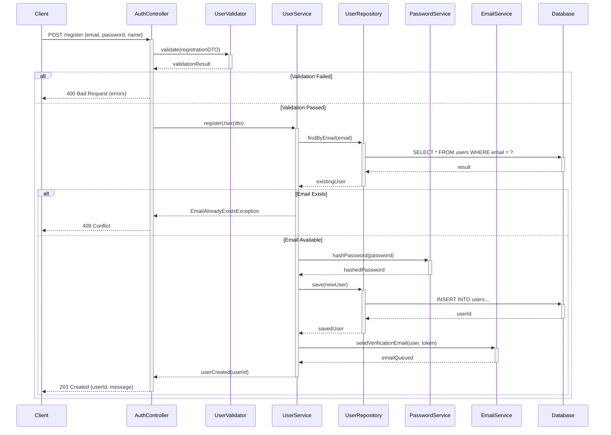
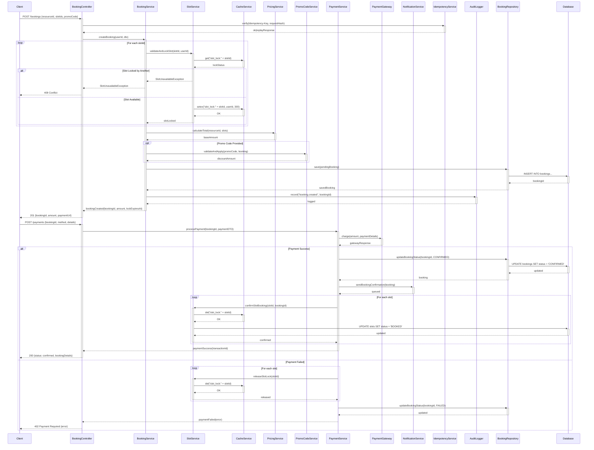
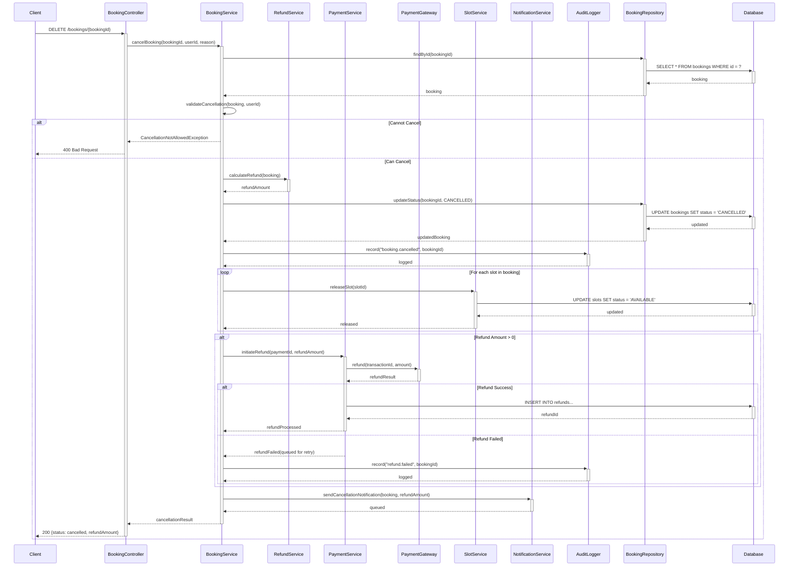
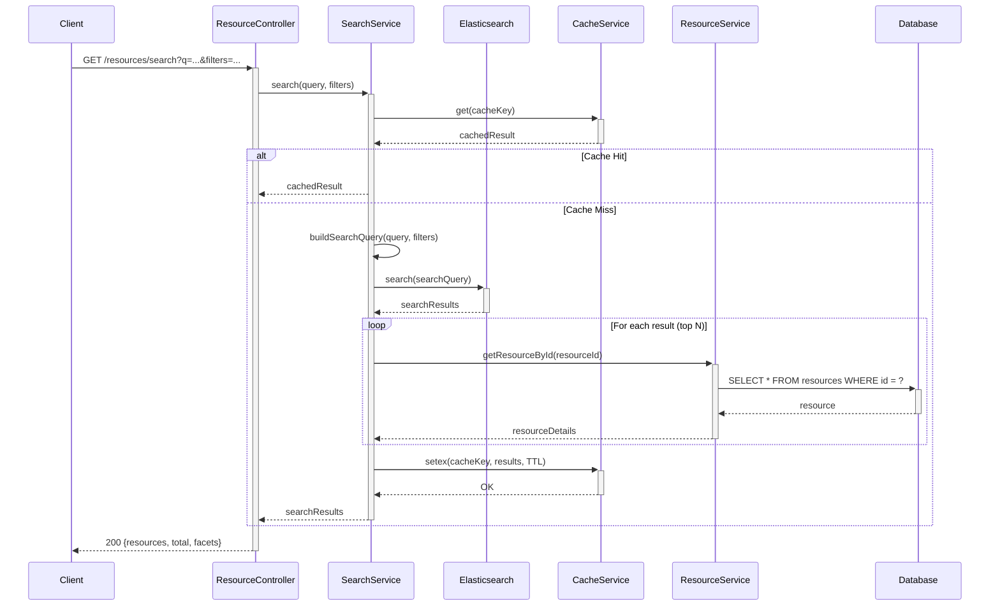
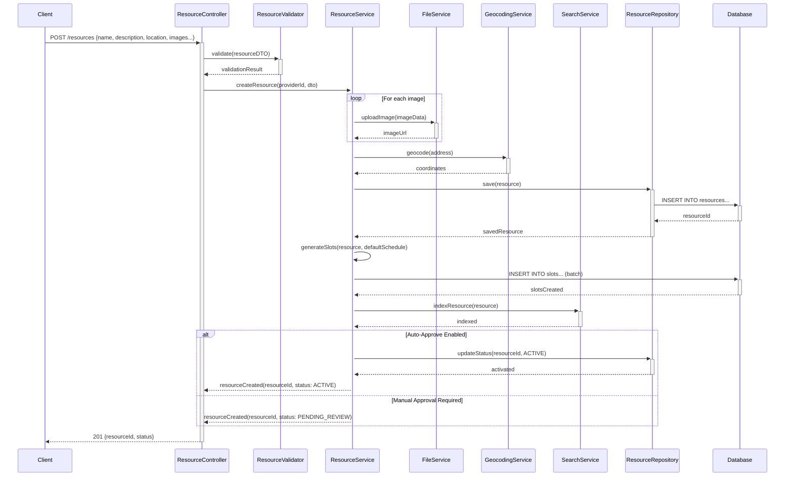
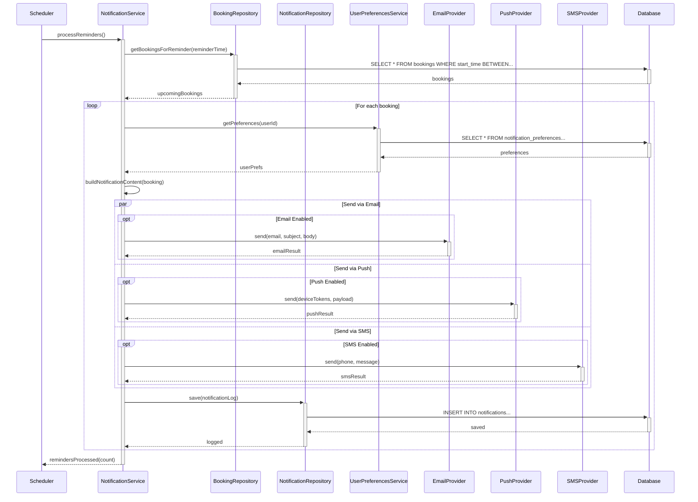
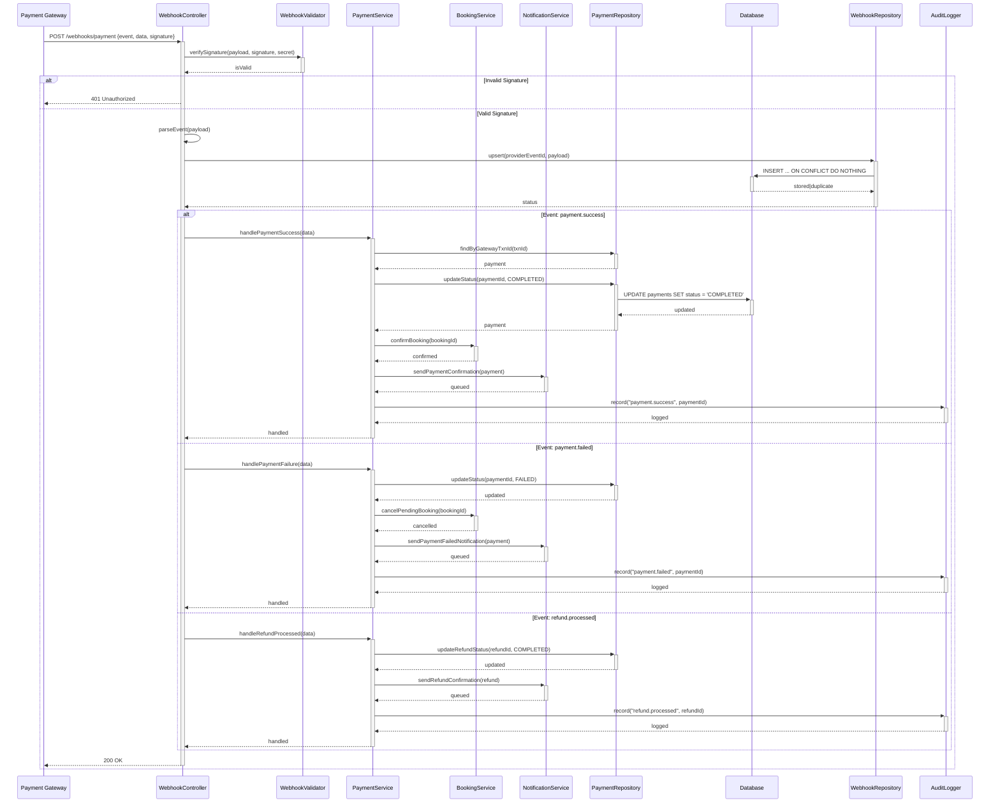

# Sequence Diagram - Slot Booking System

> **Platform Independence**: Shows internal object interactions applicable to any implementation.

---

## Overview

Sequence diagrams show detailed interactions between objects within the system, revealing internal implementation flow.

---

## SD-01: User Registration

---

## SD-02: Complete Booking Flow

---

## SD-03: Cancel Booking with Refund

---

## SD-04: Resource Search

---

## SD-05: Provider Creates Resource

---

## SD-06: Send Booking Reminder

---

## SD-07: Handle Payment Webhook

---

## Sequence Diagram Summary

| Diagram | Primary Flow | Key Components |
|---------|--------------|----------------|
| SD-01 | User Registration | AuthController, UserService, EmailService |
| SD-02 | Complete Booking | BookingService, SlotService, PaymentService, Cache |
| SD-03 | Cancel with Refund | BookingService, RefundService, SlotService |
| SD-04 | Resource Search | SearchService, Elasticsearch, Cache |
| SD-05 | Provider Creates Resource | ResourceService, FileService, GeocodingService |
| SD-06 | Booking Reminder | NotificationService, Scheduler, Providers |
| SD-07 | Payment Webhook | WebhookController, PaymentService, BookingService |
