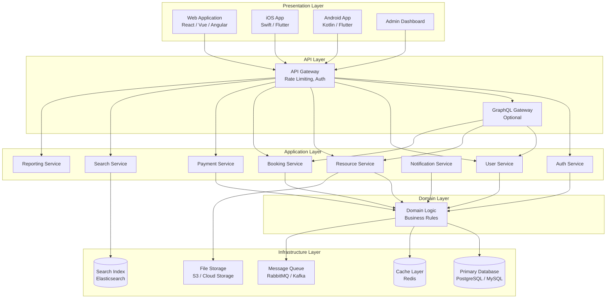
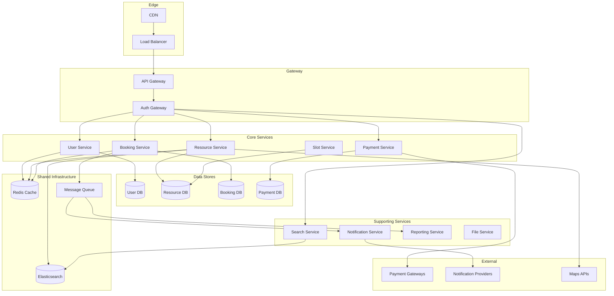
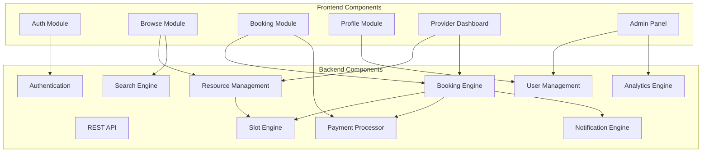
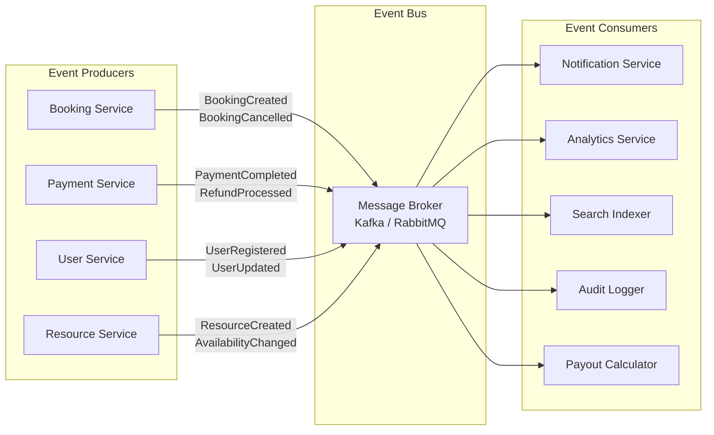
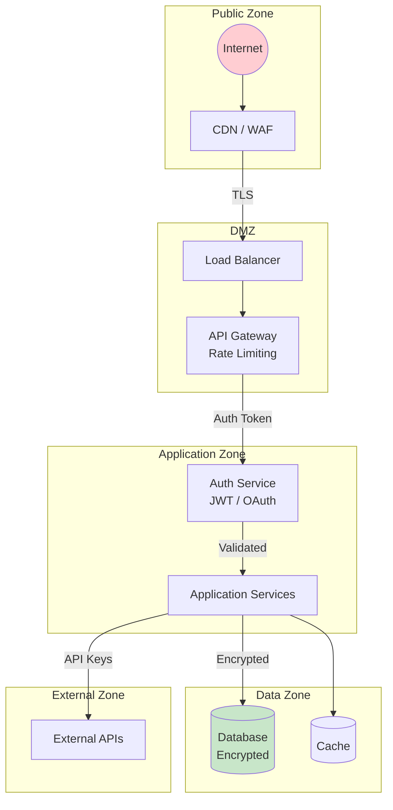
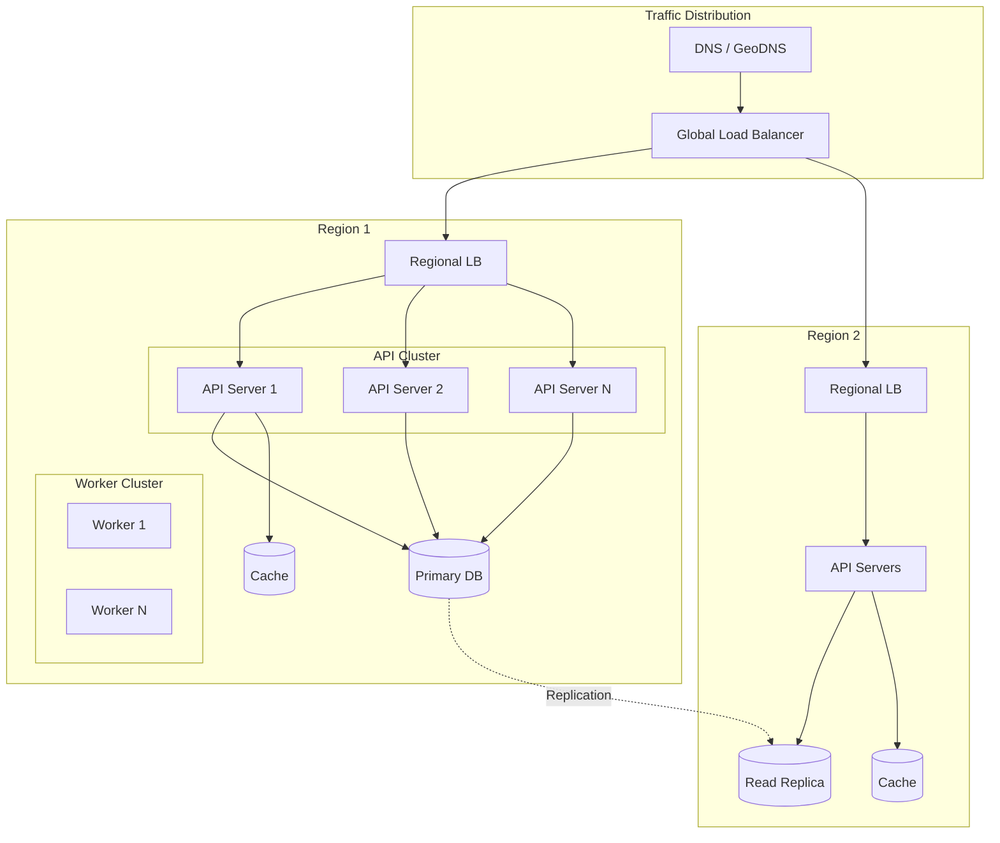

# High-Level Architecture Diagram - Slot Booking System

> **Platform Independence**: Architecture patterns shown are technology-agnostic.

---

## Overview

This document presents the high-level architecture of the Slot Booking System, showing major components and their interactions.

---

## Layered Architecture

---

## Microservices Architecture

---

## Component Architecture

---

## Event-Driven Architecture

---

## Security Architecture

---

## Scalability Architecture

---

## Technology Recommendations

| Layer | Options | Notes |
|-------|---------|-------|
| **Frontend Web** | React, Vue, Angular, Next.js | SPA or SSR |
| **Mobile** | React Native, Flutter, Native | Cross-platform or native |
| **API Gateway** | Kong, AWS API Gateway, Nginx | Rate limiting, auth |
| **Backend** | Node.js, Python, Go, Java | Microservices-ready |
| **Database** | PostgreSQL, MySQL | ACID compliance |
| **Cache** | Redis, Memcached | Session, slot locks |
| **Search** | Elasticsearch, Algolia | Full-text search |
| **Message Queue** | RabbitMQ, Kafka, SQS | Async processing |
| **File Storage** | S3, GCS, Azure Blob | Images, documents |
| **CDN** | CloudFlare, CloudFront | Static assets |

---

## Architecture Patterns Used

| Pattern | Usage |
|---------|-------|
| **Layered Architecture** | Separation of concerns |
| **Microservices** | Independent deployability |
| **Event-Driven** | Loose coupling, async processing |
| **CQRS** | Separate read/write models (optional) |
| **API Gateway** | Single entry point |
| **Cache-Aside** | Performance optimization |
| **Circuit Breaker** | Fault tolerance |
| **Saga** | Distributed transactions (booking flow) |
