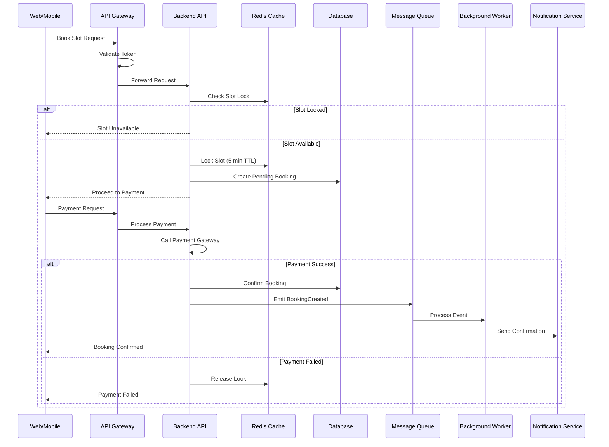

# C4 Context & Container Diagrams - Slot Booking System

> **Platform Independence**: C4 Model provides technology-agnostic visualization at different abstraction levels.

---

## C4 Model Overview

The C4 model provides four levels of abstraction:
1. **Context** - System and its relationships with users and external systems
2. **Container** - High-level building blocks (applications, data stores)
3. **Component** - Inside a container (covered in detailed design)
4. **Code** - Class-level detail (covered in implementation)

---

## Level 1: System Context Diagram

```mermaid
graph TB
    subgraph "Users"
        USER["👤 User<br/>[Person]<br/>Books slots for resources"]
        PROVIDER["🏢 Provider<br/>[Person]<br/>Manages resources and availability"]
        ADMIN["👨‍💼 Admin<br/>[Person]<br/>Administers the platform"]
    end
    
    SBS["📅 Slot Booking System<br/>[Software System]<br/>Allows users to discover, book,<br/>and manage slot reservations"]
    
    subgraph "External Systems"
        PAY["💳 Payment Gateway<br/>[External System]<br/>Processes payments and refunds"]
        EMAIL["📧 Email System<br/>[External System]<br/>Sends transactional emails"]
        SMS["📱 SMS Provider<br/>[External System]<br/>Sends SMS notifications"]
        PUSH["🔔 Push Service<br/>[External System]<br/>Delivers push notifications"]
        MAPS["🗺️ Maps Service<br/>[External System]<br/>Provides geocoding and maps"]
        STORAGE["☁️ Cloud Storage<br/>[External System]<br/>Stores files and images"]
    end
    
    USER -->|"Browses resources,<br/>Makes bookings,<br/>Manages reservations"| SBS
    PROVIDER -->|"Lists resources,<br/>Sets availability,<br/>Views earnings"| SBS
    ADMIN -->|"Configures system,<br/>Manages users,<br/>Reviews analytics"| SBS
    
    SBS -->|"Processes payments"| PAY
    SBS -->|"Sends emails"| EMAIL
    SBS -->|"Sends SMS"| SMS
    SBS -->|"Sends notifications"| PUSH
    SBS -->|"Gets location data"| MAPS
    SBS -->|"Stores/retrieves files"| STORAGE
    
    style SBS fill:#438dd5,color:#fff
    style USER fill:#08427b,color:#fff
    style PROVIDER fill:#08427b,color:#fff
    style ADMIN fill:#08427b,color:#fff
    style PAY fill:#999,color:#fff
    style EMAIL fill:#999,color:#fff
    style SMS fill:#999,color:#fff
    style PUSH fill:#999,color:#fff
    style MAPS fill:#999,color:#fff
    style STORAGE fill:#999,color:#fff
```



---

## Level 2: Container Diagram

```mermaid
graph TB
    subgraph "Users"
        USER["👤 User"]
        PROVIDER["🏢 Provider"]
        ADMIN["👨‍💼 Admin"]
    end
    
    subgraph "Slot Booking System"
        direction TB
        
        subgraph "Frontend Containers"
            WEB["🌐 Web Application<br/>[Container: JavaScript/React]<br/>Provides booking UI<br/>for users"]
            MOBILE["📱 Mobile App<br/>[Container: Flutter/React Native]<br/>Native mobile experience"]
            ADMIN_WEB["🖥️ Admin Dashboard<br/>[Container: JavaScript/React]<br/>Admin management UI"]
        end
        
        subgraph "API Containers"
            API_GW["🚪 API Gateway<br/>[Container: Kong/Nginx]<br/>Routes requests, rate limiting,<br/>authentication"]
            API["⚙️ Backend API<br/>[Container: Node.js/Python]<br/>Handles business logic"]
        end
        
        subgraph "Worker Containers"
            WORKER["⚡ Background Workers<br/>[Container: Node.js/Python]<br/>Async job processing"]
            SCHEDULER["⏰ Scheduler<br/>[Container: Cron/Celery]<br/>Scheduled tasks,<br/>reminders"]
        end
        
        subgraph "Data Containers"
            DB[("💾 Database<br/>[Container: PostgreSQL]<br/>Stores users, resources,<br/>bookings, payments")]
            CACHE[("⚡ Cache<br/>[Container: Redis]<br/>Session, locks,<br/>hot data")]
            SEARCH[("🔍 Search Index<br/>[Container: Elasticsearch]<br/>Resource search")]
            QUEUE["📬 Message Queue<br/>[Container: RabbitMQ]<br/>Async messaging"]
        end
    end
    
    subgraph "External Systems"
        PAY["💳 Payment Gateway"]
        NOTIF["📧 Notification Services"]
        MAPS["🗺️ Maps API"]
        STORAGE["☁️ File Storage"]
    end
    
    USER -->|"HTTPS"| WEB
    USER -->|"HTTPS"| MOBILE
    PROVIDER -->|"HTTPS"| WEB
    PROVIDER -->|"HTTPS"| MOBILE
    ADMIN -->|"HTTPS"| ADMIN_WEB
    
    WEB -->|"HTTPS/JSON"| API_GW
    MOBILE -->|"HTTPS/JSON"| API_GW
    ADMIN_WEB -->|"HTTPS/JSON"| API_GW
    
    API_GW -->|"HTTP/JSON"| API
    
    API -->|"SQL"| DB
    API -->|"Redis Protocol"| CACHE
    API -->|"REST"| SEARCH
    API -->|"AMQP"| QUEUE
    
    QUEUE --> WORKER
    WORKER --> DB
    SCHEDULER --> QUEUE
    
    API -->|"REST"| PAY
    WORKER -->|"REST/SMTP"| NOTIF
    API -->|"REST"| MAPS
    API -->|"S3 API"| STORAGE
    
    style WEB fill:#438dd5,color:#fff
    style MOBILE fill:#438dd5,color:#fff
    style ADMIN_WEB fill:#438dd5,color:#fff
    style API_GW fill:#438dd5,color:#fff
    style API fill:#438dd5,color:#fff
    style WORKER fill:#438dd5,color:#fff
    style SCHEDULER fill:#438dd5,color:#fff
    style DB fill:#438dd5,color:#fff
    style CACHE fill:#438dd5,color:#fff
    style SEARCH fill:#438dd5,color:#fff
    style QUEUE fill:#438dd5,color:#fff
```



---

## Container Descriptions

| Container | Technology | Responsibility | Scaling |
|-----------|------------|----------------|---------|
| **Web Application** | React/Vue/Angular | User-facing SPA for booking | CDN, Static hosting |
| **Mobile App** | Flutter/React Native | Native mobile experience | App stores |
| **Admin Dashboard** | React + Admin framework | Platform administration | Static hosting |
| **API Gateway** | Kong/Nginx/AWS API GW | Routing, auth, rate limiting | Horizontal |
| **Backend API** | Node.js/Python/Go | Core business logic | Horizontal |
| **Background Workers** | Same as API | Async processing | Horizontal |
| **Scheduler** | Cron/Celery Beat | Timed jobs | Single (HA pair) |
| **Database** | PostgreSQL/MySQL | Persistent data | Read replicas |
| **Cache** | Redis | Sessions, locks, caching | Cluster |
| **Search Index** | Elasticsearch | Full-text search | Cluster |
| **Message Queue** | RabbitMQ/Kafka | Async messaging | Cluster |

---

## Container Interactions



---

## Technology Stack Options

### Option A: Monolithic Start
```
┌─────────────────────────────────────────┐
│              Web Application            │
│              (React/Next.js)            │
└───────────────────┬─────────────────────┘
                    │
┌───────────────────▼─────────────────────┐
│           Monolithic Backend            │
│    (Django/Rails/Express + Queue)       │
└───────────────────┬─────────────────────┘
                    │
        ┌───────────┴───────────┐
        ▼                       ▼
┌───────────────┐       ┌───────────────┐
│  PostgreSQL   │       │    Redis      │
└───────────────┘       └───────────────┘
```

### Option B: Microservices
```
┌─────────────────────────────────────────┐
│            API Gateway (Kong)           │
└───────────────────┬─────────────────────┘
                    │
    ┌───────────────┼───────────────┐
    ▼               ▼               ▼
┌────────┐    ┌──────────┐    ┌─────────┐
│  User  │    │ Resource │    │ Booking │
│Service │    │ Service  │    │ Service │
└────┬───┘    └────┬─────┘    └────┬────┘
     │             │               │
     ▼             ▼               ▼
┌────────┐    ┌──────────┐    ┌─────────┐
│User DB │    │Resource  │    │Booking  │
│        │    │DB        │    │DB       │
└────────┘    └──────────┘    └─────────┘
```

---

## Deployment Contexts

| Deployment | Containers Used | Use Case |
|------------|-----------------|----------|
| **Minimal MVP** | Web, API, DB, Redis | Quick launch, low traffic |
| **Growth Stage** | + Workers, Search, Queue | Higher load, async processing |
| **Enterprise** | Full microservices | Multi-region, high availability |

---

## Key Design Decisions

| Decision | Rationale |
|----------|-----------|
| API Gateway | Single entry point, centralized auth, rate limiting |
| Background Workers | Don't block HTTP requests with slow operations |
| Message Queue | Decouple services, enable retry, eventual consistency |
| Redis Cache | Low-latency slot locking, session management |
| Elasticsearch | Fast resource search with filters, autocomplete |
| PostgreSQL | ACID transactions for booking operations |
