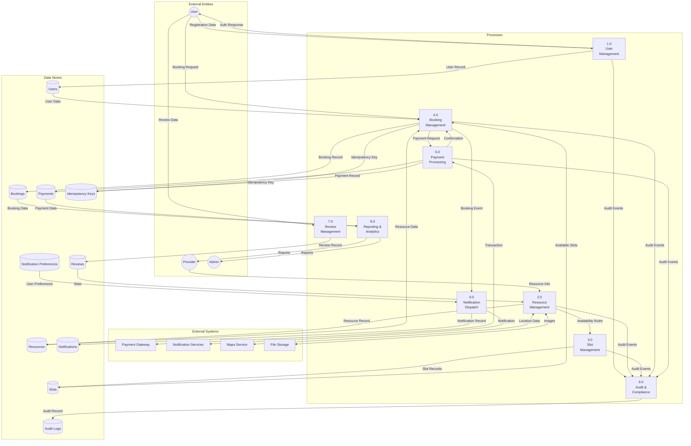
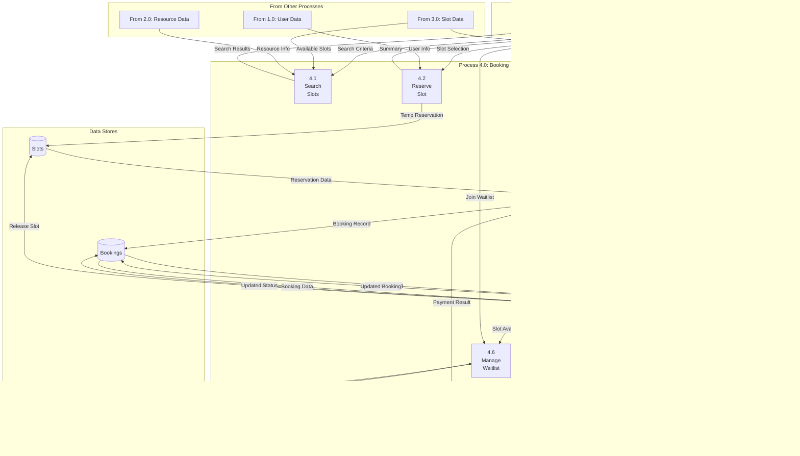
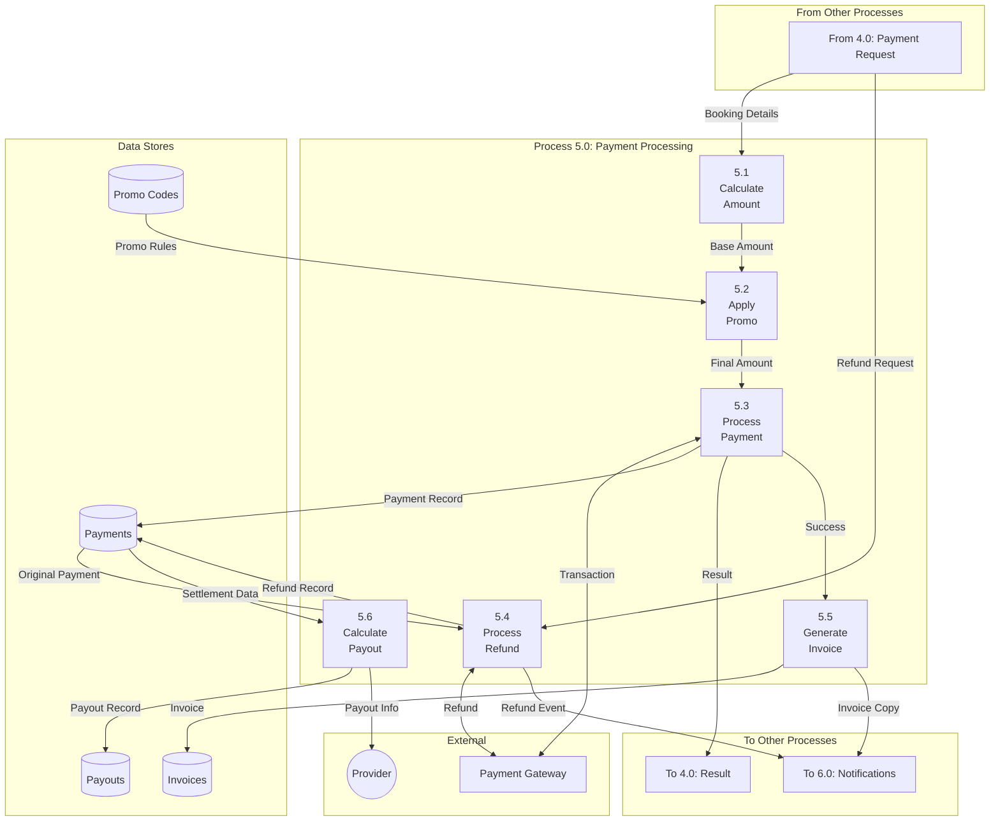
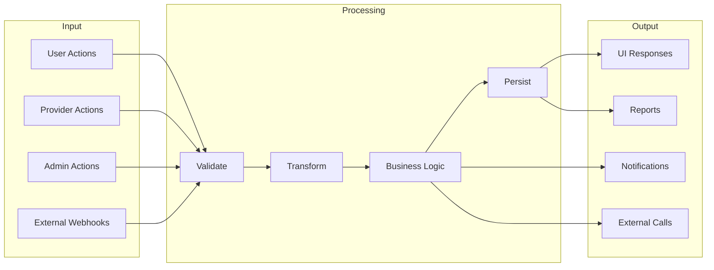

# Data Flow Diagram - Slot Booking System

> **Platform Independence**: Shows how data moves through the system regardless of technology choices.

---

## Overview

Data Flow Diagrams (DFDs) show the flow of data through the system, from external entities through processes to data stores.

---

## Level 0: Context Diagram

```mermaid
flowchart LR
    U((User)) -->|Registration Data,<br/>Booking Requests| SBS[Slot Booking<br/>System]
    SBS -->|Confirmations,<br/>Notifications| U
    
    P((Provider)) -->|Resource Data,<br/>Availability| SBS
    SBS -->|Booking Alerts,<br/>Earnings Reports| P
    
    A((Admin)) -->|Configuration,<br/>Approvals| SBS
    SBS -->|Analytics,<br/>Alerts| A
    
    PG[Payment<br/>Gateway] <-->|Payment Data,<br/>Refunds| SBS
    
    NS[Notification<br/>Services] <--|Email, SMS,<br/>Push Data| SBS
```

---

## Level 1: Main Processes



---

## Level 2: Booking Management Process (4.0)



---

## Level 2: Payment Processing (5.0)



---

## Data Dictionary

### Data Flows

| Data Flow | Description | Contents |
|-----------|-------------|----------|
| Registration Data | User signup info | email, password, name, phone |
| Booking Request | Slot reservation request | userId, slotIds, notes |
| Resource Info | Resource details | name, description, location, pricing |
| Payment Request | Payment initiation | amount, method, bookingId |
| Booking Event | Booking lifecycle event | type, bookingId, timestamp |

### Data Stores

| Store | Description | Key Fields |
|-------|-------------|------------|
| D1: Users | User accounts | userId, email, role, profile |
| D2: Resources | Bookable resources | resourceId, providerId, details |
| D3: Slots | Time slots | slotId, resourceId, startTime, status |
| D4: Bookings | Reservations | bookingId, userId, slotId, status |
| D5: Payments | Transactions | paymentId, amount, status |
| D6: Reviews | User feedback | reviewId, rating, comment |
| D7: Notifications | Sent notifications | notifId, userId, channel |
| D8: Audit Logs | Compliance records | actorId, action, timestamp |
| D9: Idempotency Keys | Request deduplication | key, status, response |
| D10: Notification Preferences | User settings | userId, channels, quiet_hours |

---

## Data Flow Summary


