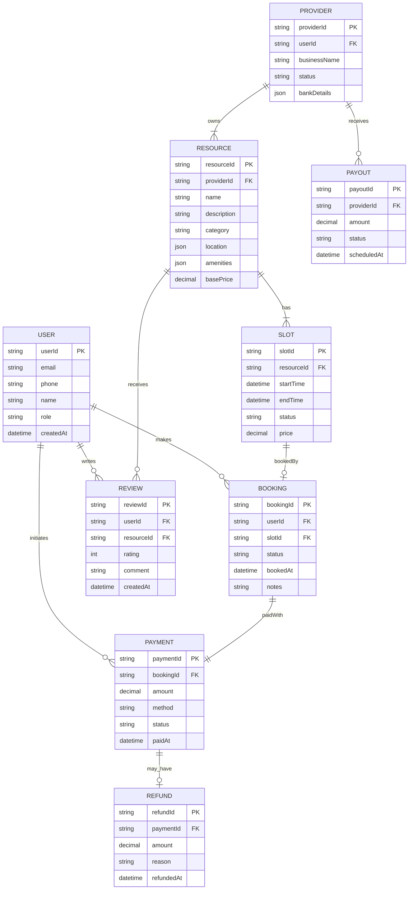
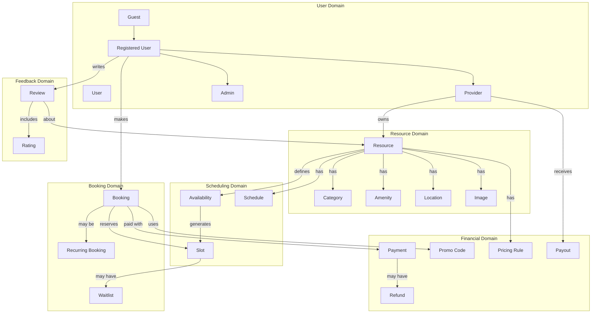
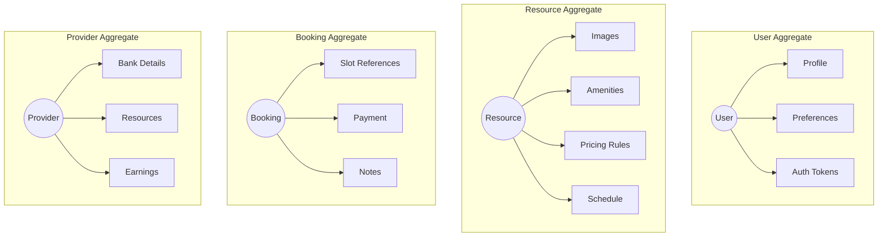

# Domain Model - Slot Booking System

> **Platform Independence**: Uses generic entity names adaptable to any booking domain.

---

## Overview

The Domain Model represents the key entities in the business domain and their relationships, independent of implementation details.

---

## Core Domain Model

---

## Simplified Domain Relationships

---

## Entity Definitions

### Core Entities

| Entity | Description | Domain Example |
|--------|-------------|----------------|
| **User** | Any person interacting with the system | Customer, Guest, Provider, Admin |
| **Provider** | Business/individual offering bookable resources | Futsal venue owner, Event organizer |
| **Resource** | A bookable entity | Court, Room, Table, Equipment |
| **Slot** | A specific time window for a resource | 3:00 PM - 4:00 PM on Court A |
| **Booking** | A confirmed reservation | User X has Court A on Jan 20 at 3 PM |
| **Payment** | Financial transaction for a booking | $50 paid via Stripe |

### Supporting Entities

| Entity | Description |
|--------|-------------|
| **Category** | Classification of resources (e.g., Indoor, Outdoor) |
| **Amenity** | Features of a resource (e.g., Lights, AC, Parking) |
| **Location** | Physical address with coordinates |
| **Availability** | Operating schedule for a resource |
| **PricingRule** | Time-based or conditional pricing |
| **PromoCode** | Discount codes for bookings |
| **Review** | User feedback with rating and comment |
| **Notification** | System messages to users |
| **Payout** | Provider earnings disbursement |

---

## Domain Aggregates

---

## Domain Events

| Event | Triggered When | Subscribers |
|-------|----------------|-------------|
| `UserRegistered` | New user signs up | Email service, Analytics |
| `BookingCreated` | Booking confirmed | Notification, Calendar, Analytics |
| `BookingCancelled` | Booking cancelled | Notification, Refund service, Slot service |
| `PaymentCompleted` | Payment successful | Booking service, Receipt generator |
| `PaymentFailed` | Payment declined | Notification, Booking service |
| `SlotReleased` | Slot becomes available | Waitlist service |
| `ReviewPosted` | User posts review | Notification (provider), Ranking service |
| `ResourceCreated` | Provider adds resource | Admin notification (if approval needed) |
| `ProviderApproved` | Admin approves provider | Notification, Welcome flow |

---

## Domain Services

| Service | Responsibility |
|---------|----------------|
| **AvailabilityService** | Calculate available slots based on schedule and existing bookings |
| **BookingService** | Orchestrate booking creation, validation, conflict detection |
| **PricingService** | Calculate prices based on rules, time, promos |
| **PaymentService** | Handle payment processing, refunds |
| **NotificationService** | Dispatch notifications across channels |
| **SearchService** | Index and search resources |
| **SchedulingService** | Manage recurring bookings, reminders |

---

## Value Objects

| Value Object | Description | Example |
|--------------|-------------|---------|
| `TimeRange` | Start and end time | 3:00 PM - 4:00 PM |
| `Money` | Amount and currency | $50.00 USD |
| `Address` | Physical location | 123 Main St, City |
| `Coordinates` | Latitude/Longitude | 27.7172, 85.3240 |
| `Rating` | Numeric rating value | 4.5 / 5 |
| `Duration` | Time period | 1 hour |

---

## Invariants / Business Rules

| Rule | Description |
|------|-------------|
| **No Double Booking** | A slot can only be booked by one user at a time |
| **Booking Window** | Bookings must be made within allowed advance time |
| **Cancellation Policy** | Refund amount depends on time before slot |
| **Minimum Duration** | Resources have minimum booking duration |
| **Provider Verification** | Providers must be verified before going live |
| **Review Eligibility** | Only users who completed bookings can review |
