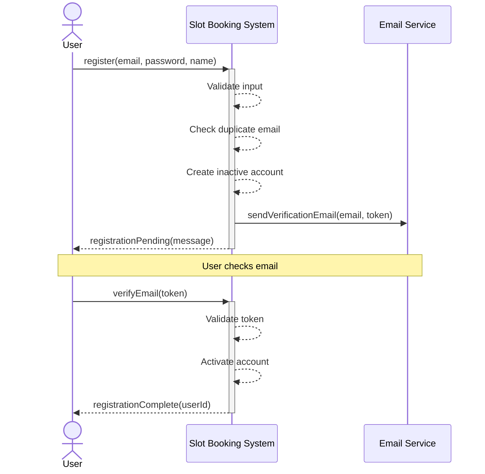
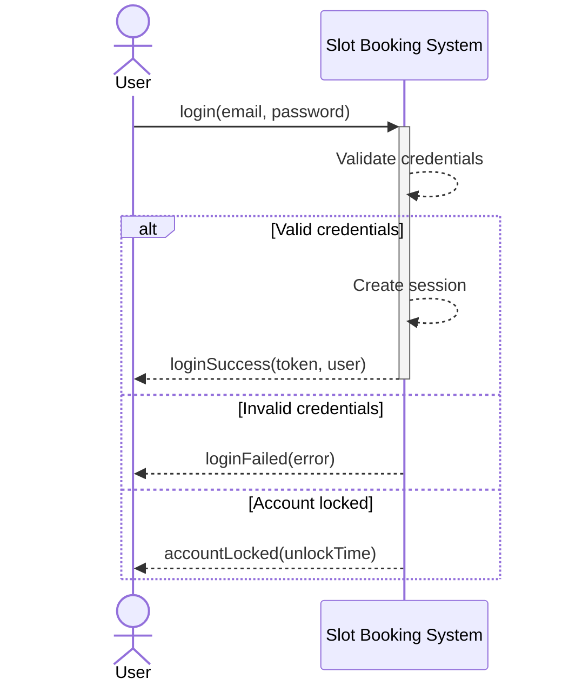
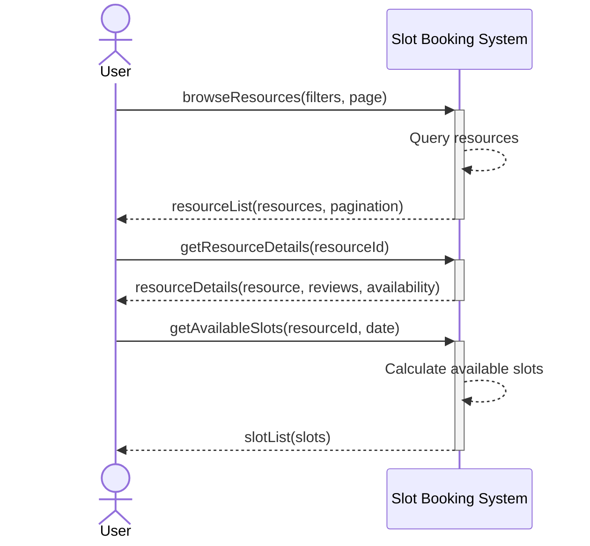
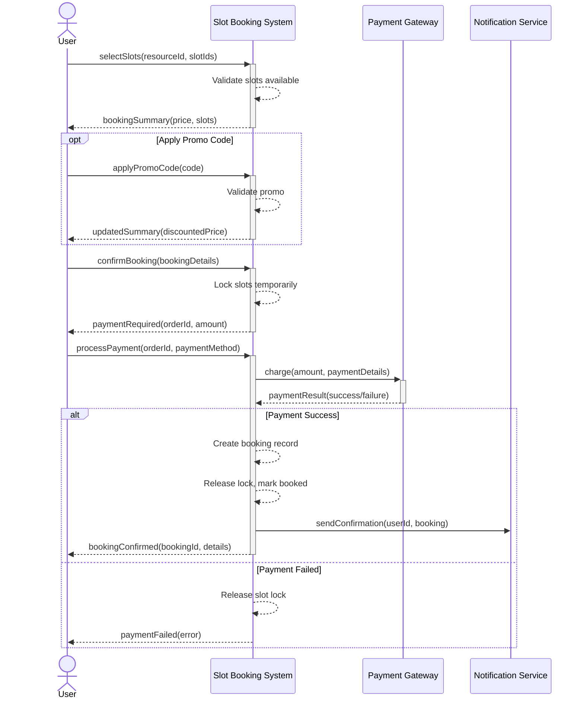
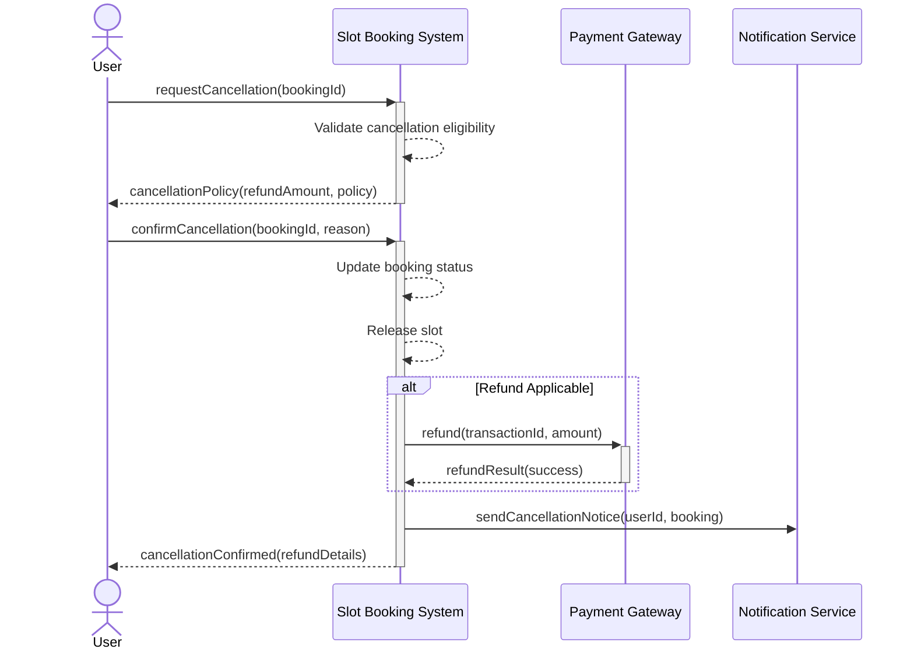
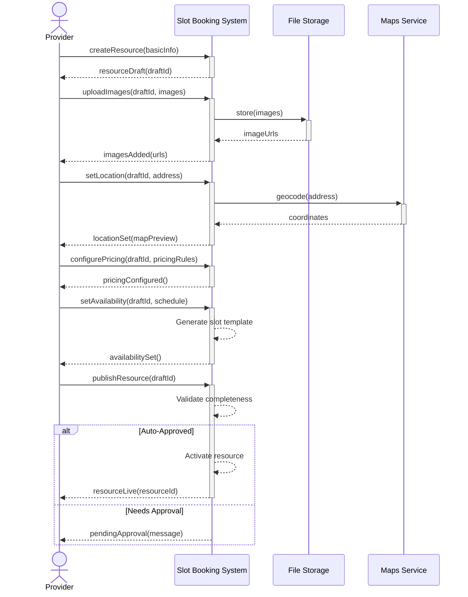
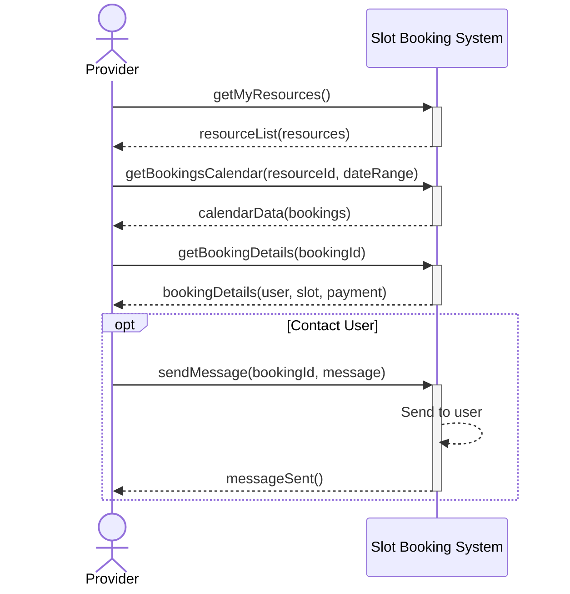
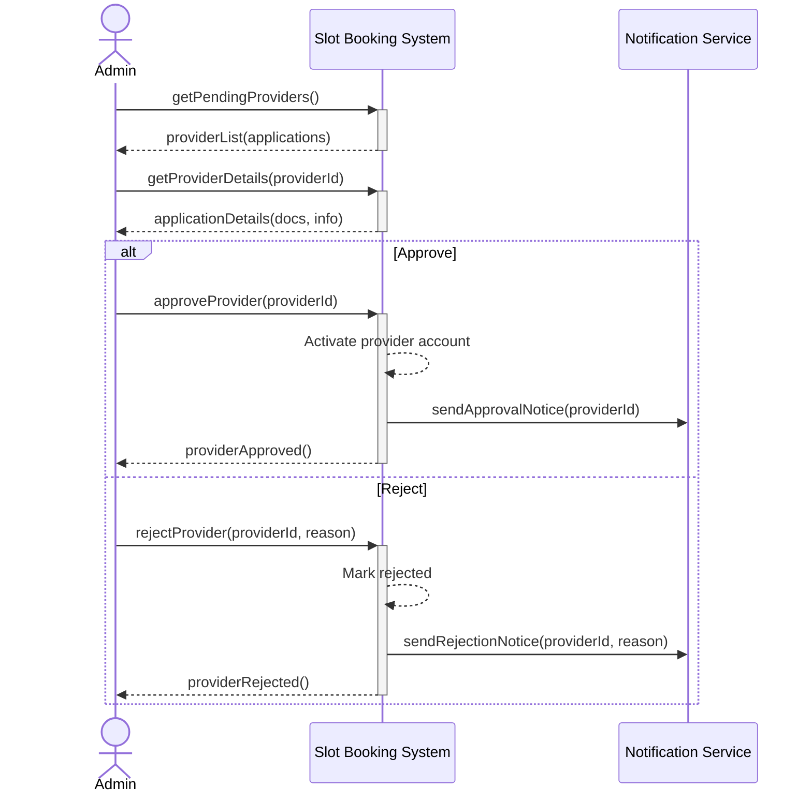
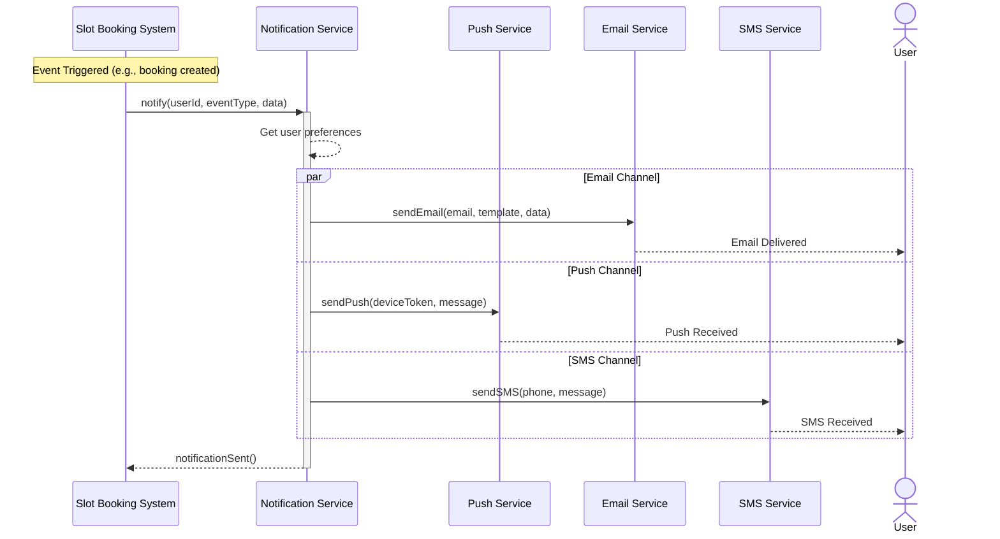
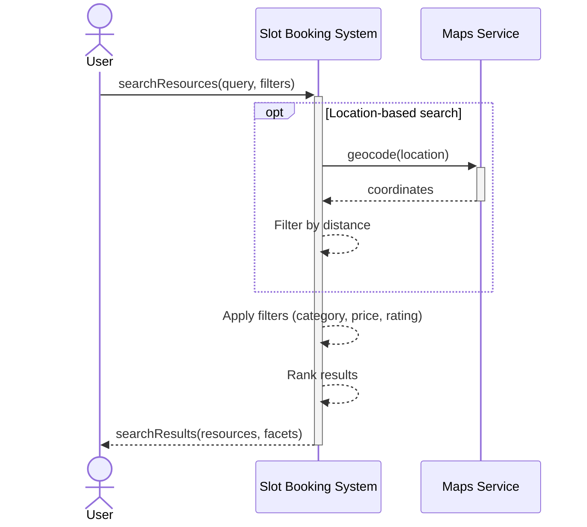

# System Sequence Diagram - Slot Booking System

> **Platform Independence**: Diagrams show black-box system interactions applicable to any booking domain.

---

## Overview

System Sequence Diagrams show the system as a black box, focusing on interactions between external actors and the system boundary without revealing internal implementation.

---

## SSD-01: User Registration

---

## SSD-02: User Login

---

## SSD-03: Browse and View Resources

---

## SSD-04: Complete Booking Flow

---

## SSD-05: Cancel Booking

---

## SSD-06: Provider Adds Resource

---

## SSD-07: Provider Views Bookings

---

## SSD-08: Admin Approves Provider

---

## SSD-09: Receive Notification Flow

---

## SSD-10: Search Resources

---

## Summary of System Operations

| SSD | Primary Operation | Actors | External Systems |
|-----|-------------------|--------|------------------|
| 01 | Registration | User | Email Service |
| 02 | Login | User | - |
| 03 | Browse Resources | User | - |
| 04 | Complete Booking | User | Payment, Notification |
| 05 | Cancel Booking | User | Payment, Notification |
| 06 | Add Resource | Provider | Storage, Maps |
| 07 | View Bookings | Provider | - |
| 08 | Approve Provider | Admin | Notification |
| 09 | Send Notification | System | Push, Email, SMS |
| 10 | Search Resources | User | Maps |
