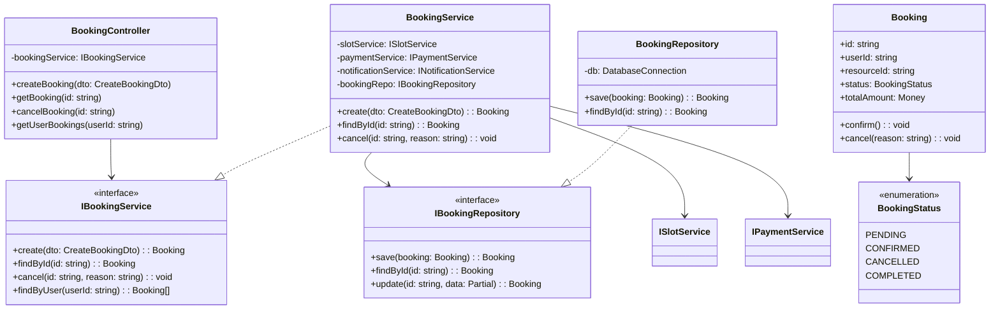
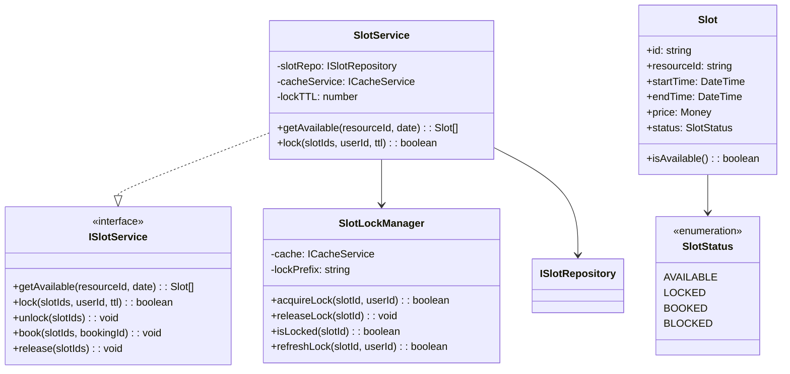
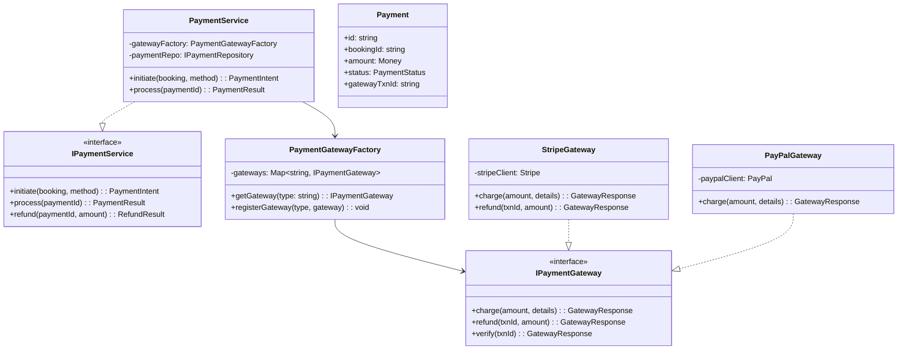
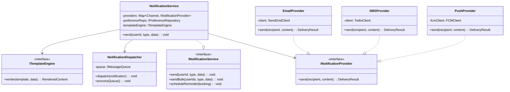
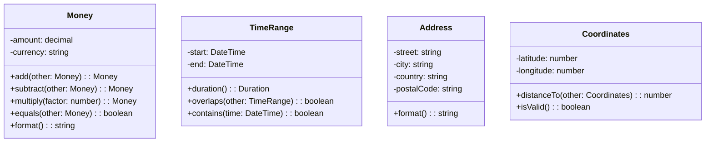

# C4 Code Diagram - Slot Booking System

> **Platform Independence**: C4 Level 4 showing class-level design (optional detail level).

---

## Overview

The C4 Code Diagram (Level 4) provides the most detailed view, showing the internal structure of components at the code/class level.

---

## Booking Service Code Structure

---

## Slot Management Code Structure

---

## Payment Processing Code Structure

---

## Notification Service Code Structure

---

## Value Objects

---

## Code Module Summary

| Module | Classes | Interfaces | Purpose |
|--------|---------|------------|---------|
| Booking | 3 | 2 | Booking lifecycle |
| Slot | 4 | 2 | Slot management |
| Payment | 5 | 3 | Payment processing |
| Notification | 6 | 3 | Multi-channel notifications |
| Domain | 10+ | - | Domain entities, value objects |
