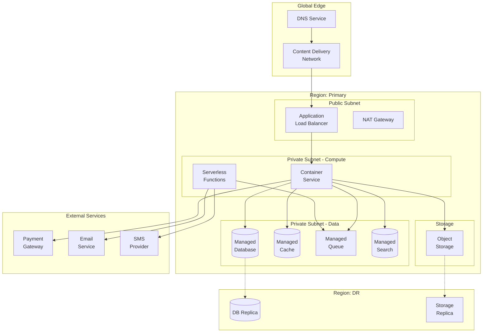
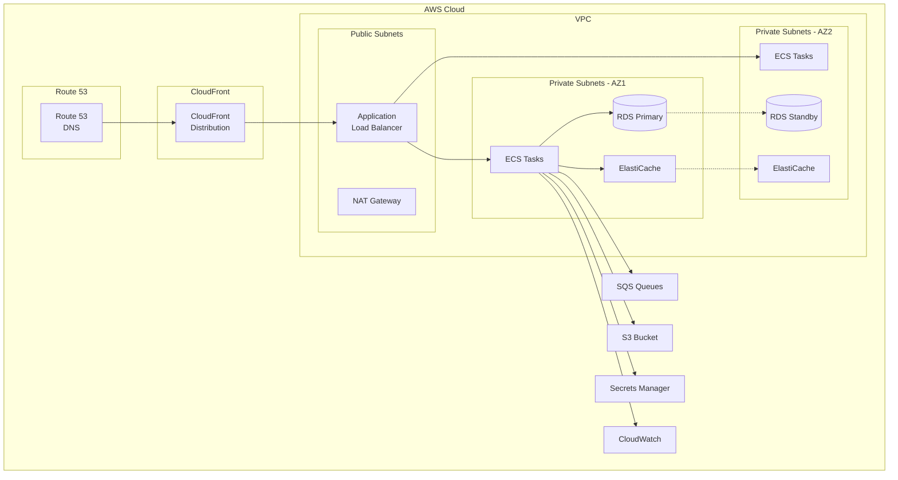
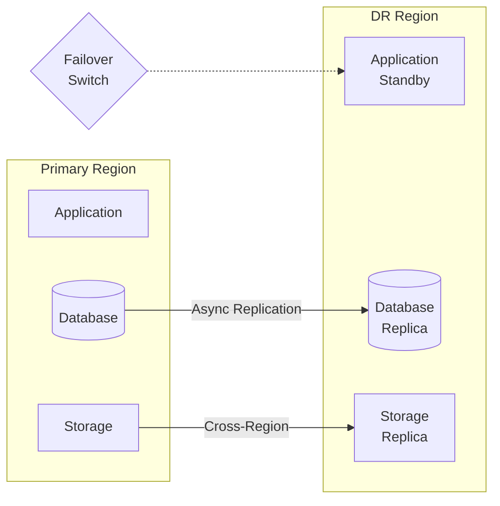
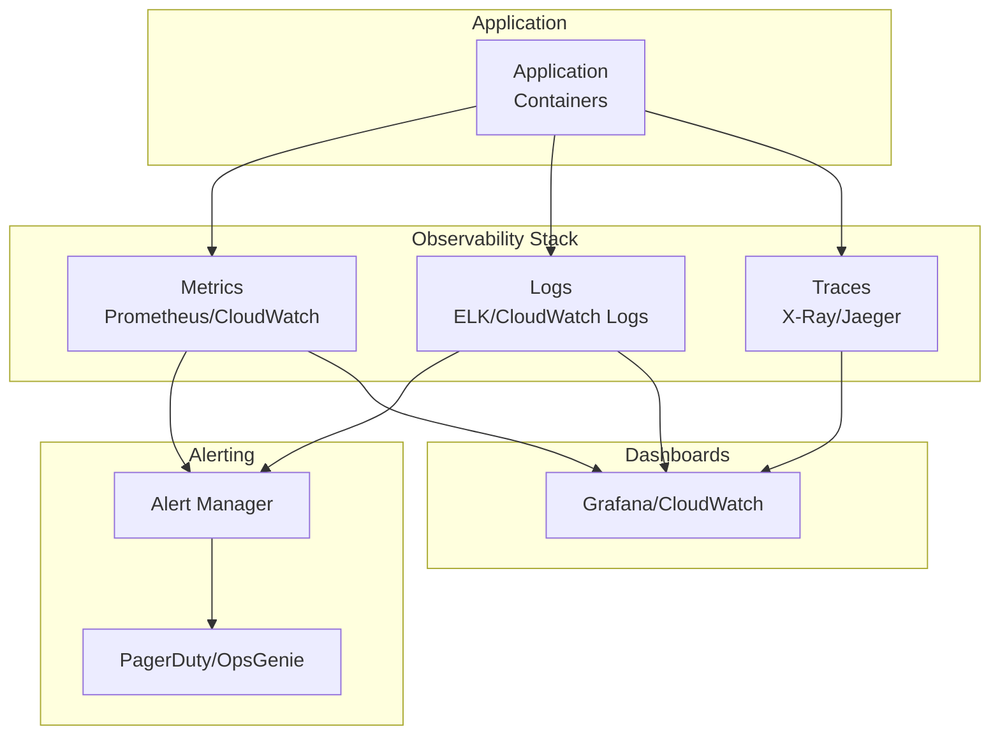

# Cloud Architecture Diagram - Slot Booking System

> **Platform Independence**: Shows cloud-agnostic architecture with provider-specific mappings.

---

## Overview

This document presents cloud architecture patterns that can be implemented on AWS, GCP, Azure, or other providers.

---

## Cloud-Agnostic Architecture

---

## Provider Mapping

| Component | AWS | GCP | Azure |
|-----------|-----|-----|-------|
| DNS | Route 53 | Cloud DNS | Azure DNS |
| CDN | CloudFront | Cloud CDN | Azure CDN |
| Load Balancer | ALB | Cloud Load Balancing | Azure LB |
| Container Service | ECS / EKS | GKE / Cloud Run | AKS / Container Apps |
| Serverless | Lambda | Cloud Functions | Azure Functions |
| Database | RDS PostgreSQL | Cloud SQL | Azure PostgreSQL |
| Cache | ElastiCache | Memorystore | Azure Cache |
| Queue | SQS | Pub/Sub | Service Bus |
| Search | OpenSearch | Elastic Cloud | Cognitive Search |
| Object Storage | S3 | Cloud Storage | Blob Storage |
| Secrets | Secrets Manager | Secret Manager | Key Vault |

---

## AWS-Specific Architecture

---

## Cost Optimization Tiers

### Starter (~$200/month)
- ECS Fargate Spot for workers
- RDS t3.micro (single AZ)
- ElastiCache t3.micro
- S3 Standard

### Growth (~$800/month)
- ECS Fargate (on-demand)
- RDS t3.medium (Multi-AZ)
- ElastiCache r6g.large
- CloudFront with custom domain

### Enterprise (~$3000+/month)
- EKS with auto-scaling
- RDS r6g.xlarge (Multi-AZ)
- ElastiCache cluster mode
- Global Accelerator
- WAF + Shield

---

## Disaster Recovery

| Metric | RTO | RPO |
|--------|-----|-----|
| Standard | 4 hours | 1 hour |
| Critical | 1 hour | 15 minutes |

---

## Monitoring & Observability

---

## Security Best Practices

| Area | Implementation |
|------|----------------|
| Network | VPC, Security Groups, NACLs |
| Identity | IAM roles, MFA, least privilege |
| Encryption | TLS 1.3, KMS for at-rest |
| Secrets | Secrets Manager/Vault |
| Compliance | CloudTrail, Config Rules |
| DDoS | Shield, WAF |
