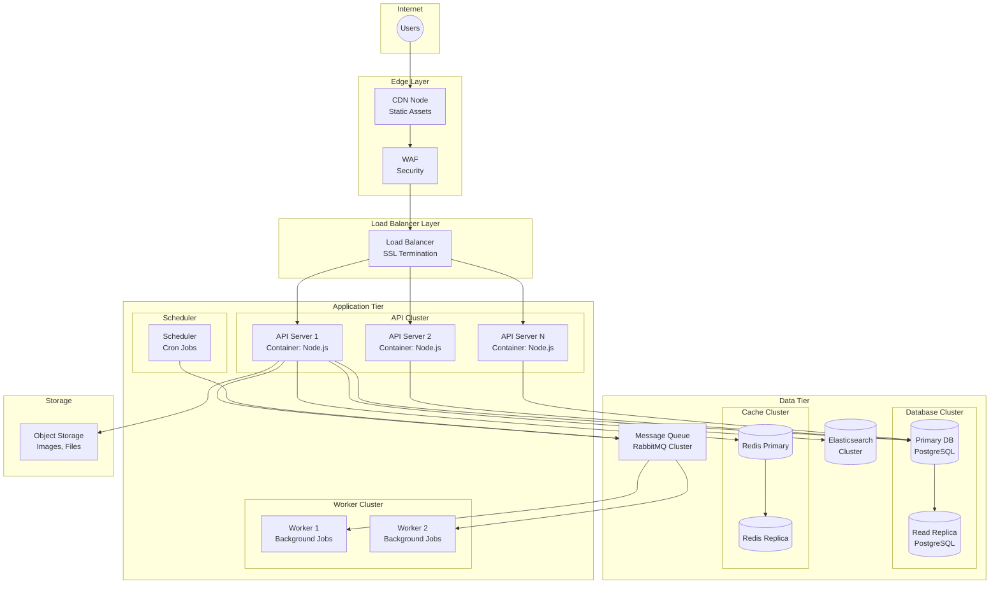
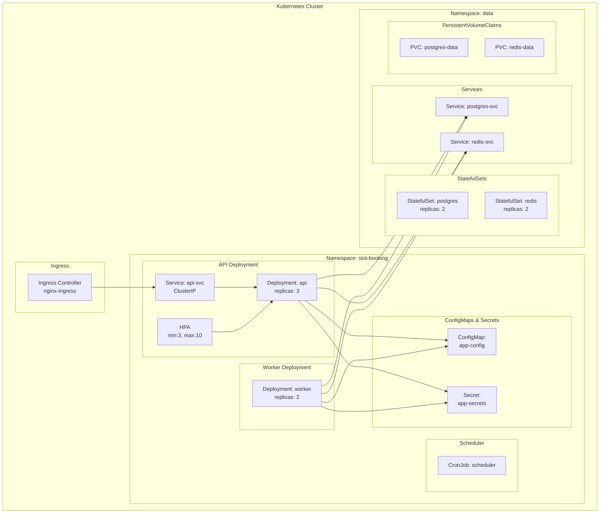
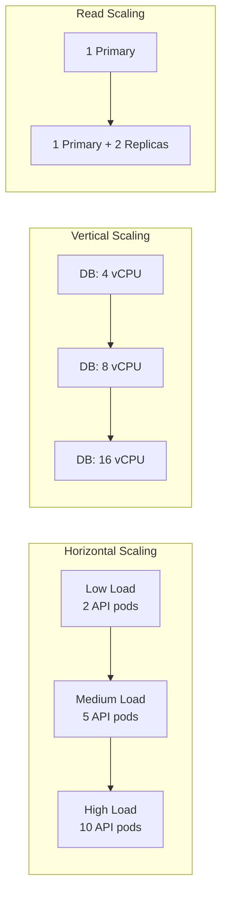

# Deployment Diagram - Slot Booking System

> **Platform Independence**: Shows software-to-hardware mapping independent of specific vendors.

---

## Overview

The Deployment Diagram shows how software components are deployed onto hardware nodes.

---

## Production Deployment

---

## Container Deployment (Kubernetes)

---

## Node Specifications

| Node | Specs | Purpose |
|------|-------|---------|
| **API Server** | 2 vCPU, 4GB RAM | Handle HTTP requests |
| **Worker** | 2 vCPU, 4GB RAM | Process async jobs |
| **Database** | 4 vCPU, 16GB RAM, SSD | Data persistence |
| **Redis** | 2 vCPU, 8GB RAM | Caching, locks |
| **Elasticsearch** | 4 vCPU, 8GB RAM | Search indexing |

---

## Deployment Artifacts

| Artifact | Type | Deployment Target |
|----------|------|-------------------|
| `api-image:v1` | Docker Image | API Servers |
| `worker-image:v1` | Docker Image | Worker Servers |
| `web-app/dist` | Static Files | CDN |
| `mobile-app.apk/.ipa` | Mobile App | App Stores |

---

## Environment Configuration

| Environment | API Replicas | DB Type | Purpose |
|-------------|--------------|---------|---------|
| **Development** | 1 | Local SQLite | Local dev |
| **Staging** | 2 | Managed PostgreSQL | Testing |
| **Production** | 3+ | Managed PostgreSQL (HA) | Live traffic |

---

## Scaling Strategy

