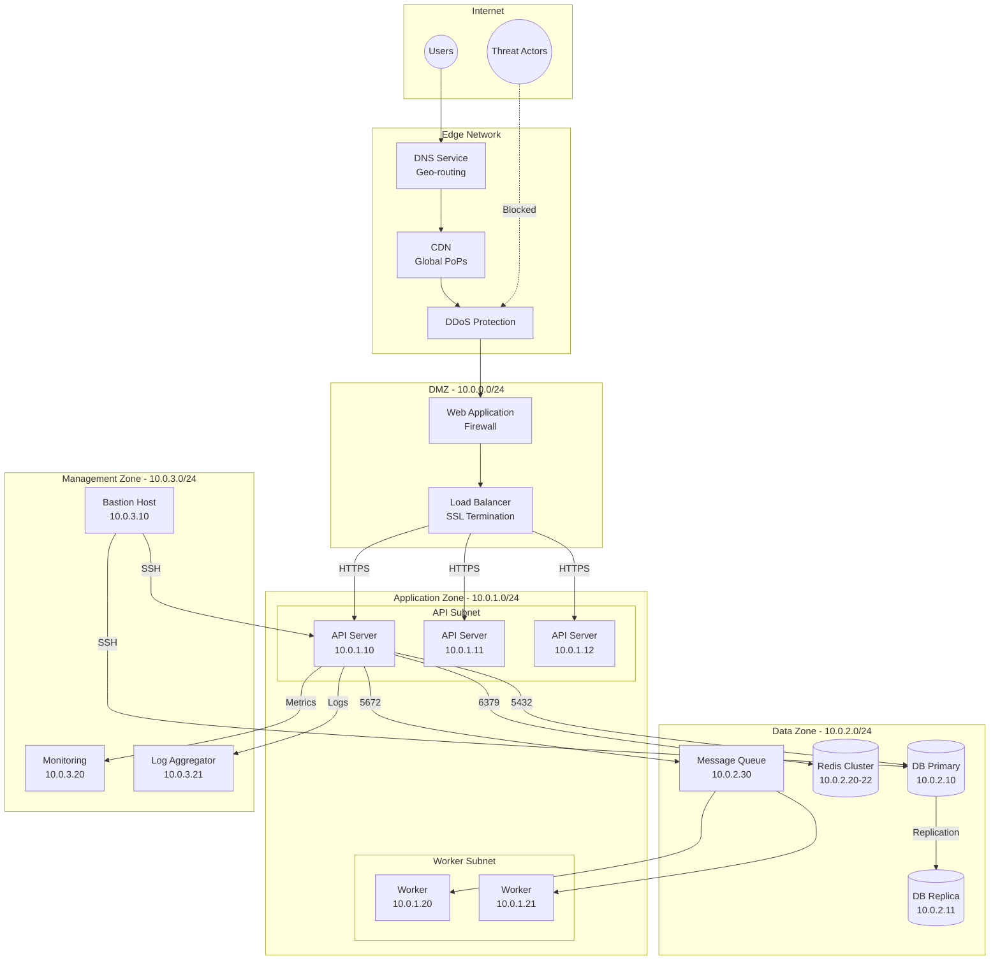
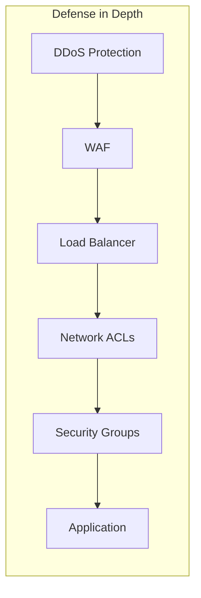
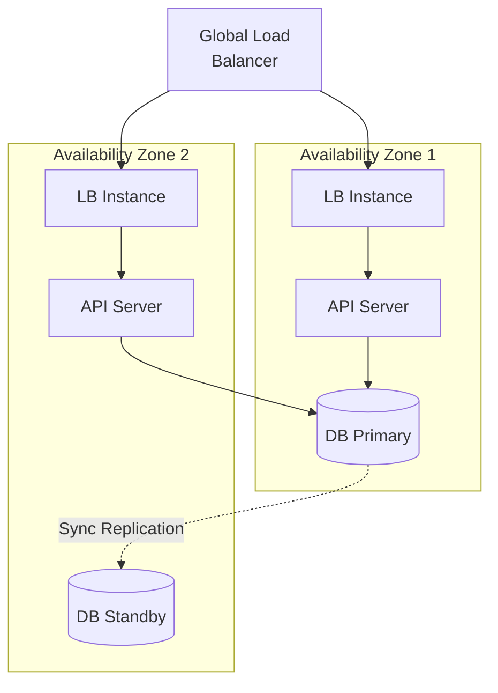
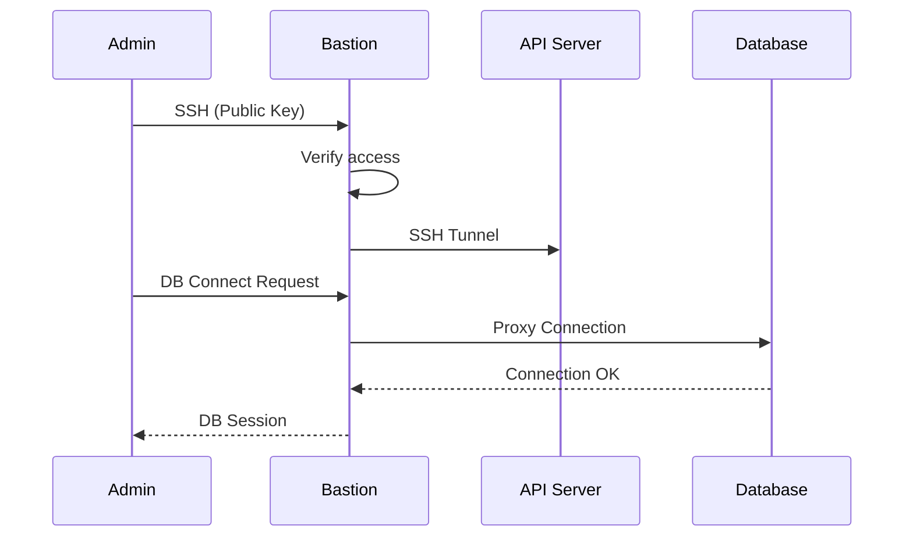

# Network / Infrastructure Diagram - Slot Booking System

> **Platform Independence**: Shows network topology applicable to any hosting environment.

---

## Overview

The Network Infrastructure Diagram shows how network components are organized and connected.

---

## Network Architecture

---

## Security Zones

| Zone | CIDR | Access Level | Purpose |
|------|------|--------------|---------|
| **DMZ** | 10.0.0.0/24 | Public | Edge services |
| **Application** | 10.0.1.0/24 | Private | Application servers |
| **Data** | 10.0.2.0/24 | Restricted | Databases, caches |
| **Management** | 10.0.3.0/24 | Admin only | Ops, monitoring |

---

## Firewall Rules

| From | To | Port | Protocol | Action |
|------|-----|------|----------|--------|
| Internet | LB | 443 | HTTPS | Allow |
| LB | API Servers | 3000 | HTTP | Allow |
| API Servers | DB | 5432 | TCP | Allow |
| API Servers | Redis | 6379 | TCP | Allow |
| API Servers | MQ | 5672 | AMQP | Allow |
| Bastion | All Internal | 22 | SSH | Allow |
| All | All | * | * | Deny |

---

## Network Security Controls

| Layer | Control | Purpose |
|-------|---------|---------|
| Edge | DDoS Protection | Absorb volumetric attacks |
| Edge | WAF | Block OWASP Top 10 |
| Network | Network ACLs | Subnet-level filtering |
| Instance | Security Groups | Instance-level firewall |
| Application | Rate Limiting | Prevent abuse |

---

## High Availability Setup

---

## VPN / Bastion Access

