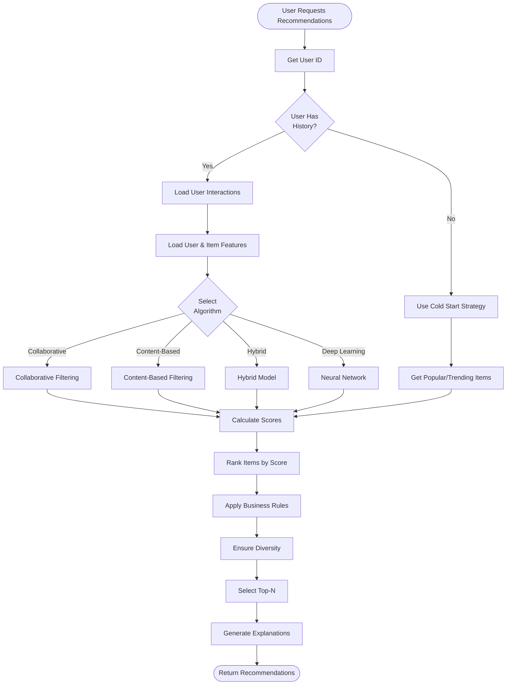
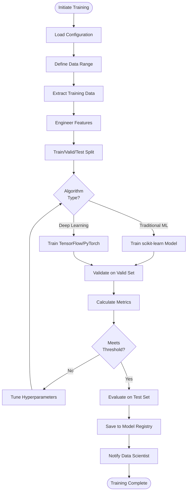
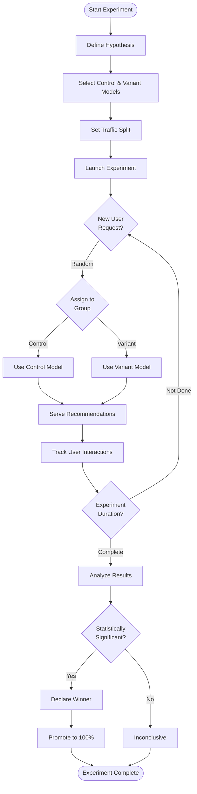
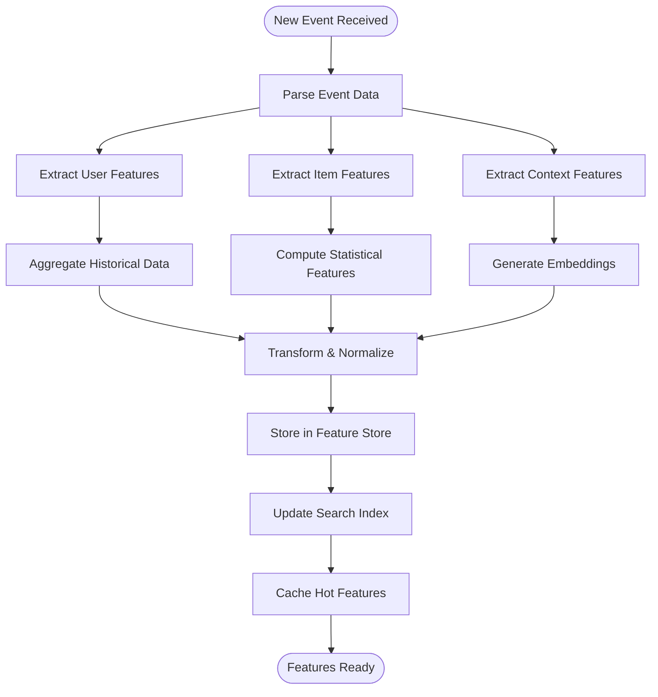
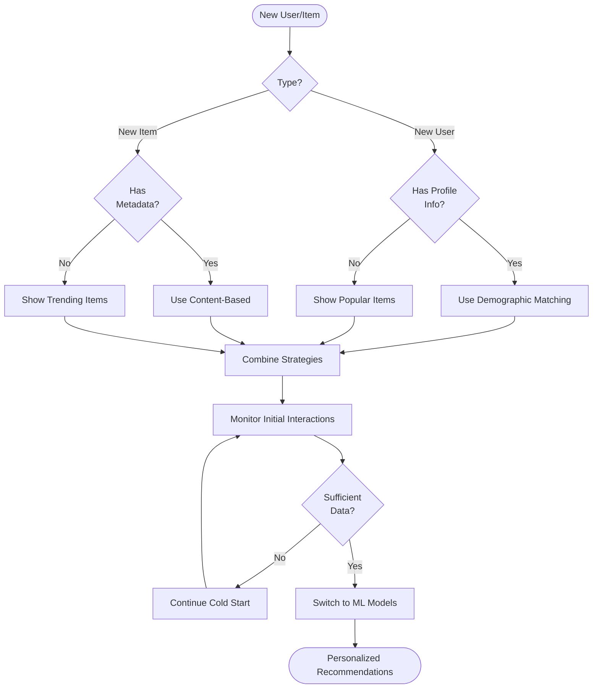

# Activity Diagram - Smart Recommendation Engine

> **Platform Independence**: Workflows shown are technology-agnostic.

---

## 1. Generate Recommendations Flow

---

## 2. Model Training Flow

---

## 3. A/B Testing Flow

---

## 4. Feature Engineering Flow

---

## 5. Cold Start Handling Flow

