# BPMN / Swimlane Diagram - Smart Recommendation Engine

> **Platform Independence**: Workflows show role-based interactions.

---

## 1. End-to-End Recommendation Lifecycle

```mermaid
flowchart TB
    subgraph User["👤 User Lane"]
        U1([Browse App]) --> U2[View Items]
        U2 --> U3[See Recommendations]
        U3 --> U4{Like Rec?}
        U4 -->|Yes| U5[Click/Interact]
        U4 -->|No| U6[Thumbs Down]
    end
    
    subgraph System["🖥️ Recommendation Engine"]
        S1[Track View Event]
        S2[Load User Profile]
        S3[Generate Recommendations]
        S4[Return Top-N]
        S5[Record Interaction]
        S6[Update Profile]
    end
    
    subgraph ML["🤖 ML Pipeline"]
        M1[Process Events]
        M2[Update Features]
        M3[Retrain Model]
    end
    
    U2 -.-> S1
    S1 --> S2
    S2 --> S3
    S3 --> S4
    S4 -.-> U3
    U5 -.-> S5
    U6 -.-> S6
    S5 --> M1
    S6 --> M1
    M1 --> M2
    M2 --> M3
```

---

## 2. Model Training & Deployment Workflow

```mermaid
flowchart LR
    subgraph DS["👨‍💻 Data Scientist"]
        DS1[Define Experiment]
        DS2[Review Results]
        DS3[Approve Deploy]
    end
    
    subgraph Train["⚙️ Training Pipeline"]
        T1[Load Data]
        T2[Train Model]
        T3[Evaluate]
        T4[Register Model]
    end
    
    subgraph Deploy["🚀 Deployment"]
        D1[A/B Test Setup]
        D2[Gradual Rollout]
        D3[Monitor Metrics]
    end
    
    subgraph Admin["👨‍💼 Admin"]
        A1[Review Metrics]
        A2[Promote/Rollback]
    end
    
    DS1 --> T1
    T1 --> T2
    T2 --> T3
    T3 --> T4
    T4 --> DS2
    DS2 --> DS3
    DS3 --> D1
    D1 --> D2
    D2 --> D3
    D3 --> A1
    A1 --> A2
```

---

## 3. Cold Start User Onboarding

```mermaid
flowchart TB
    subgraph NewUser["🆕 New User"]
        NU1([Sign Up])
        NU2[Complete Profile]
        NU3[Browse Items]
        NU4[First Interaction]
    end
    
    subgraph RecEngine["🤖 System"]
        RE1[Create User Profile]
        RE2[Show Popular Items]
        RE3[Track Behavior]
        RE4{Enough Data?}
        RE5[Switch to ML]
    end
    
    subgraph ML["🧠 ML Models"]
        ML1[Demographic Matching]
        ML2[Content-Based]
        ML3[Collaborative Filtering]
    end
    
    NU1 --> RE1
    RE1 --> ML1
    ML1 --> RE2
    RE2 -.-> NU2
    NU2 -.-> NU3
    NU3 -.-> RE3
    RE3 --> RE4
    RE4 -->|No| RE2
    RE4 -->|Yes| RE5
    RE5 --> ML3
    ML3 -.-> NU4
```

