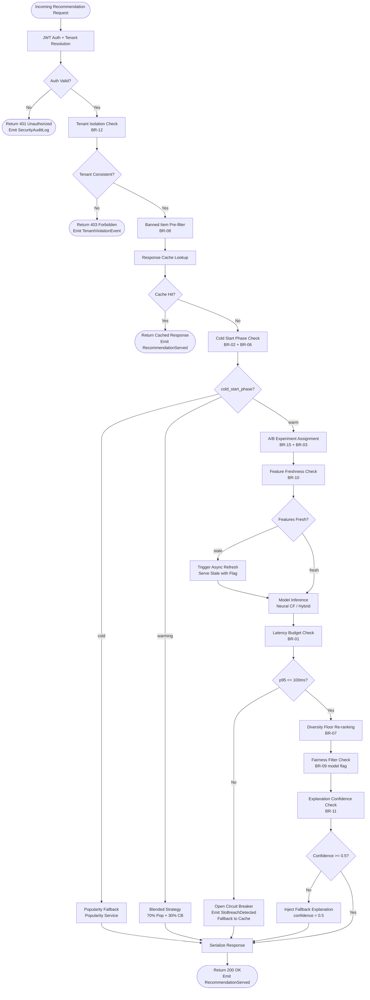

# Business Rules — Smart Recommendation Engine

**Version:** 1.0  
**Status:** Approved  
**Last Updated:** 2025-01-01  

---

## Table of Contents

1. [Overview](#1-overview)
2. [Enforceable Rules](#2-enforceable-rules)
3. [Rule Evaluation Pipeline](#3-rule-evaluation-pipeline)
4. [Exception and Override Handling](#4-exception-and-override-handling)
5. [Traceability Table](#5-traceability-table)

---

## 1. Overview

The Smart Recommendation Engine operates under a strict set of enforceable business rules that govern every phase of the recommendation lifecycle — from real-time request serving and model promotion to experiment management, fairness auditing, and GDPR compliance. These rules are not advisory guidelines; they are machine-enforced constraints embedded in the API gateway, model registry, feature store, A/B service, and the training pipeline.

Each rule has a unique identifier (`BR-XX`), a designated enforcer service, a clear trigger condition, deterministic action, and an explicit override policy. Rule failures generate structured audit events with decision trace IDs that feed the SRE observability stack and the compliance reporting dashboard.

Rules are grouped into five categories:

| Category | Description |
|---|---|
| **Performance** | Latency budgets, circuit breaker triggers, and SLO enforcement |
| **Cold Start** | Fallback policies for new users and new items |
| **Experiment** | A/B traffic allocation, mutual exclusion, and assignment stickiness |
| **Model Governance** | Promotion gates, fairness thresholds, and rollback triggers |
| **Data & Compliance** | Deduplication windows, retention limits, GDPR erasure, tenant isolation |

---

## 2. Enforceable Rules

---

### BR-01 — Real-time Latency Budget Enforcement

**Category:** Performance  
**Enforcer:** Recommendation API Gateway / SLO Monitor  
**Priority:** Critical — Safety Fence  

**Description:**  
Every recommendation response must be delivered within a strict end-to-end latency budget of 100 ms at p95, measured from the moment the request reaches the API gateway to the moment the serialized response leaves. The budget is allocated across the internal pipeline stages as follows:

| Stage | Budget |
|---|---|
| Auth + tenant isolation check | ≤ 5 ms |
| Feature retrieval (Redis fast path) | ≤ 15 ms |
| Nearest-neighbour index lookup | ≤ 25 ms |
| Ranking model inference | ≤ 30 ms |
| Diversity re-ranking + explanation | ≤ 20 ms |
| Serialization + response write | ≤ 5 ms |

**Trigger:** p95 latency > 100 ms over a rolling 60-second window as measured by the SLO Monitor.

**Action:**
1. Emit `SloBreachDetected` event with current p95, window timestamp, and tenant context.
2. Open circuit breaker for the affected model version.
3. Serve cached recommendations (TTL = 5 minutes) from the response cache tier.
4. Page the on-call SRE via PagerDuty.
5. Log `SLO_BREACH` entry in the security audit table.

**Rule Logic (pseudocode):**

```
on_request_complete(request, latency_ms):
  slo_window.record(latency_ms)

  if slo_window.p95() > 100:
    emit SloBreachDetected(p95=slo_window.p95(), tenant=request.tenant_id)
    circuit_breaker.open(model_version=request.model_version_id)
    return response_cache.get(request.user_id, request.slot_id)
      ?? popularity_fallback.get(request.slot_id, limit=request.limit)
```

**Exceptions:** Emergency maintenance windows declared by Platform Admin are exempt from SLO breach paging for up to 30 minutes. The breach is still logged.

---

### BR-02 — Cold Start Fallback Policy

**Category:** Cold Start  
**Enforcer:** Recommendation API Gateway / Cold Start Handler  
**Priority:** High  

**Description:**  
Users and items with insufficient interaction history cannot be reliably served by collaborative-filtering or neural models. This rule enforces graceful fallback to deterministic strategies that provide useful (if less personalized) recommendations while history accumulates.

**User cold-start threshold:** `interaction_count < 5` → `cold_start_phase = cold`  
**Warming threshold:** `5 ≤ interaction_count < 20` → `cold_start_phase = warming`  
**Full personalization threshold:** `interaction_count ≥ 20` → `cold_start_phase = warm`

**Item cold-start threshold:** `item_interaction_count < 10` → use attribute-similarity fallback  
**Item warm threshold:** `item_interaction_count ≥ 10` → eligible for collaborative filtering matrix

**Actions by phase:**

| Phase | Strategy |
|---|---|
| `cold` | Popularity-based (trending in same category/locale) |
| `warming` | Blend: 70% popularity + 30% content-based filtering |
| `warm` | Full personalized model (collaborative filtering or hybrid) |

**Rule Logic (pseudocode):**

```
serve_recommendations(user, slot, limit):
  phase = user.cold_start_phase

  if phase == "cold":
    return popularity_service.get_trending(
      category=user.preferred_category ?? slot.default_category,
      locale=user.country,
      limit=limit
    )

  if phase == "warming":
    popular = popularity_service.get_trending(limit=ceil(limit * 0.7))
    content  = content_based_service.get_similar_to_history(user, limit=floor(limit * 0.3))
    return merge_deduplicated(popular, content, limit=limit)

  # warm phase — full personalization
  return personalized_model.recommend(user, slot, limit)
```

**Post-interaction update:** After each interaction, re-evaluate `cold_start_phase` and emit `ColdStartTriggered` if the user transitions between phases.

---

### BR-03 — A/B Experiment Traffic Split Validation

**Category:** Experiment  
**Enforcer:** A/B Experiment Service (write path)  
**Priority:** High  

**Description:**  
Statistically valid A/B experiments require precise traffic allocation. Misconfigured splits produce biased results, waste traffic on under-powered variants, and invalidate significance tests. This rule enforces split integrity at experiment creation and modification time.

**Constraints:**
- The sum of all variant `traffic_split_pct` values must equal exactly `100.0`.
- Every variant must receive a minimum of `5%` of experiment traffic.
- Experiments that overlap in time and target the same user population must declare membership in a mutual exclusion group (see BR-15).
- Experiment-level `traffic_percentage` (proportion of total eligible users enrolled) must be between `1%` and `100%`.

**Rule Logic (pseudocode):**

```
validate_experiment(experiment):
  total = sum(v.traffic_split_pct for v in experiment.variants)
  if abs(total - 100.0) > 0.001:
    raise ExperimentValidationError(
      code="SPLIT_SUM_INVALID",
      detail=f"Variant splits sum to {total}, must be 100.0"
    )

  for variant in experiment.variants:
    if variant.traffic_split_pct < 5.0:
      raise ExperimentValidationError(
        code="VARIANT_TOO_SMALL",
        detail=f"Variant '{variant.name}' has {variant.traffic_split_pct}% < minimum 5%"
      )

  if experiment.traffic_percentage < 1.0 or experiment.traffic_percentage > 100.0:
    raise ExperimentValidationError(code="TRAFFIC_PCT_OUT_OF_RANGE")
```

**Exceptions:** Canary experiments targeting < 5% of traffic for smoke-testing new model versions may use a single variant with a Platform Admin override. Override must be logged with experiment_id, approver, and expiry.

---

### BR-04 — Model Version Promotion Gate

**Category:** Model Governance  
**Enforcer:** Model Registry / ML CI Pipeline  
**Priority:** Critical  

**Description:**  
A model version must pass a multi-stage gate before it is permitted to serve live traffic. Promoting an under-performing or biased model can silently degrade user experience and violate compliance requirements.

**Promotion gate checklist (all conditions must pass):**

| Gate | Threshold | Notes |
|---|---|---|
| NDCG@10 | ≥ 0.35 | Evaluated on held-out test set |
| Precision@10 | ≥ 0.25 | Evaluated on held-out test set |
| Hit Rate@10 | ≥ 0.45 | Evaluated on held-out test set |
| Shadow mode A/B duration | ≥ 72 hours | No production traffic impact |
| Fairness score (BR-09) | Passes all fairness thresholds | Mandatory before promotion |
| Test set definition | Last 20% of interactions by `occurred_at` | Time-based split mandatory |

**Rule Logic (pseudocode):**

```
promote_model(model_version):
  evaluation = evaluation_service.get(model_version.evaluation_result_id)

  if evaluation.ndcg_at_10 < 0.35:
    raise PromotionBlockedError("NDCG@10 below threshold")
  if evaluation.precision_at_10 < 0.25:
    raise PromotionBlockedError("Precision@10 below threshold")
  if evaluation.hit_rate_at_10 < 0.45:
    raise PromotionBlockedError("HitRate@10 below threshold")

  fairness = fairness_service.get_latest_audit(model_version.version_id)
  if not fairness.passes_threshold:
    raise PromotionBlockedError("Fairness audit failed — see BR-09")

  shadow_hours = (now() - model_version.shadow_started_at).hours
  if shadow_hours < 72:
    raise PromotionBlockedError(f"Shadow mode only {shadow_hours}h < required 72h")

  model_version.status = "approved"
  emit ModelVersionApproved(model_version_id=model_version.version_id)
```

**Exceptions:** A Platform Admin may bypass the shadow-mode duration requirement during a critical production incident. Bypass must include incident ticket ID and is logged as a high-severity audit event.

---

### BR-05 — Duplicate Interaction Deduplication Window

**Category:** Data & Compliance  
**Enforcer:** Interaction Collector (write path)  
**Priority:** Medium  

**Description:**  
Users can trigger rapid duplicate signals (double-clicks, page reloads, mobile scroll bounce). Counting these as distinct interactions inflates training signal and biases the model toward frequently triggered accidental events.

**Deduplication key:** `hash(user_id + item_id + interaction_type)`  
**Default window:** 5 minutes (configurable per tenant: 1–60 minutes)  
**Storage:** Redis key with TTL equal to the deduplication window  

**Actions:**
- If dedup key exists in Redis → mark interaction as `is_duplicate = true`, store record for audit, do **not** increment interaction count or emit `InteractionRecorded` to the training pipeline.
- If dedup key absent → create Redis key with TTL, set `is_duplicate = false`, emit `InteractionRecorded`.

**Rule Logic (pseudocode):**

```
record_interaction(interaction):
  dedup_key = f"dedup:{interaction.tenant_id}:{interaction.user_id}:{interaction.item_id}:{interaction.interaction_type}"
  window_ttl = tenant_config.get(interaction.tenant_id, "dedup_window_seconds", default=300)

  if redis.exists(dedup_key):
    interaction.is_duplicate = True
    db.insert(interaction)   # store for audit
    return InteractionResult(deduplicated=True)

  redis.set(dedup_key, "1", ex=window_ttl)
  interaction.is_duplicate = False
  db.insert(interaction)
  emit InteractionRecorded(interaction_id=interaction.interaction_id, ...)
  return InteractionResult(deduplicated=False)
```

---

### BR-06 — Minimum Interaction Count for Collaborative Filtering

**Category:** Cold Start / Model Governance  
**Enforcer:** Training Pipeline / Model Serving Layer  
**Priority:** High  

**Description:**  
Collaborative filtering (CF) requires a minimum density of user-item interactions to produce reliable similarity estimates. Sparse users and items generate noise-dominated embeddings that hurt recommendation quality.

**Thresholds:**
- User must have `interaction_count ≥ 5` to receive CF-based recommendations (else → BR-02 fallback).
- Item must appear in `≥ 3` unique user interactions to be included in the CF interaction matrix.
- Items below the threshold are served via content-based similarity (embedding distance on attribute vectors).

**Training pipeline enforcement:**
- CF matrix construction filters out users and items below thresholds before factorization.
- Items below threshold are still indexed in the nearest-neighbour index using attribute embeddings.
- Matrix recomputed daily; online incremental updates applied every 15 minutes for hot users/items.

---

### BR-07 — Diversity Score Floor

**Category:** Performance / Ranking  
**Enforcer:** Diversity Re-ranker (post-processing step)  
**Priority:** Medium  

**Description:**  
A recommendation slate composed entirely of highly similar items leads to "filter bubble" effects, reduces exploration, and lowers long-term user retention. This rule enforces a minimum diversity floor on every delivered slate.

**Constraints:**
- Intra-list diversity score `≥ 0.3` (measured as mean pairwise cosine distance between item embedding vectors in the slate).
- No more than `30%` of recommendations in a slate may share the same `category_path[0]` (top-level category).
- No more than `40%` of recommendations may share the same `brand` or `creator` attribute.

**Exceptions:**
- `"more like this"` slots (`placement = pdp`) may relax intra-list diversity to `≥ 0.15`.
- Diversity constraints are configurable per slot in `SlotConfig.diversity_config`.

**Rule Logic (pseudocode):**

```
apply_diversity_floor(candidates, slot_config, limit):
  config = slot_config.diversity_config
  min_diversity = config.get("min_intra_list_diversity", 0.3)
  max_category_pct = config.get("max_same_category_pct", 0.30)
  max_brand_pct    = config.get("max_same_brand_pct", 0.40)

  slate = diversity_reranker.mmr_rerank(
    candidates=candidates,
    lambda_param=0.5,
    target_size=limit
  )

  # enforce hard caps
  slate = enforce_category_cap(slate, max_category_pct, limit)
  slate = enforce_brand_cap(slate, max_brand_pct, limit)

  if intra_list_diversity(slate) < min_diversity:
    slate = inject_diverse_items(slate, min_diversity, candidates)

  return slate
```

---

### BR-08 — Banned Item List Enforcement

**Category:** Data & Compliance / Safety  
**Enforcer:** Item Retrieval Layer + Catalog Service  
**Priority:** Critical — Safety Fence  

**Description:**  
Items may be banned for legal, safety, or policy reasons (e.g., recalled products, copyright violations, policy violations). Banned items must never appear in any recommendation slate, regardless of model score.

**Enforcement point:** Banned item exclusion happens at the **retrieval stage** (ANN index query), not only at the ranking stage. This prevents banned items from even entering the candidate pool.

**Ban scopes:**
- `global` — applies across all tenants (e.g., regulatory requirement).
- `tenant` — applies only within the specified tenant's catalogs.

**SLA:** Banned item must be excluded from the ANN index within **60 seconds** of the ban record being created.

**Actions:**
- If a banned item somehow passes retrieval (race condition window), it is filtered at the ranking stage as a secondary defence.
- Any recommendation response that included a banned item (detected in audit) triggers a `SecurityAuditLog` entry with severity `HIGH`.

---

### BR-09 — Fairness Score Threshold Before Deployment

**Category:** Model Governance / Compliance  
**Enforcer:** Fairness Service / Model Registry  
**Priority:** Critical  

**Description:**  
Machine learning recommendation models can encode and amplify demographic biases present in historical interaction data. This rule mandates a fairness audit before any model version transitions from `approved` to `deployed` status.

**Thresholds:**

| Metric | Threshold | Protected Groups |
|---|---|---|
| Demographic Parity Difference | < 0.10 | gender, age_bucket, country |
| Equal Opportunity Difference | < 0.05 | gender, age_bucket |
| Individual Fairness Score | > 0.85 | all users |

**Audit requirements:**
- Audit must use interaction data from the **last 30 days**.
- Audit run must be completed **after** the model's evaluation result is recorded.
- If any threshold is not met, `ModelVersion.status` remains `approved` (blocked from `deployed`).
- A Platform Admin or Compliance Officer may issue a **documented manual override** (see §4) with a remediation plan and timeline.

---

### BR-10 — Feature Vector Freshness Check

**Category:** Performance / Data Quality  
**Enforcer:** Feature Store / Recommendation API Gateway  
**Priority:** High  

**Description:**  
Stale feature vectors cause the model to make recommendations based on outdated user preferences or item attributes, degrading quality silently.

**Freshness thresholds:**

| Entity | Stale After | Action on Stale |
|---|---|---|
| User feature vector | 24 hours | Serve with `feature_stale=true` flag; trigger async refresh |
| Item feature vector | 7 days | Serve with `feature_stale=true` flag; trigger async refresh |
| Feature service down | 48 hours max | Fall back to last-known-good vectors |

**Rule Logic (pseudocode):**

```
get_feature_vector(entity_id, entity_type):
  vector = feature_store.get(entity_id, entity_type)

  stale_threshold = 86400 if entity_type == "user" else 604800  # seconds

  if vector is None:
    trigger_async_feature_computation(entity_id, entity_type)
    return cold_start_fallback_vector(entity_id, entity_type)

  age_seconds = (now() - vector.computed_at).total_seconds()
  if age_seconds > stale_threshold:
    vector.is_stale = True
    trigger_async_feature_computation(entity_id, entity_type)

  if age_seconds > 172800:  # 48h — feature service down scenario
    raise FeatureServiceUnavailableError("Max stale window exceeded")

  return vector
```

---

### BR-11 — Explanation Confidence Minimum

**Category:** Ranking / UX  
**Enforcer:** Explanation Service / Recommendation API  
**Priority:** Medium  

**Description:**  
Displaying low-confidence or fabricated explanations erodes user trust and may violate transparency requirements in regulated markets.

**Constraints:**
- Explanations with `confidence_score < 0.5` must **not** be displayed to end users.
- Explanation generation must complete within **20 ms** (included in the 100 ms total budget from BR-01).
- Every recommendation in a displayed slate must have **at least one explanation factor**.
- If the primary explanation cannot be generated, serve the fallback: `"Recommended based on your activity"` with `confidence_score = 0.5`.

**Explanation factor types:** `collaborative_signal`, `content_similarity`, `trending_in_category`, `highly_rated`, `purchase_history`, `explicit_preference`.

---

### BR-12 — Tenant Isolation in Multi-tenant Mode

**Category:** Data & Compliance / Security  
**Enforcer:** All Services (enforced at ORM and query layer)  
**Priority:** Critical — Safety Fence  

**Description:**  
The platform serves multiple tenants from a shared infrastructure. Cross-tenant data leakage — even accidental — constitutes a data breach and may violate contractual and regulatory obligations.

**Constraints:**
- Every database query against tenant-scoped tables must include a `tenant_id` predicate.
- Training jobs must only access interaction records belonging to the requesting tenant.
- Feature vectors are tenant-scoped; cross-tenant feature vector reads are prohibited at the application layer and enforced by row-level security policies in PostgreSQL.
- ANN index partitions are tenant-scoped; a tenant's index query cannot return items from another tenant's catalog.

**Verification:** Tenant isolation is validated by an automated integration test suite that executes cross-tenant query attempts and asserts `0 rows returned`. This suite runs on every deployment.

---

### BR-13 — Model Rollback Trigger

**Category:** Model Governance / Resilience  
**Enforcer:** Model Registry / SLO Monitor  
**Priority:** Critical  

**Description:**  
A deployed model version that degrades user experience or system health must be automatically rolled back to the last stable version without requiring manual intervention.

**Automatic rollback triggers:**

| Condition | Window | Threshold |
|---|---|---|
| CTR drop vs. baseline | 1 hour rolling | > 20% relative drop |
| p95 latency | 5 minutes sustained | > 150 ms |
| Error rate | 2 minutes sustained | > 1% of requests |

**Manual rollback:** Any ML Engineer or Platform Admin may trigger a manual rollback at any time via the Model Registry API or the admin console.

**Retention:** The previous model version artifact and its configuration must be retained for a minimum of **30 days** to enable rollback. Version purge before 30 days requires a Platform Admin override.

**Rule Logic (pseudocode):**

```
evaluate_rollback(deployed_version, metrics):
  baseline = model_registry.get_baseline_metrics(deployed_version.model_id)

  ctr_drop = (baseline.ctr - metrics.ctr) / baseline.ctr
  if ctr_drop > 0.20 and metrics.window_hours >= 1:
    trigger_rollback(deployed_version, reason="CTR_DROP_EXCEEDED")
    return

  if metrics.p95_latency_ms > 150 and metrics.sustained_minutes >= 5:
    trigger_rollback(deployed_version, reason="LATENCY_SLO_BREACH")
    return

  if metrics.error_rate > 0.01 and metrics.sustained_minutes >= 2:
    trigger_rollback(deployed_version, reason="ERROR_RATE_EXCEEDED")
```

---

### BR-14 — Interaction Data Retention and GDPR Right to Erasure

**Category:** Data & Compliance  
**Enforcer:** Data Retention Service / GDPR Processor  
**Priority:** Critical — Legal Obligation  

**Description:**  
Interaction data is the lifeblood of model training, but it must be handled in accordance with GDPR Article 17 (Right to Erasure) and internal data retention policies.

**Retention limits:**
- Raw interaction records: maximum **2 years** from `occurred_at`.
- User feature vectors: deleted or anonymized when user account is deactivated or upon erasure request.
- Recommendation history: retained for **90 days** for personalisation; anonymized aggregate statistics retained indefinitely.

**GDPR erasure request handling:**
Upon receiving a `gdpr_erasure_requested_at` timestamp on a `UserProfile` record, the following must be deleted within **30 days**:

| Data Store | Records to Delete |
|---|---|
| PostgreSQL | interactions, feature vectors, recommendation history, A/B assignments, user profile |
| Redis | feature vector cache entries (by user_id prefix) |
| Offline feature store (S3/GCS) | All user-scoped Parquet partitions |
| ANN index | No action needed (item-scoped, not user-scoped) |

**Anonymized aggregates** (e.g., daily active user counts, category-level CTR) may be retained indefinitely as they contain no PII.

---

### BR-15 — Experiment Mutual Exclusion Enforcement

**Category:** Experiment  
**Enforcer:** A/B Experiment Service (assignment path)  
**Priority:** High  

**Description:**  
Running two simultaneous experiments on the same user can produce interaction effects that confound both experiments' results, making it impossible to draw statistically valid conclusions.

**Constraints:**
- A user cannot be simultaneously assigned to two active experiments that share the same `exclusion_group`.
- Exclusion groups are defined per experiment at creation time. Default = `null` (no exclusion).
- Assignment is **sticky**: once assigned to a variant, the user remains in that variant for the experiment's duration, even if they re-qualify for re-assignment.
- If an experiment is paused or concluded, users in that experiment revert to the control treatment for any new requests.

**Rule Logic (pseudocode):**

```
assign_user_to_experiment(user_id, experiment):
  if experiment.exclusion_group is not None:
    conflicting = assignment_store.get_active_assignments(
      user_id=user_id,
      exclusion_group=experiment.exclusion_group
    )
    if conflicting:
      return None  # user not assigned; served control treatment

  existing = assignment_store.get(user_id, experiment.experiment_id)
  if existing:
    return existing  # sticky re-use

  variant = sample_variant(experiment.variants, user_id)  # deterministic hash
  assignment = UserAssignment(
    user_id=user_id,
    experiment_id=experiment.experiment_id,
    variant_id=variant.variant_id,
    assigned_at=now(),
    is_sticky=True
  )
  assignment_store.save(assignment)
  return assignment
```

---

## 3. Rule Evaluation Pipeline

Every incoming recommendation request passes through a deterministic evaluation pipeline before a response is generated. The pipeline is structured as a series of gates: early gates are fast and cheap (auth, cache lookup), later gates involve heavier computation (model inference, diversity re-ranking).



### Pipeline Stage Descriptions

| Stage | Rule(s) | SLA |
|---|---|---|
| JWT Auth + Tenant Resolution | BR-12 | ≤ 5 ms |
| Banned Item Pre-filter | BR-08 | ≤ 2 ms (in-memory bloom filter) |
| Response Cache Lookup | BR-01 | ≤ 3 ms |
| Cold Start Check | BR-02, BR-06 | ≤ 1 ms |
| A/B Assignment | BR-15, BR-03 | ≤ 3 ms |
| Feature Freshness Check | BR-10 | ≤ 15 ms |
| Model Inference | BR-01, BR-04 | ≤ 30 ms |
| Diversity Re-ranking | BR-07 | ≤ 10 ms |
| Explanation Generation | BR-11 | ≤ 20 ms |

---

## 4. Exception and Override Handling

### 4.1 Override Governance Matrix

| Rule | Who Can Override | Override Requires | Max Duration |
|---|---|---|---|
| BR-01 (Latency SLO) | Platform Admin | Incident ticket ID | 30 minutes |
| BR-03 (Experiment split) | Platform Admin | Written justification | 1 experiment lifetime |
| BR-04 (Promotion gate — shadow mode) | Platform Admin | Incident ticket ID | 1 promotion event |
| BR-09 (Fairness threshold) | Compliance Officer + Platform Admin (dual approval) | Remediation plan with timeline | 14 days |
| BR-13 (Rollback trigger) | ML Engineer | Documented rationale | 1 deployment cycle |
| BR-14 (GDPR erasure deadline) | Legal + Data Protection Officer | Regulatory correspondence | Per DPA direction |
| All other BRs | Platform Admin | Written justification | 7 days |

### 4.2 Override Logging Requirements

Every override **must** be recorded in the `RuleOverrideLog` table with the following fields:

```
override_id        UUID        PK
rule_id            VARCHAR     e.g. "BR-04"
overridden_by      UUID        FK → UserProfile.user_id
approved_by        UUID        FK → UserProfile.user_id (second approver if required)
justification      TEXT        Free-form rationale
incident_ticket    VARCHAR     Optional link to incident management system
expires_at         TIMESTAMPTZ Override auto-expires at this time
tenant_id          UUID        Scope of override
created_at         TIMESTAMPTZ
revoked_at         TIMESTAMPTZ NULL if still active
```

### 4.3 Time-Limited Overrides

All overrides have a mandatory expiry timestamp. When an override expires:
1. The original rule constraint is automatically re-enforced.
2. A `RuleOverrideExpired` event is emitted to the compliance topic.
3. A follow-up task is created in the task management system for post-override review.

### 4.4 Emergency Bypass Procedure

In a production incident where a rule enforcement is causing wider system failure (e.g., BR-09 fairness check blocking an emergency model rollback):

1. **Declare incident** in the incident management system.
2. **Request emergency bypass** via the admin console (requires Platform Admin session).
3. **System logs** the bypass with incident ID, bypass actor, rule bypassed, and duration.
4. **Post-incident review** must be completed within 5 business days; findings fed back into rule configuration.

### 4.5 Audit Trail Requirements

The following must be queryable for compliance audits:
- All rule evaluations with pass/fail outcome, per request (stored in `RequestAuditLog`).
- All override events with full justification chain.
- All model promotion decisions with evaluation evidence.
- All GDPR erasure completions with per-store confirmation timestamps.

Audit logs are **immutable** (append-only) and retained for **7 years** in compliance with financial and data protection regulations.

---

## 5. Traceability Table

| Rule ID | Rule Name | Related Use Cases | Related FRs | Enforcer Service | Business Justification |
|---|---|---|---|---|---|
| BR-01 | Latency Budget | UC-Recommend | FR-PERF-01 | API Gateway, SLO Monitor | User retention; sub-100ms responses prevent abandonment |
| BR-02 | Cold Start Fallback | UC-NewUser, UC-NewItem | FR-COLD-01 | Recommendation API | Ensures new users/items receive useful recommendations |
| BR-03 | Experiment Split Validation | UC-Experiment | FR-EXP-01 | A/B Service | Statistical validity of A/B results |
| BR-04 | Model Promotion Gate | UC-ModelDeploy | FR-MLG-01 | Model Registry, ML CI | Prevents degraded models reaching production |
| BR-05 | Interaction Deduplication | UC-Collect | FR-DATA-01 | Interaction Collector | Training signal quality; prevents event inflation |
| BR-06 | CF Minimum Interactions | UC-Recommend | FR-COLD-01 | Training Pipeline | CF quality; prevents noisy sparse embeddings |
| BR-07 | Diversity Score Floor | UC-Recommend | FR-UX-01 | Diversity Re-ranker | User retention; prevents filter bubble |
| BR-08 | Banned Item Enforcement | UC-Safety | FR-SAFE-01 | Retrieval Layer | Legal compliance; safety |
| BR-09 | Fairness Threshold | UC-ModelDeploy | FR-FAIR-01 | Fairness Service | Regulatory compliance; ethical AI |
| BR-10 | Feature Freshness | UC-Recommend | FR-PERF-02 | Feature Store | Recommendation quality; staleness detection |
| BR-11 | Explanation Confidence | UC-Recommend | FR-UX-02 | Explanation Service | User trust; transparency |
| BR-12 | Tenant Isolation | UC-MultiTenant | FR-SEC-01 | All Services (ORM layer) | Data security; contractual compliance |
| BR-13 | Model Rollback | UC-ModelDeploy | FR-MLG-02 | Model Registry, SLO Monitor | Resilience; automatic recovery from degradation |
| BR-14 | Data Retention / GDPR | UC-GDPR | FR-COMP-01 | Data Retention Service | Legal obligation (GDPR Art. 17) |
| BR-15 | Experiment Mutual Exclusion | UC-Experiment | FR-EXP-02 | A/B Service | Statistical validity; prevents experiment interference |

---

*End of Business Rules Document*
