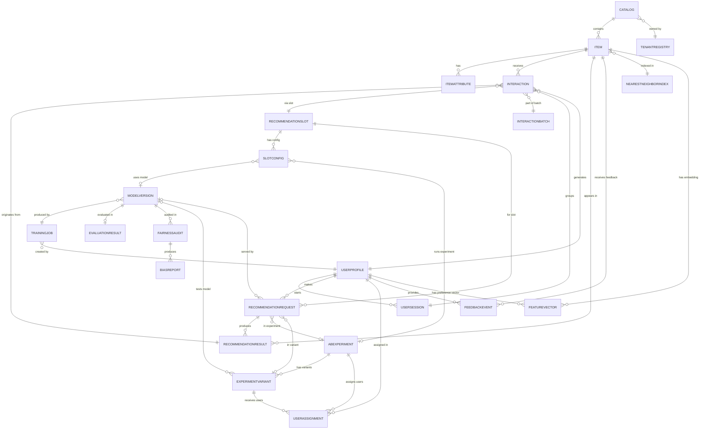

# Data Dictionary — Smart Recommendation Engine

**Version:** 1.0  
**Status:** Approved  
**Last Updated:** 2025-01-01  

---

## Table of Contents

1. [Overview](#1-overview)
2. [Core Entities](#2-core-entities)
3. [Canonical Relationship Diagram](#3-canonical-relationship-diagram)
4. [Data Quality Controls](#4-data-quality-controls)
5. [Retention and PII Classification](#5-retention-and-pii-classification)

---

## 1. Overview

This data dictionary is the canonical reference for all persistent data structures in the Smart Recommendation Engine platform. Every attribute is defined with its semantic type, nullability, validation constraints, and owning service. Teams must refer to this dictionary when building new API endpoints, analytics queries, ML feature pipelines, or data migrations.

### Notation

| Symbol | Meaning |
|---|---|
| `PK` | Primary key |
| `FK` | Foreign key |
| `UK` | Unique key / unique constraint |
| `IDX` | Indexed column |
| `ENUM(...)` | Controlled vocabulary — only listed values are valid |
| `JSONB` | Structured JSON stored in PostgreSQL JSONB column |
| `VECTOR(N)` | pgvector float32 array of dimension N |

---

## 2. Core Entities

---

### 2.1 Catalog

**Description:** Top-level container that groups items belonging to a single product vertical or content domain within a tenant. A tenant may operate multiple catalogs (e.g., "Electronics", "Books", "Movies").

**Owning service:** Catalog Service  
**Primary storage:** PostgreSQL `catalogs` table  

| Attribute | Type | Nullable | Description | Validation |
|---|---|---|---|---|
| `catalog_id` | UUID | No | PK — unique catalog identifier | UUIDv4 |
| `tenant_id` | UUID | No | FK → (external tenant registry); IDX | Must match authenticated tenant |
| `name` | VARCHAR(255) | No | Human-readable catalog name | Non-empty, unique per tenant |
| `description` | TEXT | Yes | Optional free-form description of catalog scope | Max 2000 chars |
| `domain` | VARCHAR(100) | No | Business domain tag (e.g., `ecommerce`, `media`, `news`) | Non-empty |
| `status` | ENUM | No | `active`, `inactive`, `archived` | Default `active` |
| `item_count` | INTEGER | No | Denormalised count of active items; updated async | `>= 0` |
| `embedding_model` | VARCHAR(255) | Yes | Identifier of the embedding model used for items in this catalog | Must match a registered model ID if set |
| `created_at` | TIMESTAMPTZ | No | Record creation timestamp | Set by server; immutable |
| `updated_at` | TIMESTAMPTZ | No | Last modification timestamp | Auto-updated on any change |

---

### 2.2 Item

**Description:** A single recommendable entity within a catalog — a product, article, video, course, or any domain object the engine can recommend.

**Owning service:** Catalog Service  
**Primary storage:** PostgreSQL `items` table  
**Secondary storage:** Nearest-neighbour index (embedding_vector), Elasticsearch (text search)  

| Attribute | Type | Nullable | Description | Validation |
|---|---|---|---|---|
| `item_id` | UUID | No | PK — unique item identifier | UUIDv4 |
| `catalog_id` | UUID | No | FK → Catalog.catalog_id; IDX | Must exist |
| `tenant_id` | UUID | No | FK (denormalised); IDX | Must match catalog's tenant_id |
| `external_id` | VARCHAR(512) | Yes | UK (per tenant) — client system's item ID | Unique per tenant if set |
| `title` | VARCHAR(1024) | No | Primary display title | Non-empty; max 1024 chars |
| `description` | TEXT | Yes | Full text description for content-based embeddings | Max 50,000 chars |
| `category_path` | VARCHAR[] | No | Array of category hierarchy segments (e.g., `["Electronics","Phones","Smartphones"]`) | Non-empty array |
| `tags` | VARCHAR[] | Yes | Free-form searchable tags | Max 100 tags; each max 100 chars |
| `status` | ENUM | No | `active`, `inactive`, `banned`, `archived` | Default `active` |
| `price` | NUMERIC(18,4) | Yes | Item price in the specified currency | `>= 0` if set |
| `currency` | CHAR(3) | Yes | ISO 4217 currency code | Must be valid ISO 4217 code |
| `availability` | ENUM | No | `in_stock`, `out_of_stock`, `preorder`, `discontinued` | Default `in_stock` |
| `metadata` | JSONB | Yes | Extensible key-value bag for domain-specific attributes | Must be valid JSON object |
| `embedding_vector` | VECTOR(768) | Yes | Dense embedding for nearest-neighbour retrieval | Dimension must match catalog's `embedding_model` |
| `embedding_model_version` | VARCHAR(128) | Yes | Version tag of the model that produced this embedding | Set when embedding_vector is populated |
| `embedding_generated_at` | TIMESTAMPTZ | Yes | Timestamp when the embedding was last computed | Must be set when embedding_vector is set |
| `created_at` | TIMESTAMPTZ | No | Record creation timestamp | Immutable |
| `updated_at` | TIMESTAMPTZ | No | Last modification timestamp | Auto-updated |

---

### 2.3 ItemAttribute

**Description:** Structured key-value attributes attached to an item for content-based filtering and faceted search. Complements the `metadata` JSONB field with type-safe, indexed attributes.

**Owning service:** Catalog Service  
**Primary storage:** PostgreSQL `item_attributes` table  

| Attribute | Type | Nullable | Description | Validation |
|---|---|---|---|---|
| `attribute_id` | UUID | No | PK | UUIDv4 |
| `item_id` | UUID | No | FK → Item.item_id; IDX | Must exist |
| `attribute_key` | VARCHAR(255) | No | Attribute name (e.g., `brand`, `author`, `duration_seconds`) | Non-empty; lowercase snake_case |
| `attribute_value` | TEXT | No | Serialised attribute value | Non-empty |
| `attribute_type` | ENUM | No | `string`, `number`, `boolean`, `list` | Controls how `attribute_value` is parsed |
| `is_indexed` | BOOLEAN | No | Whether this attribute is indexed for filter queries | Default `false` |
| `created_at` | TIMESTAMPTZ | No | Creation timestamp | Immutable |

---

### 2.4 UserProfile

**Description:** Represents a platform user within a tenant's user space. Stores preference vectors, cold-start phase, GDPR state, and demographic signals used for personalisation.

**Owning service:** Profile Service  
**Primary storage:** PostgreSQL `user_profiles` table  
**Secondary storage:** Redis (preference_vector cache), Offline feature store  

| Attribute | Type | Nullable | Description | Validation |
|---|---|---|---|---|
| `user_id` | UUID | No | PK — internal user identifier | UUIDv4 |
| `tenant_id` | UUID | No | FK (external); IDX | Must match authenticated tenant |
| `external_user_id` | VARCHAR(512) | No | UK (per tenant) — client system's user ID | Unique per tenant |
| `email_hash` | CHAR(64) | Yes | SHA-256 hash of email for cross-device matching | 64 hex chars if set; never store plaintext email |
| `age_bucket` | ENUM | Yes | `under_18`, `18_24`, `25_34`, `35_44`, `45_54`, `55_64`, `65_plus` | Coarse bucketing — not exact age |
| `gender` | ENUM | Yes | `male`, `female`, `non_binary`, `prefer_not_to_say` | |
| `country` | CHAR(2) | Yes | ISO 3166-1 alpha-2 country code | Must be valid ISO country code |
| `language` | VARCHAR(10) | Yes | BCP 47 language tag (e.g., `en-US`, `fr-FR`) | Valid BCP 47 tag |
| `device_type` | ENUM | Yes | `mobile`, `desktop`, `tablet`, `tv`, `other` | |
| `registration_date` | DATE | No | Date the user account was created in the client system | Must not be in the future |
| `last_active_at` | TIMESTAMPTZ | Yes | Timestamp of most recent interaction | Updated async on each interaction |
| `interaction_count` | INTEGER | No | Total non-duplicate interaction count; used for cold-start phase | `>= 0`; default 0 |
| `preference_vector` | VECTOR(128) | Yes | Compressed preference embedding from the latest trained model | Dimension 128 (configurable per tenant) |
| `preference_model_version` | VARCHAR(128) | Yes | Version tag of the model that produced preference_vector | Set when preference_vector is set |
| `cold_start_phase` | ENUM | No | `cold`, `warming`, `warm` — see BR-02 | Default `cold` |
| `gdpr_erasure_requested_at` | TIMESTAMPTZ | Yes | Timestamp when GDPR erasure request was received | Triggers 30-day erasure clock |
| `status` | ENUM | No | `active`, `suspended`, `anonymized`, `deleted` | Default `active` |
| `created_at` | TIMESTAMPTZ | No | Record creation timestamp | Immutable |
| `updated_at` | TIMESTAMPTZ | No | Last modification timestamp | Auto-updated |

---

### 2.5 UserSession

**Description:** A bounded interaction session for a user on a specific device/platform. Used for session-based recommendation algorithms and funnel analytics.

**Owning service:** Interaction Collector  
**Primary storage:** PostgreSQL `user_sessions` table  

| Attribute | Type | Nullable | Description | Validation |
|---|---|---|---|---|
| `session_id` | UUID | No | PK | UUIDv4 |
| `user_id` | UUID | No | FK → UserProfile.user_id; IDX | Must exist |
| `tenant_id` | UUID | No | IDX | Must match user's tenant |
| `started_at` | TIMESTAMPTZ | No | Session start timestamp | Immutable |
| `ended_at` | TIMESTAMPTZ | Yes | Session end timestamp; NULL if session still active | Must be >= started_at |
| `device_type` | ENUM | Yes | `mobile`, `desktop`, `tablet`, `tv`, `other` | |
| `platform` | VARCHAR(100) | Yes | Platform name (e.g., `ios`, `android`, `web`, `smart_tv`) | |
| `ip_hash` | CHAR(64) | Yes | SHA-256 hash of IP address; never store raw IP | 64 hex chars if set |
| `referrer` | VARCHAR(2048) | Yes | HTTP referrer URL or UTM-attributed source | |
| `page_count` | INTEGER | No | Number of pages viewed in session | `>= 0`; default 0 |
| `interaction_count` | INTEGER | No | Number of non-duplicate interactions in session | `>= 0`; default 0 |

---

### 2.6 Interaction

**Description:** A single recorded user-item interaction event. The primary training signal for the recommendation engine. Covers explicit signals (ratings, reviews) and implicit signals (views, clicks, dwell time, dismissals).

**Owning service:** Interaction Collector  
**Primary storage:** PostgreSQL `interactions` table (partitioned by `occurred_at` month)  
**Secondary storage:** Kafka topic `interactions.recorded.v1` (stream)  

| Attribute | Type | Nullable | Description | Validation |
|---|---|---|---|---|
| `interaction_id` | UUID | No | PK | UUIDv4 |
| `user_id` | UUID | No | FK → UserProfile.user_id; IDX | Must exist |
| `item_id` | UUID | No | FK → Item.item_id; IDX | Must exist |
| `tenant_id` | UUID | No | IDX | Must match user's and item's tenant |
| `session_id` | UUID | Yes | FK → UserSession.session_id | If set, must exist |
| `interaction_type` | ENUM | No | `view`, `click`, `cart`, `purchase`, `rating`, `review`, `dwell`, `share`, `dismiss` | |
| `interaction_value` | NUMERIC(10,4) | Yes | Quantitative value: rating (1–5) or dwell time in seconds | Range-validated per interaction_type |
| `recommendation_id` | UUID | Yes | FK → RecommendationResult.result_id — null if organic | If set, must exist |
| `slot_id` | UUID | Yes | FK → RecommendationSlot.slot_id — the slot this interaction originated from | |
| `occurred_at` | TIMESTAMPTZ | No | Wall-clock time the interaction occurred; IDX | Must not be in the future |
| `is_organic` | BOOLEAN | No | `true` if interaction was not initiated from a recommendation slate | Default `false` |
| `is_duplicate` | BOOLEAN | No | `true` if flagged as duplicate by BR-05 deduplication | Default `false` |
| `processed_at` | TIMESTAMPTZ | Yes | Timestamp when the interaction was processed by the training pipeline | |

---

### 2.7 InteractionBatch

**Description:** Metadata record for a bulk interaction import operation. Tracks provenance and processing outcome of batch ingest jobs from external systems.

**Owning service:** Interaction Collector (batch path)  
**Primary storage:** PostgreSQL `interaction_batches` table  

| Attribute | Type | Nullable | Description | Validation |
|---|---|---|---|---|
| `batch_id` | UUID | No | PK | UUIDv4 |
| `tenant_id` | UUID | No | IDX | |
| `source_system` | VARCHAR(255) | No | Identifier of the upstream system submitting the batch | Non-empty |
| `record_count` | INTEGER | No | Total records submitted | `>= 1` |
| `success_count` | INTEGER | No | Records successfully ingested | `>= 0`; `<= record_count` |
| `failure_count` | INTEGER | No | Records that failed validation or ingestion | `>= 0`; `success_count + failure_count <= record_count` |
| `status` | ENUM | No | `pending`, `processing`, `completed`, `partial`, `failed` | |
| `submitted_at` | TIMESTAMPTZ | No | When batch was received by the collector | Immutable |
| `processed_at` | TIMESTAMPTZ | Yes | When batch processing completed | |

---

### 2.8 RecommendationRequest

**Description:** A record of each recommendation API call. Captures the full context, configuration, and serving outcome for analytics, debugging, and A/B experiment attribution.

**Owning service:** Recommendation API  
**Primary storage:** PostgreSQL `recommendation_requests` table (partitioned by `requested_at` day)  

| Attribute | Type | Nullable | Description | Validation |
|---|---|---|---|---|
| `request_id` | UUID | No | PK | UUIDv4 |
| `tenant_id` | UUID | No | IDX | |
| `user_id` | UUID | No | FK → UserProfile.user_id; IDX | |
| `slot_id` | UUID | No | FK → RecommendationSlot.slot_id; IDX | |
| `context` | JSONB | Yes | Request context: page URL, device, geo, search query, cart contents, etc. | Valid JSON object |
| `filters` | JSONB | Yes | Client-supplied item filters (category, price range, availability) | Valid JSON object |
| `limit` | SMALLINT | No | Number of recommendations requested | `1–100`; default 10 |
| `algorithm_override` | VARCHAR(100) | Yes | Client-requested algorithm override (for testing); requires API flag | |
| `experiment_id` | UUID | Yes | FK → ABExperiment.experiment_id — experiment this request was assigned to | |
| `variant_id` | UUID | Yes | FK → ExperimentVariant.variant_id | |
| `requested_at` | TIMESTAMPTZ | No | Request receipt timestamp; IDX | Immutable |
| `served_at` | TIMESTAMPTZ | Yes | Timestamp when response was sent | >= requested_at |
| `latency_ms` | SMALLINT | Yes | End-to-end latency in milliseconds | `>= 0` |
| `model_version_id` | UUID | Yes | FK → ModelVersion.version_id — model that served this request | |
| `feature_vector_age_seconds` | INTEGER | Yes | Age of user feature vector at serve time | `>= 0` |
| `status` | ENUM | No | `success`, `fallback_cache`, `fallback_popularity`, `error` | |

---

### 2.9 RecommendationResult

**Description:** Each individual recommended item that was part of a served recommendation slate. One `RecommendationRequest` produces N `RecommendationResult` rows (one per recommended item).

**Owning service:** Recommendation API  
**Primary storage:** PostgreSQL `recommendation_results` table  

| Attribute | Type | Nullable | Description | Validation |
|---|---|---|---|---|
| `result_id` | UUID | No | PK | UUIDv4 |
| `request_id` | UUID | No | FK → RecommendationRequest.request_id; IDX | |
| `item_id` | UUID | No | FK → Item.item_id; IDX | |
| `rank` | SMALLINT | No | 1-based position in the recommendation slate | `>= 1` |
| `score` | FLOAT | No | Raw model score before re-ranking | Any float |
| `algorithm` | VARCHAR(100) | No | Algorithm that produced this score (e.g., `two_tower`, `collaborative_filtering`) | |
| `explanation_text` | TEXT | Yes | Human-readable explanation for this recommendation | Max 500 chars |
| `explanation_factors` | JSONB | Yes | Structured explanation factors — see BR-11 | Valid JSON array |
| `confidence_score` | FLOAT | No | Explanation confidence — see BR-11 | `0.0–1.0` |
| `served_at` | TIMESTAMPTZ | No | Timestamp this result was served | |
| `clicked_at` | TIMESTAMPTZ | Yes | Timestamp if item was clicked from this recommendation | >= served_at |
| `converted_at` | TIMESTAMPTZ | Yes | Timestamp if item resulted in a purchase/conversion from this recommendation | >= clicked_at if set |
| `diversity_contribution` | FLOAT | Yes | This item's contribution to intra-list diversity score | `0.0–1.0` |

---

### 2.10 RecommendationSlot

**Description:** A logical placement configuration that defines where and how recommendations appear in the product UI (homepage carousel, product page, cart cross-sell, email digest, etc.).

**Owning service:** Slot Configuration Service  
**Primary storage:** PostgreSQL `recommendation_slots` table  

| Attribute | Type | Nullable | Description | Validation |
|---|---|---|---|---|
| `slot_id` | UUID | No | PK | UUIDv4 |
| `tenant_id` | UUID | No | IDX | |
| `name` | VARCHAR(255) | No | Human-readable slot name (e.g., `Homepage Top Row`) | Unique per tenant |
| `placement` | ENUM | No | `homepage`, `pdp`, `cart`, `search`, `email`, `sidebar`, `push_notification` | |
| `description` | TEXT | Yes | Purpose and UX context of this slot | |
| `default_limit` | SMALLINT | No | Default number of recommendations for this slot | `1–100` |
| `algorithm_config` | JSONB | No | Default algorithm configuration and weights for this slot | Valid JSON object |
| `diversity_config` | JSONB | No | Diversity constraints — see BR-07 | Valid JSON object |
| `explanation_enabled` | BOOLEAN | No | Whether explanations are displayed for this slot | Default `true` |
| `created_at` | TIMESTAMPTZ | No | Creation timestamp | Immutable |
| `updated_at` | TIMESTAMPTZ | No | Last modification timestamp | Auto-updated |

---

### 2.11 SlotConfig

**Description:** An active configuration version bound to a slot, optionally linking a model version, experiment, and boost/bury rules. Supports blue-green configuration updates without slot recreation.

**Owning service:** Slot Configuration Service  
**Primary storage:** PostgreSQL `slot_configs` table  

| Attribute | Type | Nullable | Description | Validation |
|---|---|---|---|---|
| `config_id` | UUID | No | PK | UUIDv4 |
| `slot_id` | UUID | No | FK → RecommendationSlot.slot_id; IDX | |
| `tenant_id` | UUID | No | IDX | |
| `model_version_id` | UUID | Yes | FK → ModelVersion.version_id — override default model for this slot | |
| `experiment_id` | UUID | Yes | FK → ABExperiment.experiment_id — experiment running on this slot | |
| `is_active` | BOOLEAN | No | Only one config per slot can be active at a time | Default `false` |
| `filters` | JSONB | Yes | Static filters applied to all recommendations from this config | |
| `boost_rules` | JSONB | Yes | Rules to boost items matching criteria (e.g., new arrivals, sponsored) | |
| `bury_rules` | JSONB | Yes | Rules to demote items matching criteria (e.g., out-of-stock, low-margin) | |
| `created_at` | TIMESTAMPTZ | No | Creation timestamp | Immutable |
| `updated_at` | TIMESTAMPTZ | No | Last modification timestamp | Auto-updated |

---

### 2.12 ModelVersion

**Description:** A specific trained artefact of a recommendation model. Tracks the full lifecycle from training through evaluation, deployment, and potential rollback.

**Owning service:** Model Registry  
**Primary storage:** PostgreSQL `model_versions` table  
**Secondary storage:** Object store (artifact_uri → S3/GCS)  

| Attribute | Type | Nullable | Description | Validation |
|---|---|---|---|---|
| `version_id` | UUID | No | PK | UUIDv4 |
| `model_id` | UUID | No | Logical model identifier grouping versions; IDX | |
| `tenant_id` | UUID | No | IDX | |
| `algorithm` | ENUM | No | `collaborative_filtering`, `content_based`, `hybrid`, `neural_cf`, `bert4rec`, `two_tower` | |
| `version_tag` | VARCHAR(64) | No | Human-readable version (e.g., `v2.3.1`, `2025-01-15`) | Unique per model_id |
| `status` | ENUM | No | `training`, `trained`, `evaluating`, `approved`, `deployed`, `deprecated`, `rolled_back` | |
| `artifact_uri` | TEXT | Yes | URI to the serialised model artefact in object storage | Set when status = `trained` |
| `training_job_id` | UUID | Yes | FK → TrainingJob.job_id | |
| `evaluation_result_id` | UUID | Yes | FK → EvaluationResult.evaluation_id | |
| `promoted_at` | TIMESTAMPTZ | Yes | Timestamp when model was approved for deployment | |
| `deployed_at` | TIMESTAMPTZ | Yes | Timestamp when model was deployed to production | |
| `rolled_back_at` | TIMESTAMPTZ | Yes | Timestamp of rollback if applicable | |
| `rollback_reason` | TEXT | Yes | Human-readable rollback reason; required if `rolled_back_at` is set | |
| `created_at` | TIMESTAMPTZ | No | Creation timestamp | Immutable |

---

### 2.13 TrainingJob

**Description:** An execution of the model training pipeline for a specific algorithm and data window. Captures hyperparameters, status, and output metrics.

**Owning service:** Training Pipeline  
**Primary storage:** PostgreSQL `training_jobs` table  

| Attribute | Type | Nullable | Description | Validation |
|---|---|---|---|---|
| `job_id` | UUID | No | PK | UUIDv4 |
| `tenant_id` | UUID | No | IDX | |
| `model_id` | UUID | No | Logical model identifier; IDX | |
| `algorithm` | ENUM | No | Same ENUM as ModelVersion.algorithm | |
| `hyperparameters` | JSONB | No | Full hyperparameter configuration snapshot | Valid JSON object; immutable after job start |
| `training_data_start` | TIMESTAMPTZ | No | Start of the interaction data window used for training | |
| `training_data_end` | TIMESTAMPTZ | No | End of the interaction data window | Must be > training_data_start |
| `status` | ENUM | No | `queued`, `running`, `completed`, `failed`, `cancelled` | |
| `started_at` | TIMESTAMPTZ | Yes | Job execution start | |
| `completed_at` | TIMESTAMPTZ | Yes | Job completion timestamp | >= started_at if set |
| `error_message` | TEXT | Yes | Error details if status = `failed` | |
| `artifact_uri` | TEXT | Yes | Object store URI for the trained model artefact | Set when status = `completed` |
| `metrics` | JSONB | Yes | Training-time metrics (loss curves, epoch count, training NDCG) | |
| `created_by` | UUID | No | FK → UserProfile.user_id — who triggered the training job | |

---

### 2.14 EvaluationResult

**Description:** Offline evaluation metrics for a trained model version. Contains ranking quality metrics, coverage, fairness pass/fail, and the threshold verdict used by the promotion gate (BR-04).

**Owning service:** Evaluation Service  
**Primary storage:** PostgreSQL `evaluation_results` table  

| Attribute | Type | Nullable | Description | Validation |
|---|---|---|---|---|
| `evaluation_id` | UUID | No | PK | UUIDv4 |
| `model_version_id` | UUID | No | FK → ModelVersion.version_id; UK | One evaluation per version |
| `dataset_description` | TEXT | No | Description of the test set (e.g., "Last 20% of interactions by time") | |
| `ndcg_at_10` | FLOAT | No | Normalised Discounted Cumulative Gain at rank 10 | `0.0–1.0` |
| `map_at_10` | FLOAT | No | Mean Average Precision at rank 10 | `0.0–1.0` |
| `precision_at_10` | FLOAT | No | Precision at rank 10 | `0.0–1.0` |
| `recall_at_10` | FLOAT | No | Recall at rank 10 | `0.0–1.0` |
| `hit_rate_at_10` | FLOAT | No | Hit Rate (Recall@1) at rank 10 | `0.0–1.0` |
| `mrr` | FLOAT | No | Mean Reciprocal Rank | `0.0–1.0` |
| `auc_roc` | FLOAT | No | Area Under ROC Curve for click prediction | `0.0–1.0` |
| `coverage` | FLOAT | No | Catalogue coverage — % of items appearing in top-N recommendations | `0.0–1.0` |
| `intra_list_diversity` | FLOAT | No | Mean pairwise diversity of recommendation slates | `0.0–1.0` |
| `serendipity` | FLOAT | Yes | Serendipity score — unexpectedness weighted by relevance | `0.0–1.0` |
| `novelty` | FLOAT | Yes | Mean inverse popularity of recommended items | `>= 0.0` |
| `evaluated_at` | TIMESTAMPTZ | No | Evaluation completion timestamp | Immutable |
| `passes_threshold` | BOOLEAN | No | Whether all promotion gate thresholds are met (BR-04) | Computed by Evaluation Service |

---

### 2.15 ABExperiment

**Description:** Configuration record for an A/B (or multi-variant) recommendation experiment. Defines traffic allocation, statistical parameters, and lifecycle timestamps.

**Owning service:** A/B Experiment Service  
**Primary storage:** PostgreSQL `ab_experiments` table  

| Attribute | Type | Nullable | Description | Validation |
|---|---|---|---|---|
| `experiment_id` | UUID | No | PK | UUIDv4 |
| `tenant_id` | UUID | No | IDX | |
| `name` | VARCHAR(255) | No | UK (per tenant) — experiment name | |
| `description` | TEXT | Yes | Purpose and hypothesis summary | |
| `hypothesis` | TEXT | Yes | Formal statistical hypothesis being tested | |
| `status` | ENUM | No | `draft`, `running`, `paused`, `concluded`, `archived` | |
| `traffic_percentage` | FLOAT | No | Proportion of eligible users enrolled in experiment | `1.0–100.0` |
| `exclusion_group` | VARCHAR(255) | Yes | Mutual exclusion group identifier — see BR-15 | |
| `start_date` | TIMESTAMPTZ | Yes | Scheduled start; required when status transitions to `running` | |
| `end_date` | TIMESTAMPTZ | Yes | Scheduled end; experiment auto-concludes if reached | >= start_date if set |
| `concluded_at` | TIMESTAMPTZ | Yes | Actual conclusion timestamp | |
| `primary_metric` | VARCHAR(100) | No | Primary success metric (e.g., `click_through_rate`, `conversion_rate`) | |
| `minimum_detectable_effect` | FLOAT | Yes | MDE for power analysis | `0.0–1.0` |
| `significance_level` | FLOAT | Yes | Alpha (Type I error rate) | Default `0.05` |
| `power` | FLOAT | Yes | Statistical power (1 - Beta) | Default `0.80` |
| `winning_variant_id` | UUID | Yes | FK → ExperimentVariant.variant_id — set when concluded | |
| `created_by` | UUID | No | FK → UserProfile.user_id | |
| `created_at` | TIMESTAMPTZ | No | Creation timestamp | Immutable |

---

### 2.16 ExperimentVariant

**Description:** A single treatment arm within an A/B experiment. Specifies the model version and algorithm configuration to use for users assigned to this variant.

**Owning service:** A/B Experiment Service  
**Primary storage:** PostgreSQL `experiment_variants` table  

| Attribute | Type | Nullable | Description | Validation |
|---|---|---|---|---|
| `variant_id` | UUID | No | PK | UUIDv4 |
| `experiment_id` | UUID | No | FK → ABExperiment.experiment_id; IDX | |
| `name` | VARCHAR(255) | No | Variant name (e.g., `control`, `treatment_a`) | Unique per experiment |
| `description` | TEXT | Yes | What this variant tests | |
| `is_control` | BOOLEAN | No | `true` for the control (baseline) arm | Exactly one control per experiment |
| `traffic_split_pct` | FLOAT | No | % of experiment traffic assigned to this variant — see BR-03 | `5.0–95.0`; sum across experiment = 100.0 |
| `model_version_id` | UUID | Yes | FK → ModelVersion.version_id — override model for this variant | |
| `algorithm_config` | JSONB | Yes | Algorithm-level overrides specific to this variant | |
| `created_at` | TIMESTAMPTZ | No | Creation timestamp | Immutable |

---

### 2.17 UserAssignment

**Description:** Records which experiment variant a user was assigned to. Sticky by design — the same user always receives the same variant for the duration of the experiment.

**Owning service:** A/B Experiment Service  
**Primary storage:** PostgreSQL `user_assignments` table  

| Attribute | Type | Nullable | Description | Validation |
|---|---|---|---|---|
| `assignment_id` | UUID | No | PK | UUIDv4 |
| `user_id` | UUID | No | FK → UserProfile.user_id; IDX | |
| `experiment_id` | UUID | No | FK → ABExperiment.experiment_id; IDX | |
| `variant_id` | UUID | No | FK → ExperimentVariant.variant_id | |
| `assigned_at` | TIMESTAMPTZ | No | Assignment timestamp | Immutable |
| `is_sticky` | BOOLEAN | No | Always `true` in current implementation | Default `true` |

---

### 2.18 FeatureVector

**Description:** A computed feature representation for a user or item entity, stored in the feature store and served during real-time recommendation requests.

**Owning service:** Feature Store  
**Primary storage:** PostgreSQL `feature_vectors` table (metadata); Redis (hot cache); Parquet files in object store (offline)  

| Attribute | Type | Nullable | Description | Validation |
|---|---|---|---|---|
| `vector_id` | UUID | No | PK | UUIDv4 |
| `entity_id` | UUID | No | User or item ID; IDX | |
| `entity_type` | ENUM | No | `user`, `item` | |
| `tenant_id` | UUID | No | IDX | |
| `feature_set_name` | VARCHAR(255) | No | Named feature set (e.g., `user_behavioral_v3`, `item_semantic_v2`) | |
| `vector_dimension` | SMALLINT | No | Dimension of the feature vector | Must match actual vector length |
| `vector_data` | JSONB | No | Serialised float array (stored as JSON array for portability) | Non-empty array of floats |
| `feature_version` | VARCHAR(64) | No | Version of the feature pipeline that produced this vector | |
| `computed_at` | TIMESTAMPTZ | No | Computation timestamp — used for freshness check (BR-10) | Immutable |
| `expires_at` | TIMESTAMPTZ | No | Explicit expiry timestamp derived from staleness thresholds | computed_at + threshold |
| `is_stale` | BOOLEAN | No | Derived flag: `true` if `now() > expires_at` | Computed at read time |

---

### 2.19 NearestNeighborIndex

**Description:** Metadata about an ANN (Approximate Nearest Neighbour) index built over item embeddings, used for fast candidate retrieval during recommendation serving.

**Owning service:** Retrieval Service  
**Primary storage:** PostgreSQL `nn_indexes` table; index artefact in object store  

| Attribute | Type | Nullable | Description | Validation |
|---|---|---|---|---|
| `index_id` | UUID | No | PK | UUIDv4 |
| `tenant_id` | UUID | No | IDX | |
| `item_type` | VARCHAR(100) | No | Category or type of items in this index | |
| `algorithm` | ENUM | No | `faiss`, `qdrant`, `annoy`, `hnsw` | |
| `index_uri` | TEXT | No | Object store URI for the serialised index | |
| `vector_dimension` | SMALLINT | No | Embedding dimension this index was built with | Must match item embeddings |
| `item_count` | INTEGER | No | Number of items indexed | `>= 0` |
| `build_time_seconds` | FLOAT | Yes | Wall-clock seconds to build this index | |
| `built_at` | TIMESTAMPTZ | No | Index build completion timestamp | Immutable |
| `status` | ENUM | No | `building`, `active`, `stale`, `deprecated` | |

---

### 2.20 FeedbackEvent

**Description:** Explicit negative or positive feedback provided by a user about a recommendation (thumbs down, "not interested", report). Used to update preference models and filter future recommendations.

**Owning service:** Feedback Service  
**Primary storage:** PostgreSQL `feedback_events` table  

| Attribute | Type | Nullable | Description | Validation |
|---|---|---|---|---|
| `feedback_id` | UUID | No | PK | UUIDv4 |
| `user_id` | UUID | No | FK → UserProfile.user_id; IDX | |
| `item_id` | UUID | No | FK → Item.item_id; IDX | |
| `tenant_id` | UUID | No | IDX | |
| `request_id` | UUID | Yes | FK → RecommendationRequest.request_id — if feedback is on a recommendation | |
| `feedback_type` | ENUM | No | `explicit_like`, `explicit_dislike`, `not_interested`, `report` | |
| `occurred_at` | TIMESTAMPTZ | No | When feedback was recorded | Immutable |
| `processed_at` | TIMESTAMPTZ | Yes | When feedback was processed by the preference model update pipeline | |

---

### 2.21 FairnessAudit

**Description:** Result of a fairness evaluation of a model version across protected demographic groups, required by BR-09 before deployment.

**Owning service:** Fairness Service  
**Primary storage:** PostgreSQL `fairness_audits` table  

| Attribute | Type | Nullable | Description | Validation |
|---|---|---|---|---|
| `audit_id` | UUID | No | PK | UUIDv4 |
| `tenant_id` | UUID | No | IDX | |
| `model_version_id` | UUID | No | FK → ModelVersion.version_id; IDX | |
| `audit_date` | DATE | No | Date the audit was conducted | |
| `demographic_parity_difference` | FLOAT | No | Max DPD across all protected groups — threshold < 0.10 | `0.0–1.0` |
| `equalized_odds_difference` | FLOAT | No | Max EOD across all protected groups — threshold < 0.05 | `0.0–1.0` |
| `individual_fairness_score` | FLOAT | No | Individual fairness metric — threshold > 0.85 | `0.0–1.0` |
| `protected_attributes_checked` | JSONB | No | List of protected attributes included in audit | Non-empty JSON array |
| `passes_threshold` | BOOLEAN | No | `true` if all fairness thresholds are met (BR-09) | Computed by Fairness Service |
| `audited_by` | UUID | No | FK → UserProfile.user_id — analyst who ran the audit | |
| `completed_at` | TIMESTAMPTZ | No | Audit completion timestamp | Immutable |

---

### 2.22 BiasReport

**Description:** A detailed report of a specific bias type identified during a fairness audit. A single FairnessAudit may produce multiple BiasReports.

**Owning service:** Fairness Service  
**Primary storage:** PostgreSQL `bias_reports` table  

| Attribute | Type | Nullable | Description | Validation |
|---|---|---|---|---|
| `report_id` | UUID | No | PK | UUIDv4 |
| `audit_id` | UUID | No | FK → FairnessAudit.audit_id; IDX | |
| `bias_type` | ENUM | No | `popularity`, `demographic`, `price`, `geographic`, `temporal` | |
| `severity` | ENUM | No | `low`, `medium`, `high`, `critical` | |
| `affected_group` | VARCHAR(255) | No | Description of the affected demographic group or segment | |
| `bias_magnitude` | FLOAT | No | Quantified magnitude of the detected bias | `>= 0.0` |
| `description` | TEXT | No | Human-readable description of the bias pattern | |
| `recommended_action` | TEXT | Yes | Suggested remediation steps | |
| `created_at` | TIMESTAMPTZ | No | Creation timestamp | Immutable |

---

## 3. Canonical Relationship Diagram

---

## 4. Data Quality Controls

### 4.1 Write-Path Validation

All write paths (REST API endpoints and Kafka consumer handlers) enforce the following validation layers before persisting data:

| Layer | What is Checked | Error Behaviour |
|---|---|---|
| **Schema validation** | Required fields present; types match declared types | Return 422 Unprocessable Entity with field-level errors |
| **Referential integrity** | FK targets exist and belong to the same tenant | Return 422 with specific missing-reference error |
| **Enum validation** | All enum fields contain a declared value | Return 422 with invalid value and list of valid options |
| **Range checks** | Numeric fields within declared bounds | Return 422 with out-of-range details |
| **PII field rules** | Email stored as hash; IP stored as hash; no raw PII in metadata | Write rejected if raw PII pattern detected |
| **Tenant isolation** | `tenant_id` on write matches authenticated principal | Return 403 Forbidden |

### 4.2 Feature Vector Freshness

Feature vectors have explicit freshness SLAs enforced during model serving (see BR-10):

| Vector Type | Maximum Age | Stale Behaviour |
|---|---|---|
| User preference vector | 24 hours | Async refresh triggered; served with `is_stale=true` flag |
| Item semantic vector | 7 days | Async refresh triggered; served with `is_stale=true` flag |
| Item attribute vector | 24 hours (if item updated) | Invalidated on `ItemUpdated` event; recomputed |

### 4.3 Duplicate Detection

| Entity | Natural Key | Dedup Window | Mechanism |
|---|---|---|---|
| `Interaction` | `user_id + item_id + interaction_type` | 5 minutes (configurable) | Redis TTL key (BR-05) |
| `InteractionBatch` | `tenant_id + source_system + batch reference` | N/A | UK constraint |
| `UserAssignment` | `user_id + experiment_id` | N/A | UK constraint; sticky |
| `FeedbackEvent` | `user_id + item_id + feedback_type` within 1 hour | 1 hour | Redis TTL key |

### 4.4 PII Classification and Handling

| Field | PII Level | Handling |
|---|---|---|
| `UserProfile.email_hash` | Pseudonymous | Stored as SHA-256 hash; never plaintext |
| `UserSession.ip_hash` | Pseudonymous | Stored as SHA-256 hash; never plaintext |
| `UserProfile.age_bucket` | Quasi-identifier | Coarse bucketing only; exact age never stored |
| `UserProfile.gender` | Sensitive | Optional; prefer_not_to_say always accepted |
| `UserProfile.country` | Quasi-identifier | Country-level only; no sub-national precision |
| `Interaction.*` | Behavioural | Linked to pseudonymous user_id; deleted on GDPR erasure |
| `RecommendationRequest.context` | Potentially sensitive | Scrubbed of any raw PII before storage |

### 4.5 Downstream Data Contract Enforcement

Before publishing a `FeatureVectorUpdated` event or triggering a training pipeline run, the Feature Store performs the following contract checks:

1. **Dimension consistency:** All vectors in a feature set have the same declared dimension.
2. **Range normalisation:** Vectors must be unit-normalised (L2 norm = 1.0 ± 0.01) before publication.
3. **Cardinality guard:** If the number of unique categorical feature values exceeds `10,000`, a `CardinalityExplosionAlert` event is emitted and the feature set publication is blocked pending review.
4. **Enum drift detection:** If a new categorical value appears that was not in the training-time vocabulary, a `FeatureEnumDriftDetected` event is emitted.

---

## 5. Retention and PII Classification

### 5.1 Retention Policy Summary

| Entity | Online Retention | Archive | Deletion Trigger |
|---|---|---|---|
| `Item` | Indefinite (while active) | On archive | Manual ban/archive + ItemDeleted event cascade |
| `Interaction` | 2 years from `occurred_at` | Cold storage year 2–5 | GDPR erasure request OR retention TTL expiry |
| `UserProfile` | Lifetime of account | On deactivation | GDPR erasure request |
| `FeatureVector` | Per freshness SLA | On model deprecation | GDPR erasure OR feature set version deprecation |
| `RecommendationRequest` | 90 days | 90 days – 2 years | Retention TTL |
| `RecommendationResult` | 90 days | 90 days – 1 year | Retention TTL |
| `TrainingJob` | 5 years | — | Manual purge only |
| `EvaluationResult` | 5 years | — | Manual purge only |
| `ABExperiment` | Indefinite | — | Manual archive |
| `FairnessAudit` | 7 years | — | Compliance hold |
| `BiasReport` | 7 years | — | Compliance hold |

### 5.2 GDPR Erasure Checklist

When `UserProfile.gdpr_erasure_requested_at` is set, the Data Retention Service must confirm erasure of the following within 30 days:

- [ ] `interactions` — all rows with matching `user_id`
- [ ] `user_sessions` — all rows with matching `user_id`
- [ ] `recommendation_requests` — all rows with matching `user_id`
- [ ] `recommendation_results` — via cascade from deleted requests
- [ ] `user_assignments` — all rows with matching `user_id`
- [ ] `feedback_events` — all rows with matching `user_id`
- [ ] `feature_vectors` — all rows with matching `entity_id` and `entity_type = 'user'`
- [ ] Redis feature cache — keys matching `feature:{tenant_id}:user:{user_id}:*`
- [ ] Offline Parquet store — all user-scoped partition files
- [ ] `user_profiles` — anonymise record (set status = `anonymized`, null all PII fields)

Anonymised aggregate statistics (e.g., daily interaction counts by category) are not subject to erasure.

---

*End of Data Dictionary*
