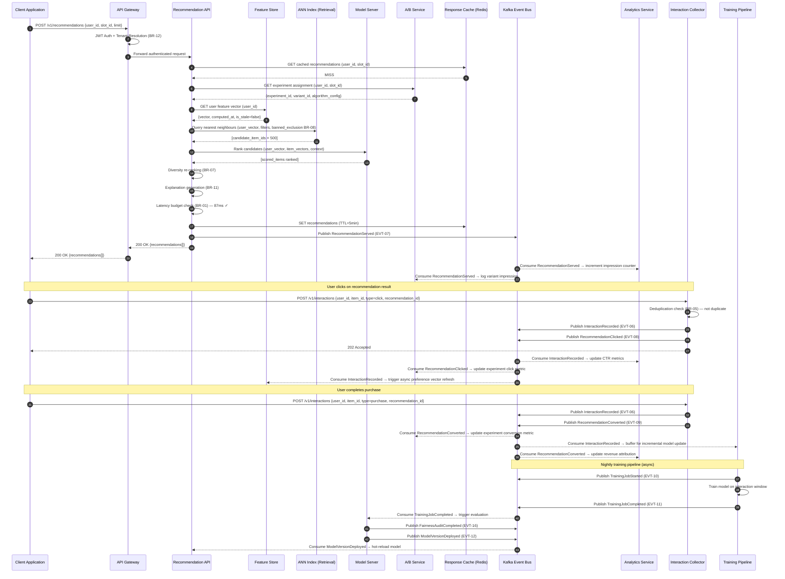

# Event Catalog — Smart Recommendation Engine

**Version:** 1.0  
**Status:** Approved  
**Last Updated:** 2025-01-01  

---

## Table of Contents

1. [Overview](#1-overview)
2. [Contract Conventions](#2-contract-conventions)
3. [Domain Events](#3-domain-events)
4. [Publish and Consumption Sequence](#4-publish-and-consumption-sequence)
5. [Operational SLOs](#5-operational-slos)

---

## Overview

The Smart Recommendation Engine is built on an event-driven architecture where every significant state change in the system is expressed as a durable, versioned domain event. This catalog is the authoritative reference for all events produced and consumed by platform services. It defines the schema, delivery semantics, topic routing, idempotency strategy, and SLOs for every event.

**Event bus:** Apache Kafka (managed via Confluent Cloud or self-hosted)  
**Schema registry:** Confluent Schema Registry with JSON Schema validation  
**Base spec:** CloudEvents v1.0  

---

## Contract Conventions

### 2.1 Event Naming Convention

Events use **PascalCase**, **past tense**, and follow the pattern `<Aggregate><Action>`:

```
ItemCreated
UserProfileUpdated
RecommendationServed
ModelVersionDeployed
ExperimentConcluded
FairnessAuditCompleted
```

Events must describe something that **has already happened** — they are facts, not commands.

### 2.2 Schema Format (CloudEvents v1.0)

Every event envelope conforms to the CloudEvents v1.0 specification:

```json
{
  "specversion": "1.0",
  "type": "com.recsys.<AggregateLower>.<action>.v1",
  "source": "<producing-service-name>",
  "id": "<UUID>",
  "time": "<RFC3339 timestamp>",
  "datacontenttype": "application/json",
  "subject": "<primary aggregate key>",
  "data": { ... }
}
```

**Required envelope fields:**

| Field | Description |
|---|---|
| `specversion` | Always `"1.0"` |
| `type` | Fully qualified event type including version suffix |
| `source` | Producing service name (e.g., `catalog-service`) |
| `id` | UUID v4 — globally unique event identifier; used for idempotency |
| `time` | RFC 3339 event timestamp (wall-clock time the event occurred, not enqueued) |
| `subject` | Primary aggregate key (e.g., `item:{item_id}`, `user:{user_id}`) |
| `datacontenttype` | Always `"application/json"` |

**Required `data` fields present in every event:**

| Field | Type | Description |
|---|---|---|
| `event_id` | UUID | Same as CloudEvents `id` — repeated for consumer convenience |
| `tenant_id` | UUID | Tenant scope of this event |
| `occurred_at` | RFC 3339 | Business timestamp |
| `correlation_id` | UUID | Request or workflow trace ID; used for distributed tracing |
| `schema_version` | String | Schema major.minor (e.g., `"1.0"`) |

### 2.3 Versioning Strategy

- **Minor versions** (1.0 → 1.1): Additive-only changes (new optional fields). Consumers must ignore unknown fields. Backward compatible within the same major version.
- **Major versions** (1.x → 2.0): Breaking changes. Produced in parallel on a new topic suffix. Old topic deprecated after a 90-day migration window. Consumers must register support for both versions during migration.

### 2.4 Topic Naming Convention

```
recsys.<domain>.<aggregate>.<action>.v<major>
```

Examples:
- `recsys.catalog.item.created.v1`
- `recsys.interaction.interaction.recorded.v1`
- `recsys.training.model_version.deployed.v1`
- `recsys.experiment.experiment.concluded.v1`

**Partitioning key:** `tenant_id:aggregate_id` to ensure per-aggregate ordering within a tenant.

### 2.5 Delivery Guarantees

| Guarantee | Applies To |
|---|---|
| **At-least-once** | All events; producers use Kafka `acks=all` and retry on failure |
| **Idempotency** | All consumers must implement idempotency using the CloudEvents `id` field |
| **Per-aggregate ordering** | Guaranteed within a Kafka partition (partition key = `tenant_id:aggregate_id`) |
| **No global ordering** | Cross-aggregate ordering is not guaranteed; consumers must handle out-of-order events |

---

## Domain Events

---

### EVT-01 — ItemCreated

**Topic:** `recsys.catalog.item.created.v1`  
**Producer:** Catalog Service  
**Consumers:** Feature Store, Search Index (Elasticsearch), Nearest-Neighbour Index Builder  
**Trigger:** A new item is successfully persisted in the `items` table.  
**Idempotency Key:** `event_id` — consumers deduplicate on this key before processing.

**JSON Schema:**

```json
{
  "event_id": "string (UUID)",
  "tenant_id": "string (UUID)",
  "occurred_at": "string (RFC 3339)",
  "correlation_id": "string (UUID)",
  "schema_version": "string",
  "item_id": "string (UUID)",
  "catalog_id": "string (UUID)",
  "title": "string",
  "category_path": ["string"],
  "status": "string (active|inactive)",
  "embedding_model": "string | null",
  "created_by": "string (UUID)"
}
```

**Sample Payload:**

```json
{
  "specversion": "1.0",
  "type": "com.recsys.item.created.v1",
  "source": "catalog-service",
  "id": "a1b2c3d4-e5f6-7890-abcd-ef1234567890",
  "time": "2025-01-15T10:30:00Z",
  "subject": "item:7f3a9e12-1234-5678-abcd-000000000001",
  "data": {
    "event_id": "a1b2c3d4-e5f6-7890-abcd-ef1234567890",
    "tenant_id": "f47ac10b-58cc-4372-a567-0e02b2c3d479",
    "occurred_at": "2025-01-15T10:30:00Z",
    "correlation_id": "req-9988776655",
    "schema_version": "1.0",
    "item_id": "7f3a9e12-1234-5678-abcd-000000000001",
    "catalog_id": "catalog-electronics-001",
    "title": "Wireless Noise-Cancelling Headphones",
    "category_path": ["Electronics", "Audio", "Headphones"],
    "status": "active",
    "embedding_model": "text-embedding-ada-002",
    "created_by": "user-admin-0001"
  }
}
```

---

### EVT-02 — ItemUpdated

**Topic:** `recsys.catalog.item.updated.v1`  
**Producer:** Catalog Service  
**Consumers:** Feature Store (re-embed changed fields), Nearest-Neighbour Index Builder (re-index if embedding changed)  
**Trigger:** Any mutable field on an item record is updated.  
**Idempotency Key:** `event_id`

**Key `data` fields:**

| Field | Type | Description |
|---|---|---|
| `item_id` | UUID | Updated item |
| `changed_fields` | string[] | List of field names that changed |
| `previous_status` | string | Previous `status` value (if changed) |
| `embedding_invalidated` | boolean | `true` if changes require re-embedding |

---

### EVT-03 — ItemDeleted

**Topic:** `recsys.catalog.item.deleted.v1`  
**Producer:** Catalog Service  
**Consumers:** Feature Store, Nearest-Neighbour Index Builder, Recommendation API (invalidate cache), Interaction Collector (soft-block future interactions), Banned Item Filter  
**Trigger:** An item is banned or its status transitions to `deleted` or `archived`.  
**Idempotency Key:** `event_id`

**Key `data` fields:**

| Field | Type | Description |
|---|---|---|
| `item_id` | UUID | Deleted item |
| `deletion_reason` | string | `banned`, `archived`, `gdpr_request`, `catalog_cleanup` |
| `cascading_cleanup_required` | boolean | `true` if downstream services must purge associated data |

**Consumer behaviour:** On receipt, the Nearest-Neighbour Index Builder must remove the item from the ANN index within 60 seconds (BR-08 SLA).

---

### EVT-04 — UserProfileCreated

**Topic:** `recsys.profile.user.created.v1`  
**Producer:** Profile Service  
**Consumers:** Feature Store (initialise cold-start feature vector), A/B Service (make user eligible for experiments)  
**Trigger:** A new `UserProfile` record is persisted.  
**Idempotency Key:** `event_id`

**Key `data` fields:**

| Field | Type | Description |
|---|---|---|
| `user_id` | UUID | New user |
| `tenant_id` | UUID | |
| `cold_start_phase` | string | Always `cold` on creation |
| `country` | string | ISO 3166-1 alpha-2 |
| `language` | string | BCP 47 |
| `registration_date` | date | |

---

### EVT-05 — UserProfileUpdated

**Topic:** `recsys.profile.user.updated.v1`  
**Producer:** Profile Service  
**Consumers:** Feature Store (invalidate and recompute preference vector)  
**Trigger:** Any mutable field on a `UserProfile` is updated, including `cold_start_phase` transitions.  
**Idempotency Key:** `event_id`

**Key `data` fields:**

| Field | Type | Description |
|---|---|---|
| `user_id` | UUID | Updated user |
| `changed_fields` | string[] | Field names that changed |
| `cold_start_phase_changed` | boolean | `true` if cold_start_phase transitioned |
| `previous_cold_start_phase` | string | Previous phase (if changed) |
| `new_cold_start_phase` | string | New phase (if changed) |

---

### EVT-06 — InteractionRecorded

**Topic:** `recsys.interaction.interaction.recorded.v1`  
**Producer:** Interaction Collector  
**Consumers:** Training Pipeline (incremental model update signal), Feature Store (update user preference vector), Analytics Service  
**Trigger:** A non-duplicate interaction is persisted (BR-05 deduplication passed).  
**Idempotency Key:** `event_id`

**JSON Schema:**

```json
{
  "event_id": "string (UUID)",
  "tenant_id": "string (UUID)",
  "occurred_at": "string (RFC 3339)",
  "correlation_id": "string (UUID)",
  "schema_version": "string",
  "interaction_id": "string (UUID)",
  "user_id": "string (UUID)",
  "item_id": "string (UUID)",
  "session_id": "string (UUID) | null",
  "interaction_type": "string (view|click|cart|purchase|rating|review|dwell|share|dismiss)",
  "interaction_value": "number | null",
  "recommendation_id": "string (UUID) | null",
  "slot_id": "string (UUID) | null",
  "is_organic": "boolean"
}
```

**Sample Payload:**

```json
{
  "specversion": "1.0",
  "type": "com.recsys.interaction.recorded.v1",
  "source": "interaction-collector",
  "id": "b2c3d4e5-f6a7-8901-bcde-f12345678901",
  "time": "2025-01-15T10:35:42Z",
  "subject": "interaction:b2c3d4e5-f6a7-8901-bcde-f12345678901",
  "data": {
    "event_id": "b2c3d4e5-f6a7-8901-bcde-f12345678901",
    "tenant_id": "f47ac10b-58cc-4372-a567-0e02b2c3d479",
    "occurred_at": "2025-01-15T10:35:42Z",
    "correlation_id": "req-1122334455",
    "schema_version": "1.0",
    "interaction_id": "inter-abc123",
    "user_id": "user-0042",
    "item_id": "7f3a9e12-1234-5678-abcd-000000000001",
    "session_id": "sess-99887766",
    "interaction_type": "purchase",
    "interaction_value": null,
    "recommendation_id": "result-xyz789",
    "slot_id": "slot-homepage-top",
    "is_organic": false
  }
}
```

---

### EVT-07 — RecommendationServed

**Topic:** `recsys.recommendation.request.served.v1`  
**Producer:** Recommendation API  
**Consumers:** Analytics Service, A/B Service (record impression for experiment metrics), CTR monitoring  
**Trigger:** A recommendation response is successfully sent to the caller.  
**Idempotency Key:** `event_id`

**Key `data` fields:**

| Field | Type | Description |
|---|---|---|
| `request_id` | UUID | Recommendation request ID |
| `user_id` | UUID | |
| `slot_id` | UUID | |
| `experiment_id` | UUID or null | If request was part of an experiment |
| `variant_id` | UUID or null | |
| `model_version_id` | UUID | Model that served the request |
| `item_ids` | UUID[] | Ordered list of recommended item IDs |
| `latency_ms` | integer | End-to-end latency |
| `status` | string | `success`, `fallback_cache`, `fallback_popularity`, `error` |
| `cold_start_phase` | string | User's cold-start phase at serve time |

---

### EVT-08 — RecommendationClicked

**Topic:** `recsys.recommendation.result.clicked.v1`  
**Producer:** Interaction Collector (click event attributed to a recommendation result)  
**Consumers:** Analytics Service, Training Pipeline (positive reward signal)  
**Trigger:** An `Interaction` of type `click` is recorded with a non-null `recommendation_id`.  
**Idempotency Key:** `event_id`

**Key `data` fields:**

| Field | Type | Description |
|---|---|---|
| `result_id` | UUID | FK → RecommendationResult |
| `request_id` | UUID | FK → RecommendationRequest |
| `user_id` | UUID | |
| `item_id` | UUID | Clicked item |
| `rank` | integer | Position in the recommendation slate (1-based) |
| `latency_to_click_ms` | integer | Milliseconds from recommendation served to click |

---

### EVT-09 — RecommendationConverted

**Topic:** `recsys.recommendation.result.converted.v1`  
**Producer:** Interaction Collector (purchase event attributed to a recommendation)  
**Consumers:** Analytics Service, A/B Service (conversion metric for experiment analysis), Training Pipeline (strongest positive reward signal)  
**Trigger:** An `Interaction` of type `purchase` is recorded with a non-null `recommendation_id`.  
**Idempotency Key:** `event_id`

**Key `data` fields:**

| Field | Type | Description |
|---|---|---|
| `result_id` | UUID | FK → RecommendationResult |
| `request_id` | UUID | FK → RecommendationRequest |
| `user_id` | UUID | |
| `item_id` | UUID | Purchased item |
| `conversion_value` | number | Purchase value in item's currency |
| `currency` | string | ISO 4217 |
| `experiment_id` | UUID or null | For A/B attribution |
| `variant_id` | UUID or null | |

---

### EVT-10 — TrainingJobStarted

**Topic:** `recsys.training.job.started.v1`  
**Producer:** Training Pipeline  
**Consumers:** Monitoring Service (track long-running jobs), SRE alerting  
**Trigger:** A `TrainingJob` transitions to status `running`.  
**Idempotency Key:** `event_id`

**Key `data` fields:**

| Field | Type | Description |
|---|---|---|
| `job_id` | UUID | Training job ID |
| `model_id` | UUID | Logical model being trained |
| `algorithm` | string | Algorithm name |
| `training_data_start` | RFC 3339 | Start of training window |
| `training_data_end` | RFC 3339 | End of training window |
| `estimated_duration_minutes` | integer | Estimate; used for alerting on overrun |

---

### EVT-11 — TrainingJobCompleted

**Topic:** `recsys.training.job.completed.v1`  
**Producer:** Training Pipeline  
**Consumers:** Model Registry (register new ModelVersion), Evaluation Service (trigger offline evaluation)  
**Trigger:** A `TrainingJob` transitions to status `completed`.  
**Idempotency Key:** `event_id`

**Key `data` fields:**

| Field | Type | Description |
|---|---|---|
| `job_id` | UUID | |
| `model_id` | UUID | |
| `artifact_uri` | string | Object store URI of trained model artefact |
| `training_metrics` | object | Final loss, epoch count, training NDCG |
| `duration_seconds` | integer | Actual training duration |

---

### EVT-12 — ModelVersionDeployed

**Topic:** `recsys.training.model_version.deployed.v1`  
**Producer:** Model Registry  
**Consumers:** Recommendation API (hot-reload model), Monitoring Service (start metric baseline collection), SRE alerting (begin CTR/latency watch)  
**Trigger:** A `ModelVersion` transitions to status `deployed`.  
**Idempotency Key:** `event_id`

**JSON Schema:**

```json
{
  "event_id": "string (UUID)",
  "tenant_id": "string (UUID)",
  "occurred_at": "string (RFC 3339)",
  "correlation_id": "string (UUID)",
  "schema_version": "string",
  "version_id": "string (UUID)",
  "model_id": "string (UUID)",
  "algorithm": "string",
  "version_tag": "string",
  "artifact_uri": "string",
  "previous_version_id": "string (UUID) | null",
  "deployed_by": "string (UUID)",
  "evaluation_summary": {
    "ndcg_at_10": "number",
    "precision_at_10": "number",
    "hit_rate_at_10": "number",
    "fairness_passed": "boolean"
  }
}
```

---

### EVT-13 — ModelVersionRolledBack

**Topic:** `recsys.training.model_version.rolled_back.v1`  
**Producer:** Model Registry  
**Consumers:** Recommendation API (revert to previous model version), Monitoring Service, Alerting Service (PagerDuty), Slack notification webhook  
**Trigger:** Automatic rollback (BR-13 trigger conditions met) or manual rollback.  
**Idempotency Key:** `event_id`

**Key `data` fields:**

| Field | Type | Description |
|---|---|---|
| `version_id` | UUID | Version being rolled back |
| `previous_version_id` | UUID | Version being restored |
| `rollback_reason` | string | `CTR_DROP_EXCEEDED`, `LATENCY_SLO_BREACH`, `ERROR_RATE_EXCEEDED`, `MANUAL` |
| `triggered_by` | string | `automatic` or `manual` |
| `triggered_by_user_id` | UUID or null | Set if manual rollback |
| `metric_snapshot` | object | p95 latency, CTR, error rate at time of rollback |

---

### EVT-14 — ExperimentStarted

**Topic:** `recsys.experiment.experiment.started.v1`  
**Producer:** A/B Experiment Service  
**Consumers:** Recommendation API (begin experiment assignment), Analytics Service (begin metric collection baseline)  
**Trigger:** An `ABExperiment` transitions to status `running`.  
**Idempotency Key:** `event_id`

**Key `data` fields:**

| Field | Type | Description |
|---|---|---|
| `experiment_id` | UUID | |
| `name` | string | |
| `traffic_percentage` | number | |
| `exclusion_group` | string or null | |
| `variants` | object[] | Array of `{variant_id, name, traffic_split_pct, is_control}` |
| `primary_metric` | string | |
| `start_date` | RFC 3339 | |

---

### EVT-15 — ExperimentConcluded

**Topic:** `recsys.experiment.experiment.concluded.v1`  
**Producer:** A/B Experiment Service  
**Consumers:** Analytics Service (final metric calculation), Model Registry (promote winning model variant if applicable), Product Team notification webhook  
**Trigger:** An `ABExperiment` transitions to status `concluded`.  
**Idempotency Key:** `event_id`

**Key `data` fields:**

| Field | Type | Description |
|---|---|---|
| `experiment_id` | UUID | |
| `name` | string | |
| `winning_variant_id` | UUID or null | Null if inconclusive |
| `primary_metric_result` | object | `{control_value, treatment_value, relative_lift, p_value, is_significant}` |
| `duration_days` | integer | Experiment run duration |
| `total_users_enrolled` | integer | |
| `concluded_by` | string | `auto_significance` or `manual` |

---

### EVT-16 — FairnessAuditCompleted

**Topic:** `recsys.fairness.audit.completed.v1`  
**Producer:** Fairness Service  
**Consumers:** Model Registry (update model version fairness flag), Compliance Service (store for regulatory record)  
**Trigger:** A `FairnessAudit` record is finalised with all metrics computed.  
**Idempotency Key:** `event_id`

**Key `data` fields:**

| Field | Type | Description |
|---|---|---|
| `audit_id` | UUID | |
| `model_version_id` | UUID | |
| `passes_threshold` | boolean | Whether all BR-09 thresholds are met |
| `demographic_parity_difference` | number | |
| `equalized_odds_difference` | number | |
| `individual_fairness_score` | number | |
| `protected_attributes_checked` | string[] | |
| `bias_reports_count` | integer | Number of BiasReport records created |

---

### EVT-17 — BiasAlertRaised

**Topic:** `recsys.fairness.bias.alert_raised.v1`  
**Producer:** Fairness Service  
**Consumers:** Alerting Service (PagerDuty for `high`/`critical` severity), Slack notification webhook (ML team channel)  
**Trigger:** A `BiasReport` with severity `high` or `critical` is created during a fairness audit.  
**Idempotency Key:** `event_id`

**Key `data` fields:**

| Field | Type | Description |
|---|---|---|
| `report_id` | UUID | FK → BiasReport |
| `audit_id` | UUID | FK → FairnessAudit |
| `model_version_id` | UUID | |
| `bias_type` | string | |
| `severity` | string | `high` or `critical` |
| `affected_group` | string | |
| `bias_magnitude` | number | |
| `recommended_action` | string | |
| `requires_immediate_action` | boolean | `true` if severity = `critical` |

---

### EVT-18 — FeatureVectorUpdated

**Topic:** `recsys.feature.vector.updated.v1`  
**Producer:** Feature Store  
**Consumers:** Nearest-Neighbour Index Builder (re-index updated item vector), Recommendation API cache (invalidate stale feature cache entry)  
**Trigger:** A `FeatureVector` record is newly created or updated with a fresher computation.  
**Idempotency Key:** `event_id`

**Key `data` fields:**

| Field | Type | Description |
|---|---|---|
| `vector_id` | UUID | |
| `entity_id` | UUID | User or item ID |
| `entity_type` | string | `user` or `item` |
| `feature_set_name` | string | |
| `feature_version` | string | |
| `vector_dimension` | integer | |
| `computed_at` | RFC 3339 | |
| `expires_at` | RFC 3339 | |
| `trigger` | string | `scheduled_refresh`, `interaction_triggered`, `item_updated` |

---

### EVT-19 — ColdStartTriggered

**Topic:** `recsys.profile.user.cold_start_triggered.v1`  
**Producer:** Recommendation API (or Interaction Collector on phase transition)  
**Consumers:** Analytics Service (funnel metrics), Profile Service (confirm phase written to UserProfile)  
**Trigger:** A user's `cold_start_phase` transitions between phases (`cold → warming`, `warming → warm`).  
**Idempotency Key:** `event_id`

**Key `data` fields:**

| Field | Type | Description |
|---|---|---|
| `user_id` | UUID | |
| `previous_phase` | string | `cold`, `warming` |
| `new_phase` | string | `warming`, `warm` |
| `interaction_count_at_transition` | integer | |
| `days_since_registration` | integer | |

---

## Publish and Consumption Sequence

The following sequence diagram illustrates the complete event flow for a real-time recommendation request that triggers multiple downstream events — from initial request receipt through model serving, interaction recording, A/B attribution, and an eventual fairness check.



---

## Operational SLOs

### 5.1 Event Delivery SLOs

| Tier | Events | Delivery SLO | Latency p95 |
|---|---|---|---|
| **Tier 1 — Critical** | `InteractionRecorded`, `RecommendationServed`, `ModelVersionDeployed`, `ModelVersionRolledBack` | 99.9% within 5 seconds | ≤ 500 ms |
| **Tier 2 — High** | `ItemCreated`, `ItemDeleted`, `UserProfileCreated`, `FeatureVectorUpdated`, `ExperimentStarted` | 99.5% within 30 seconds | ≤ 5 s |
| **Tier 3 — Standard** | `TrainingJobStarted`, `TrainingJobCompleted`, `FairnessAuditCompleted`, `ExperimentConcluded` | 99% within 5 minutes | ≤ 60 s |

### 5.2 Dead Letter Queue (DLQ) Handling

Every consumer group has a corresponding DLQ topic:
```
recsys.dlq.<original-topic-name>
```

**DLQ routing triggers:**
- Deserialization failure (schema mismatch — likely major version issue)
- Consumer application error after 3 retries with exponential backoff (1s → 4s → 16s)
- Business logic rejection (e.g., unknown `tenant_id`)

**DLQ SLAs:**

| Severity | Triage Acknowledgement | Resolution |
|---|---|---|
| Tier 1 event in DLQ | 15 minutes | 1 hour |
| Tier 2 event in DLQ | 1 hour | 4 hours |
| Tier 3 event in DLQ | 4 hours | 24 hours |

**DLQ replay procedure:**
1. Identify DLQ topic and message range via Kafka console consumer.
2. Fix the consumer bug or schema incompatibility.
3. Replay messages using the `kafka-consumer-groups --reset-offsets` tool or the platform replay API.
4. Verify consumer lag returns to zero within expected processing time.
5. Document root cause in the incident log.

### 5.3 Event Retention

| Topic Tier | Kafka Retention |
|---|---|
| Tier 1 | 7 days |
| Tier 2 | 14 days |
| Tier 3 | 30 days |
| DLQ topics | 30 days |

Kafka log compaction is enabled on `FeatureVectorUpdated` and `ItemUpdated` topics to retain only the latest state per key.

### 5.4 Consumer Lag Alerting

Consumer lag is monitored per consumer group per topic. Alert thresholds:

| Level | Threshold | Action |
|---|---|---|
| **Warning** | > 10,000 messages behind | Notify on-call SRE via Slack |
| **Critical** | > 100,000 messages behind | Page on-call SRE via PagerDuty; consider scaling consumer group |
| **Emergency** | > 1,000,000 messages behind | Incident declared; escalate to platform team lead |

Consumer lag metric: `kafka_consumer_group_lag` scraped every 30 seconds by Prometheus; visualised on the Kafka Operations Grafana dashboard.

### 5.5 Monitoring Dashboards

| Dashboard | Tool | Key Metrics |
|---|---|---|
| Kafka Operations | Grafana | Consumer lag by group/topic, producer throughput, DLQ depth, partition leader election rate |
| Event Health | Grafana | Event publish rate by type, delivery latency p50/p95/p99, schema validation error rate |
| Recommendation Funnel | Grafana | Impressions → Clicks → Conversions per slot/model/experiment |
| Training Pipeline | Grafana | Job queue depth, training duration, evaluation metric trends, deployment frequency |
| Fairness Monitor | Grafana | DPD/EOD trends per model version, BiasAlert frequency by severity |

### 5.6 Schema Registry Governance

- All event schemas are registered in Confluent Schema Registry before first publish.
- Schema compatibility check is enforced as `FORWARD_TRANSITIVE` within a major version.
- Schema registration is gated by the CI/CD pipeline; unregistered schemas cause producer startup failure.
- Schema review requires approval from the Platform Architecture team for any new event or major version bump.

---

*End of Event Catalog*
