# System Context Diagram - Smart Recommendation Engine

> **Domain Independence**: External systems shown are representative examples.

---

## System Context Diagram

```mermaid
graph TB
    subgraph "External Actors"
        USER((End User))
        OWNER((Content Owner))
        DS((Data Scientist))
    end
    
    RECSYS["🤖 Smart Recommendation<br/>Engine<br/>[AI-Powered System]<br/>Generates personalized<br/>recommendations"]
    
    subgraph "External Systems"
        HOST[Host Application<br/>Jobs/Ecommerce/Content Platform]
        FEATURE[Feature Store<br/>Feast / Tecton]
        REGISTRY[Model Registry<br/>MLflow / W&B]
        STREAM[Event Stream<br/>Kafka / Pub/Sub]
        VECTOR[Vector Database<br/>Milvus / Pinecone]
        MONITOR[Monitoring<br/>Prometheus / DataDog]
    end
    
    USER -->|Views items,<br/>Provides feedback| HOST
    OWNER -->|Publishes items| HOST
    DS -->|Trains models,<br/>Runs experiments| RECSYS
    
    HOST -->|User actions,<br/>Item metadata| RECSYS
    RECSYS -->|Personalized<br/>recommendations| HOST
    
    RECSYS <-->|Features| FEATURE
    RECSYS <-->|Models| REGISTRY
    RECSYS -->|Events| STREAM
    RECSYS <-->|Embeddings| VECTOR
    RECSYS -->|Metrics| MONITOR
    
    style RECSYS fill:#438dd5,color:#fff
```

---

## External System Interactions

| System | Purpose | Data Exchanged |
|--------|---------|----------------|
| **Host Application** | Main app (jobs/ecommerce/content) | User actions, item catalog, display recommendations |
| **Feature Store** | Centralized feature management | User features, item features, computed features |
| **Model Registry** | ML model versioning | Trained models, metrics, metadata |
| **Event Stream** | Real-time event processing | User interactions, impressions, clicks |
| **Vector Database** | Similarity search | Item embeddings, user embeddings |
| **Monitoring** | System health tracking | Performance metrics, model metrics |

---

## System Boundaries

### Inside the Recommendation Engine
- Event tracking & ingestion
- Feature engineering pipeline
- ML model training (batch)
- Real-time recommendation inference
- A/B testing framework
- Explainability generation

### Outside the Recommendation Engine
- User authentication (host app)
- Item creation/management (host app)
- Payment processing (host app)
- Raw data storage (data warehouse)
- UI/UX rendering (host app)
