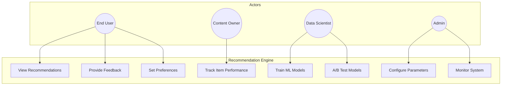
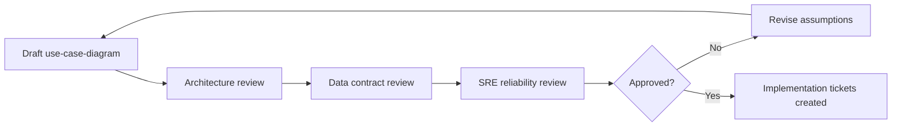

# Use Case Diagram - Smart Recommendation Engine

> **Domain Independence**: Adapt actors and use cases to your specific domain.

---

## Main Use Case Diagram

```mermaid
graph TB
    subgraph Actors
        USER((End User))
        OWNER((Content Owner))
        DS((Data Scientist))
        ADMIN((Admin))
    end
    
    subgraph "Recommendation Engine"
        UC1[View Recommendations]
        UC2[Provide Feedback]
        UC3[Set Preferences]
        UC4[Track Item Performance]
        UC5[Train ML Models]
        UC6[A/B Test Models]
        UC7[Configure Parameters]
        UC8[Monitor System]
    end
    
    USER --> UC1
    USER --> UC2
    USER --> UC3
    OWNER --> UC4
    DS --> UC5
    DS --> UC6
    ADMIN --> UC7
    ADMIN --> UC8
```

## Actor Summary

| Actor | Key Actions |
|-------|-------------|
| End User | View recommendations, provide feedback |
| Content Owner | Track performance, boost items |
| Data Scientist | Train models, A/B test |
| System Admin | Configure, monitor |

## Implementation Notes
- **Primary decision this diagram enables**: align product, data, and platform teams on boundary conditions before coding.
- **Source-of-truth inputs**: PRD, event contracts, SLO targets, and security classification matrix.
- **Validation cadence**: review on every major feature epic and before production release trains.

## Mermaid Drill-Down: Use Case Diagram Review Workflow

```mermaid
flowchart LR
    A[Draft use-case-diagram] --> B[Architecture review]
    B --> C[Data contract review]
    C --> D[SRE reliability review]
    D --> E{Approved?}
    E -- No --> F[Revise assumptions]
    F --> A
    E -- Yes --> G[Implementation tickets created]
```

## Implementation Checklist
- [ ] Actors and system boundaries map to real owning teams.
- [ ] Diagram paths include fallback behavior and failure branches.
- [ ] Every external dependency has an SLO and timeout policy attached.
- [ ] Observability events tied to each critical transition are defined.
