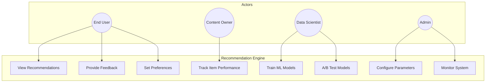

# Use Case Diagram - Smart Recommendation Engine

> **Domain Independence**: Adapt actors and use cases to your specific domain.

---

## Main Use Case Diagram

## Actor Summary

| Actor | Key Actions |
|-------|-------------|
| End User | View recommendations, provide feedback |
| Content Owner | Track performance, boost items |
| Data Scientist | Train models, A/B test |
| System Admin | Configure, monitor |
