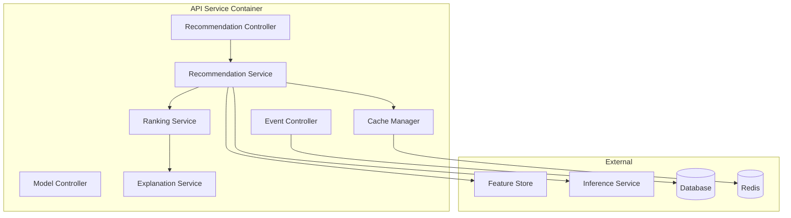
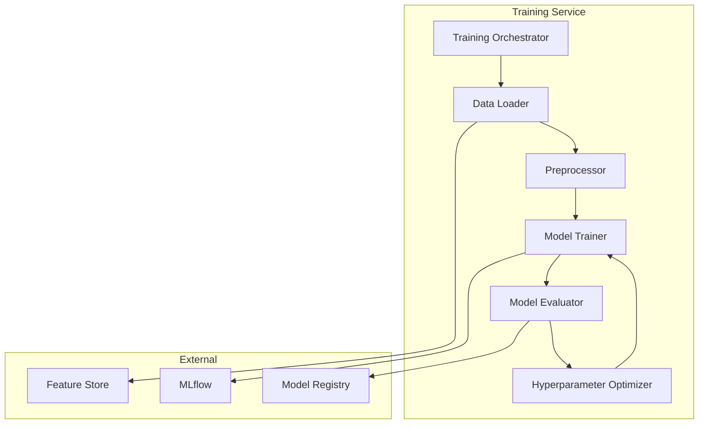
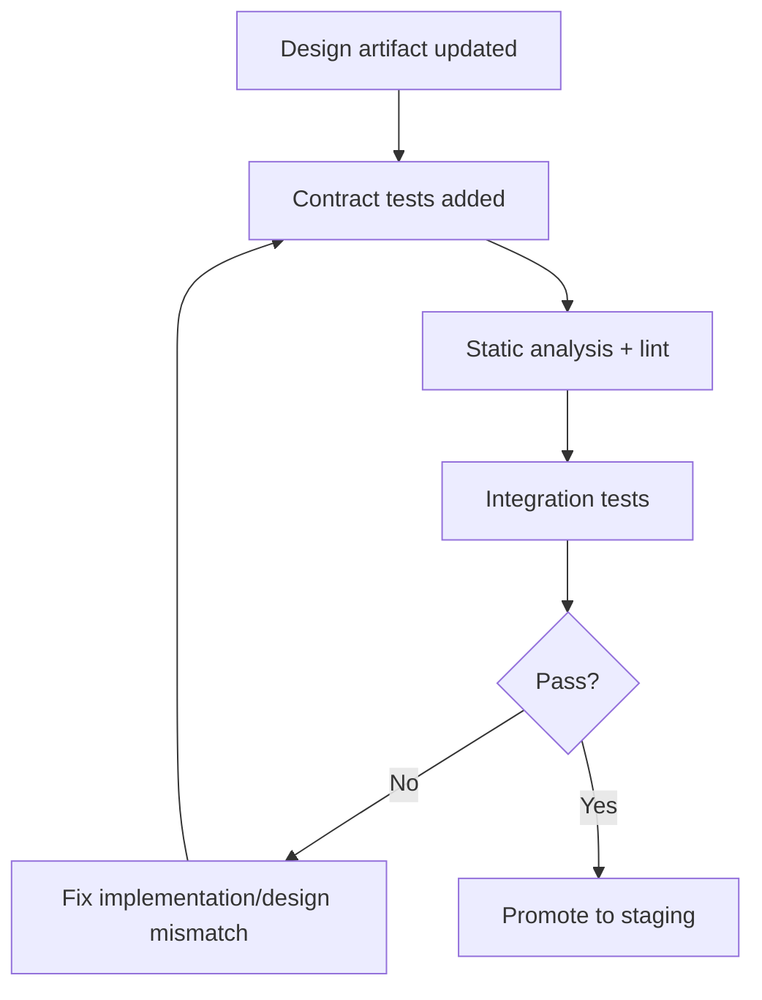

# C4 Component Diagram - Smart Recommendation Engine

## API Service Components

```mermaid
graph TB
    subgraph "API Service Container"
        REC_CTR[Recommendation Controller]
        EVENT_CTR[Event Controller]
        MODEL_CTR[Model Controller]
        
        REC_SVC[Recommendation Service]
        RANK_SVC[Ranking Service]
        EXPLAIN_SVC[Explanation Service]
        
        CACHE_MGR[Cache Manager]
    end
    
    subgraph "External"
        FS[Feature Store]
        INF[Inference Service]
        DB[(Database)]
        REDIS[(Redis)]
    end
    
    REC_CTR --> REC_SVC
    REC_SVC --> RANK_SVC
    REC_SVC --> CACHE_MGR
    REC_SVC --> INF
    REC_SVC --> FS
    
    RANK_SVC --> EXPLAIN_SVC
    CACHE_MGR --> REDIS
    
    EVENT_CTR --> DB
```

## Training Service Components

```mermaid
graph TB
    subgraph "Training Service"
        TRAIN_ORCH[Training Orchestrator]
        
        DATA_LOADER[Data Loader]
        PREPRO[Preprocessor]
        TRAINER[Model Trainer]
        EVALUATOR[Model Evaluator]
        OPTIMIZER[Hyperparameter Optimizer]
    end
    
    subgraph "External"
        FS[Feature Store]
        MLF[MLflow]
        REG[Model Registry]
    end
    
    TRAIN_ORCH --> DATA_LOADER
    DATA_LOADER --> FS
    DATA_LOADER --> PREPRO
    PREPRO --> TRAINER
    TRAINER --> EVALUATOR
    TRAINER --> MLF
    EVALUATOR --> OPTIMIZER
    OPTIMIZER --> TRAINER
    EVALUATOR --> REG
```

**Component Descriptions**:
- **Recommendation Controller**: Handle HTTP requests
- **Recommendation Service**: Orchestrate recommendation generation
- **Ranking Service**: Sort and filter items
- **Training Orchestrator**: Manage training pipeline
- **Model Trainer**: Train ML models (scikit-learn/TensorFlow)
- **Hyperparameter Optimizer**: Tune model parameters

## Detailed Implementation Constraints
- Translate each component/class/state transition into code-level interfaces with explicit pre/post-conditions.
- Every persistence change must include migration strategy, rollback script, and backfill impact analysis.

## Mermaid Verification Loop: C4 Component

```mermaid
flowchart TD
    A[Design artifact updated] --> B[Contract tests added]
    B --> C[Static analysis + lint]
    C --> D[Integration tests]
    D --> E{Pass?}
    E -- No --> F[Fix implementation/design mismatch]
    F --> B
    E -- Yes --> G[Promote to staging]
```

## Required Engineering Evidence
- API/interface compatibility report
- Query/index performance benchmarks
- State transition and error-path tests
