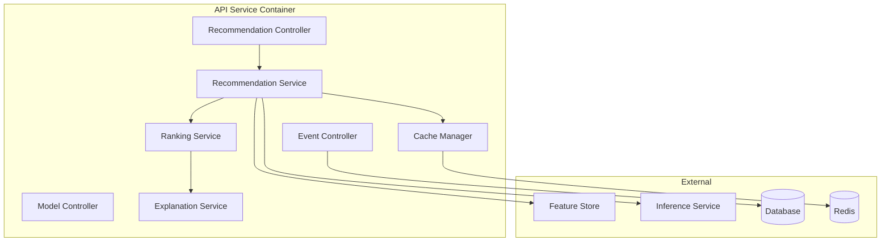
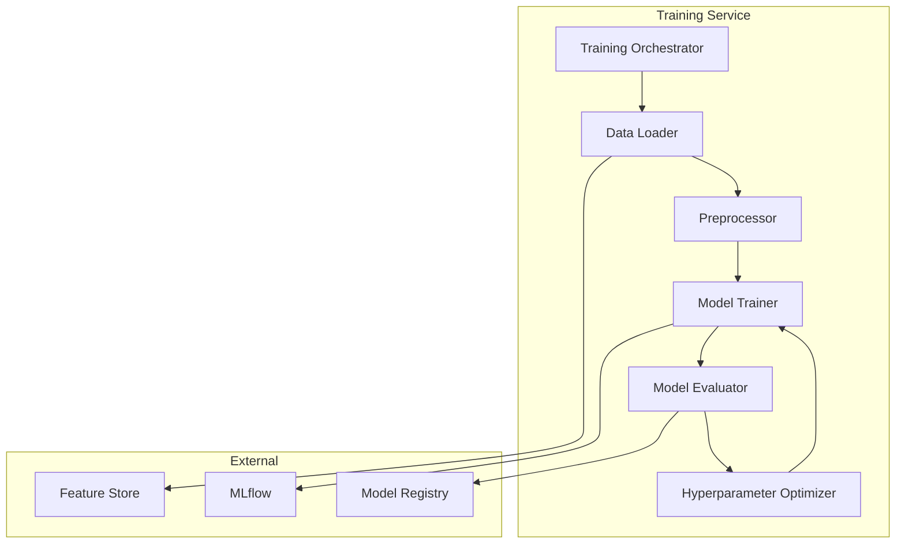

# C4 Component Diagram - Smart Recommendation Engine

## API Service Components

## Training Service Components

**Component Descriptions**:
- **Recommendation Controller**: Handle HTTP requests
- **Recommendation Service**: Orchestrate recommendation generation
- **Ranking Service**: Sort and filter items
- **Training Orchestrator**: Manage training pipeline
- **Model Trainer**: Train ML models (scikit-learn/TensorFlow)
- **Hyperparameter Optimizer**: Tune model parameters
