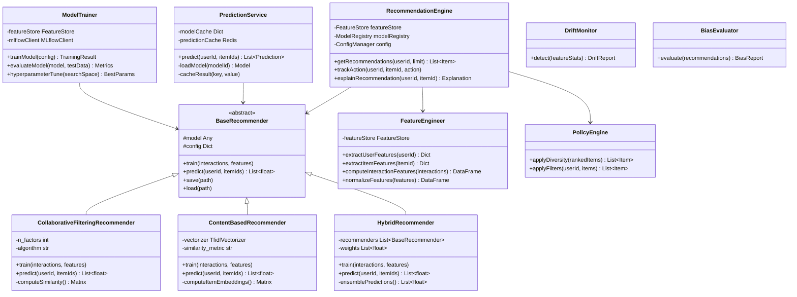
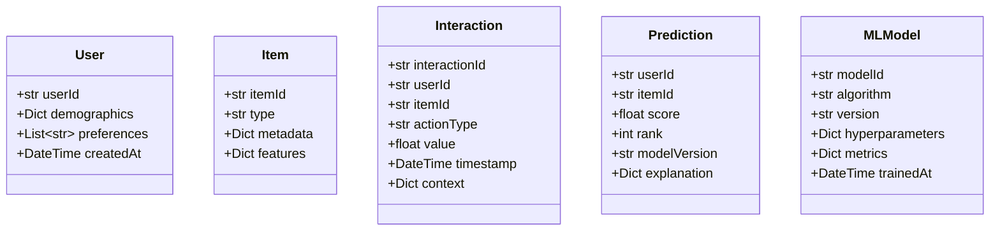

# Class Diagram - Smart Recommendation Engine

## Python ML Classes

## Data Classes

**Key Python Libraries**:
- scikit-learn: Traditional ML algorithms
- TensorFlow/PyTorch: Deep learning models
- pandas/numpy: Data manipulation
- MLflow: Experiment tracking
- Feast: Feature store
