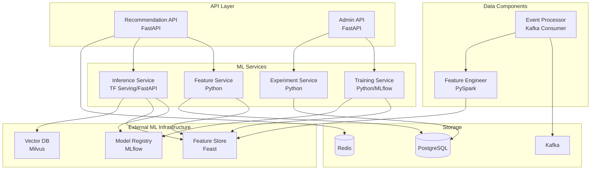

# Component Diagram - Smart Recommendation Engine

## Component Responsibilities

| Component | Technology | Purpose |
|-----------|------------|---------|
| Recommendation API | FastAPI | Serve recommendations via REST |
| Feature Service | Python | Manage feature retrieval |
| Training Service | Python, MLflow | Train and evaluate models |
| Inference Service | TensorFlow Serving | Real-time ML predictions |
| Experiment Service | Python | Manage A/B tests |
| Event Processor | Kafka Consumer | Process user action events |
| Feature Engineer | PySpark | Compute features from raw data |
