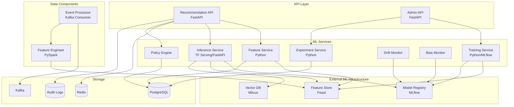
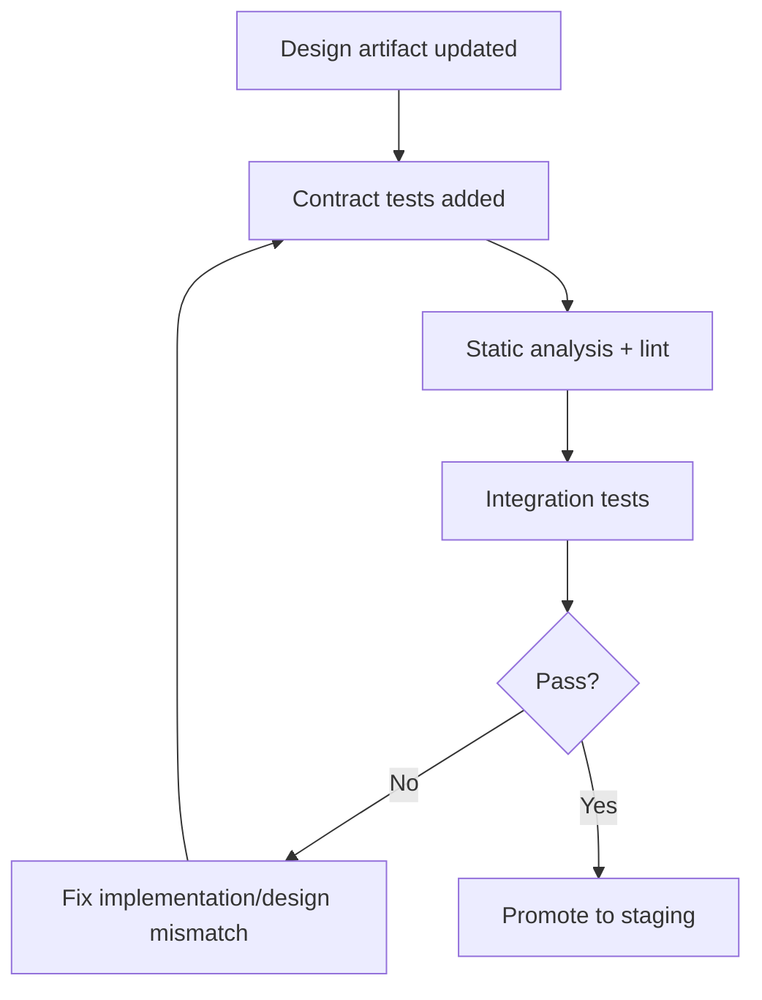

# Component Diagram - Smart Recommendation Engine

```mermaid
graph TB
    subgraph "API Layer"
        REC_API[Recommendation API<br/>FastAPI]
        ADMIN_API[Admin API<br/>FastAPI]
    end
    
    subgraph "ML Services"
        FEATURE_SVC[Feature Service<br/>Python]
        TRAINING_SVC[Training Service<br/>Python/MLflow]
        INFERENCE_SVC[Inference Service<br/>TF Serving/FastAPI]
        EXP_SVC[Experiment Service<br/>Python]
        DRIFT_SVC[Drift Monitor]
        BIAS_SVC[Bias Monitor]
        POLICY_SVC[Policy Engine]
    end
    
    subgraph "Data Components"
        EVENT_PROC[Event Processor<br/>Kafka Consumer]
        FEATURE_ENG[Feature Engineer<br/>PySpark]
    end
    
    subgraph "External ML Infrastructure"
        FEATURE_STORE[Feature Store<br/>Feast]
        MODEL_REG[Model Registry<br/>MLflow]
        VECTOR_DB[Vector DB<br/>Milvus]
    end
    
    subgraph "Storage"
        DB[(PostgreSQL)]
        CACHE[(Redis)]
        STREAM[Kafka]
        AUDIT[(Audit Logs)]
    end
    
    REC_API --> FEATURE_SVC
    REC_API --> INFERENCE_SVC
    REC_API --> CACHE
    REC_API --> POLICY_SVC
    REC_API --> AUDIT
    
    ADMIN_API --> TRAINING_SVC
    ADMIN_API --> EXP_SVC
    
    TRAINING_SVC --> FEATURE_STORE
    TRAINING_SVC --> MODEL_REG
    DRIFT_SVC --> MODEL_REG
    BIAS_SVC --> MODEL_REG
    
    INFERENCE_SVC --> MODEL_REG
    INFERENCE_SVC --> FEATURE_STORE
    INFERENCE_SVC --> VECTOR_DB
    POLICY_SVC --> DB
    
    EVENT_PROC --> STREAM
    EVENT_PROC --> FEATURE_ENG
    
    FEATURE_ENG --> FEATURE_STORE
    FEATURE_SVC --> FEATURE_STORE
    
    FEATURE_SVC --> DB
    EXP_SVC --> DB
```

## Component Responsibilities

| Component | Technology | Purpose |
|-----------|------------|---------|
| Recommendation API | FastAPI | Serve recommendations via REST |
| Feature Service | Python | Manage feature retrieval |
| Training Service | Python, MLflow | Train and evaluate models |
| Inference Service | TensorFlow Serving | Real-time ML predictions |
| Experiment Service | Python | Manage A/B tests |
| Drift Monitor | Python | Detect data/model drift |
| Bias Monitor | Python | Fairness and bias checks |
| Policy Engine | Python | Apply business rules/diversity |
| Event Processor | Kafka Consumer | Process user action events |
| Feature Engineer | PySpark | Compute features from raw data |

## Detailed Implementation Constraints
- Translate each component/class/state transition into code-level interfaces with explicit pre/post-conditions.
- Every persistence change must include migration strategy, rollback script, and backfill impact analysis.

## Mermaid Verification Loop: Component Diagram

```mermaid
flowchart TD
    A[Design artifact updated] --> B[Contract tests added]
    B --> C[Static analysis + lint]
    C --> D[Integration tests]
    D --> E{Pass?}
    E -- No --> F[Fix implementation/design mismatch]
    F --> B
    E -- Yes --> G[Promote to staging]
```

## Required Engineering Evidence
- API/interface compatibility report
- Query/index performance benchmarks
- State transition and error-path tests
