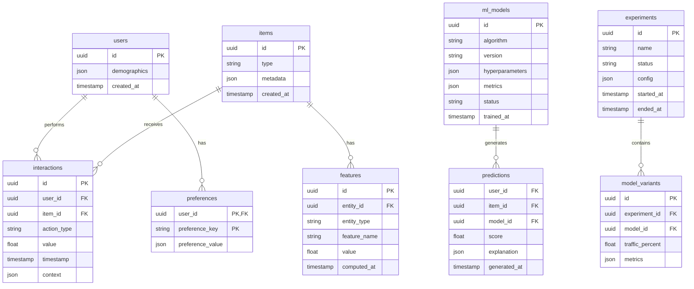

# ERD / Database Schema - Smart Recommendation Engine



## Table Definitions

### interactions
```sql
CREATE TABLE interactions (
    id UUID PRIMARY KEY DEFAULT gen_random_uuid(),
    user_id UUID NOT NULL,
    item_id UUID NOT NULL,
    action_type VARCHAR(50) NOT NULL,  -- 'view', 'click', 'purchase', 'like'
    value FLOAT DEFAULT 1.0,
    timestamp TIMESTAMP NOT NULL DEFAULT NOW(),
    context JSONB,  -- device, session, etc.
    INDEX idx_user_time (user_id, timestamp),
    INDEX idx_item_time (item_id, timestamp)
);
```

### ml_models
```sql
CREATE TABLE ml_models (
    id UUID PRIMARY KEY DEFAULT gen_random_uuid(),
    algorithm VARCHAR(100) NOT NULL,  -- 'collaborative_filtering', 'content_based', etc.
    version VARCHAR(50) NOT NULL,
    hyperparameters JSONB,
    metrics JSONB,  -- precision, recall, NDCG, etc.
    status VARCHAR(20) DEFAULT 'training',  -- training, registered, production, deprecated
    trained_at TIMESTAMP DEFAULT NOW(),
    UNIQUE(algorithm, version)
);
```

### predictions (Materialized for caching)
```sql
CREATE TABLE predictions (
    user_id UUID NOT NULL,
    item_id UUID NOT NULL,
    model_id UUID NOT NULL,
    score FLOAT NOT NULL,
    explanation JSONB,
    generated_at TIMESTAMP DEFAULT NOW(),
    PRIMARY KEY (user_id, item_id, model_id),
    INDEX idx_user_score (user_id, score DESC)
);
```

## Enum Definitions

| Enum | Values |
|------|--------|
| action_type | view, click, purchase, like, save, share |
| model_status | training, registered, staging, production, deprecated |
| experiment_status | draft, running, analyzing, concluded |
