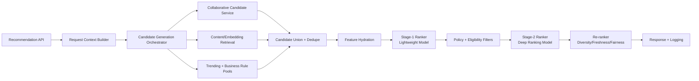

# Recommendation Pipeline Design

## 1) End-to-End Pipeline (Request Path)

### Stage contracts
- **Stage-0 (Context)**: validate identity, tenant, locale, device, and session attributes before any model call.
- **Stage-1 (Candidate Gen)**: return `N=2,000-10,000` candidates within 20ms p95 from heterogeneous sources.
- **Stage-2 (Pre-rank)**: score top `N<=2,000` with a low-latency model (target <15ms p95).
- **Stage-3 (Full rank)**: score top `N<=400` with richer features/model (target <40ms p95).
- **Stage-4 (Re-rank)**: enforce business constraints (diversity caps, policy blocks, novelty floor) on top `K<=100`.

## 2) Candidate Generation Pipelines

## 2.1 Online candidate generation
| Source | Typical Volume | SLA | Notes |
|---|---:|---:|---|
| User-user CF ANN | 500-3000 | 8ms p95 | Query user embedding against ANN index; can be absent for cold users. |
| Item-item ANN | 200-2000 | 8ms p95 | Seeded by recent interactions/session context. |
| Session co-visitation | 100-500 | 5ms p95 | Built from nearline stream aggregates. |
| Trending/popularity | 100-500 | 3ms p95 | Region/category/time-window aware fallback source. |
| Rule-driven pool | 50-300 | 3ms p95 | Sponsored, contractual, compliance-mandated inclusions. |

**Union strategy**
1. Pull sources in parallel.
2. Normalize scores (`z-score` or calibrated probability map).
3. Deduplicate by canonical item id.
4. Keep max source score + source provenance tags.
5. Reservoir sample to cap per-source dominance before ranker.

## 2.2 Offline candidate preparation
- Nightly batch computes:
  - item embeddings,
  - user embeddings,
  - co-visitation pairs,
  - popularity windows (1h/24h/7d),
  - blocked/expired inventory sets.
- Nearline jobs (1-5 minute cadence) refresh:
  - session trends,
  - short-horizon popularity,
  - soft-deletes and catalog availability.

## 3) Ranking Pipeline Design

## 3.1 Two-stage ranking
- **Pre-ranker model**: gradient boosted trees or shallow DNN using cached features only.
- **Full ranker**: richer model with cross features, sequence signals, and context embeddings.

## 3.2 Re-ranking policies
- Diversity: max 2 items per brand/seller in top-10.
- Freshness boost: new content gets controlled uplift with decay.
- Fair exposure: floor for long-tail categories by traffic segment.
- Safety/compliance: hard filtering before final response.

## 3.3 Score composition (reference)
`final_score = w_model * model_score + w_recency * recency_score + w_diversity * diversity_bonus + w_policy * policy_adjustment`

All weight updates must be feature-flagged and shadow-evaluated before rollout.

## 4) Feature Freshness Constraints

## 4.1 Freshness SLOs
| Feature Group | Max Staleness | Source | Behavior on violation |
|---|---:|---|---|
| Session actions (click/view/cart) | 120s | stream materialization | degrade to session-lite ranker |
| User aggregate counters | 15m | nearline features | fallback to previous snapshot |
| Item inventory/availability | 60s | catalog stream | hard filter unavailable items |
| Popularity windows | 5m | stream aggregates | swap to last-known-good window |
| User embedding | 24h | offline/nearline hybrid | fallback to content + popularity |
| Item embedding | 24h | offline + event-triggered refresh | if stale, reduce ANN contribution |

## 4.2 Freshness contract fields
Every feature response includes:
- `feature_version`
- `computed_at`
- `expires_at`
- `staleness_seconds`
- `source_tier` (`online`, `nearline`, `batch`, `fallback`)

Rankers must consume these fields and down-weight or bypass stale features deterministically.

## 5) Online/Offline Serving Contracts

## 5.1 Offline training -> online serving compatibility
- **Schema contract**: all online features must be defined in the training feature spec with identical type, defaulting, and transformation semantics.
- **Point-in-time correctness**: training data joins use event timestamps and leakage-safe windows.
- **Model package contract**: model artifact ships with `model.yaml` including:
  - expected feature list + types,
  - minimum feature service version,
  - calibration metadata,
  - fallback behavior matrix.

## 5.2 Inference API contract
**Request**
- `request_id`, `user_id`, `tenant_id`, `context` (locale, device, page, timestamp), optional `seed_items`.

**Response**
- `recommendations[]` with `item_id`, `rank`, `score`, `reasons[]`, `source_mix[]`.
- `degraded_mode` flag.
- `fallback_path` enum (`none`, `feature_stale`, `feature_missing`, `model_unavailable`, `index_unavailable`).

## 5.3 SLO and error budget contract
- API p95 latency < 100ms, availability >= 99.9%.
- If full-ranker budget exceeded, serve pre-ranker output + policy re-rank.
- If candidate gen fails for personalized sources, guarantee non-empty slate from trending pool.

## 5.4 Contract test suite (release gate)
- Feature parity tests (offline vs online transforms).
- Golden request replay (fixed inputs, bounded score drift).
- Backward compatibility for response schema.
- Degraded path tests for each `fallback_path` value.
