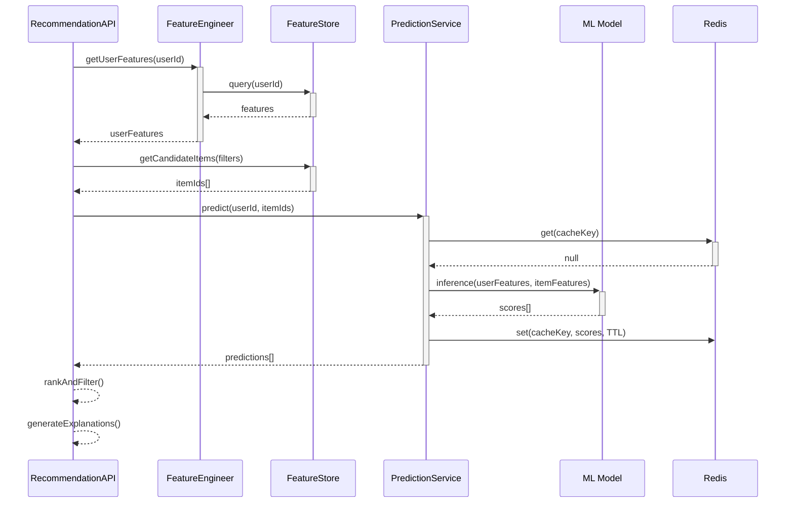
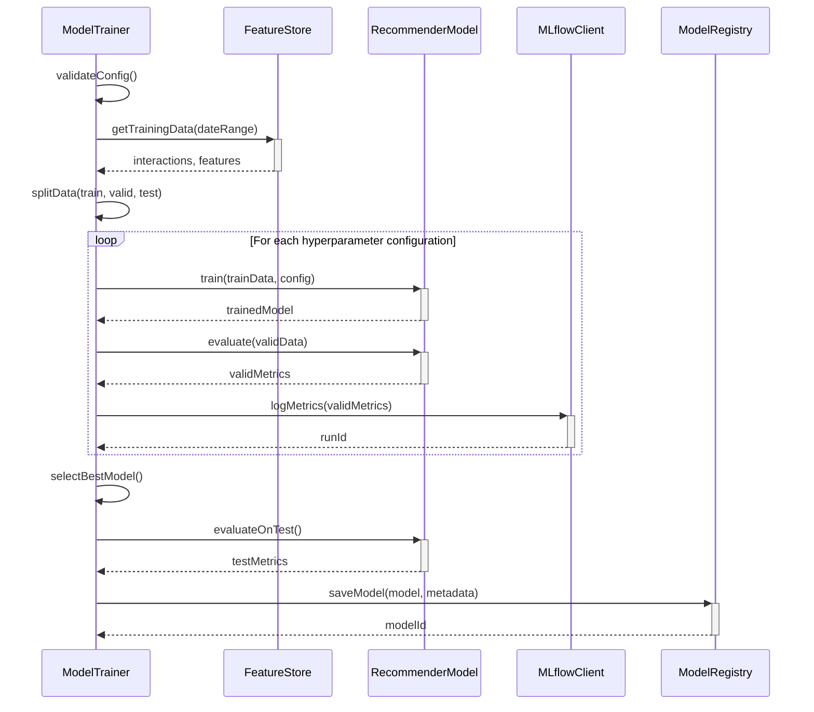

# Sequence Diagram - Smart Recommendation Engine

## SD-01: Generate Recommendations (Internal)



## SD-02: Model Training Pipeline



## SD-03: A/B Test Execution

```mermaid
sequenceDiagram
    participant User
    participant API as RecommendationAPI
    participant EXP as ExperimentManager
    participant MA as ModelA (Control)
    participant MB as ModelB (Variant)
    participant Tracker as MetricsTracker
    
    User->>+API: getRecommendations(userId)
    API->>+EXP: assignUserToGroup(userId, experimentId)
    EXP-->>-API: group

 = "control"
    
    alt Control Group
        API->>+MA: predict(userId)
        MA-->>-API: predictions
    else Variant Group
        API->>+MB: predict(userId)
        MB-->>-API: predictions
    end
    
    API-->>-User: recommendations[]
    
    Note over User: User interacts with recommendations
    
    User->>API: trackInteraction(userId, itemId, click)
    API->>Tracker: recordMetric(experimentId, group, metric)
```
