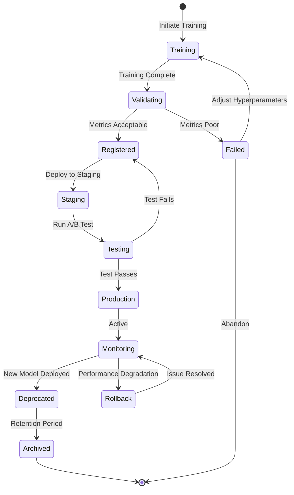
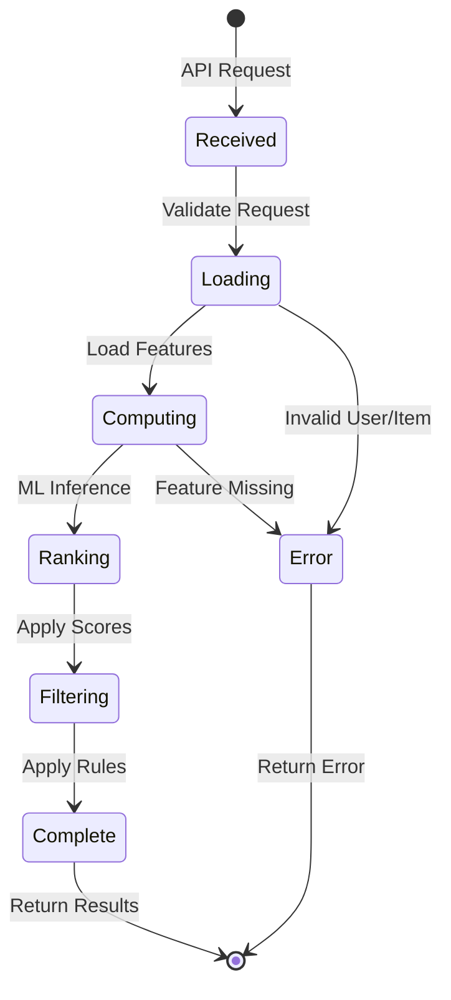
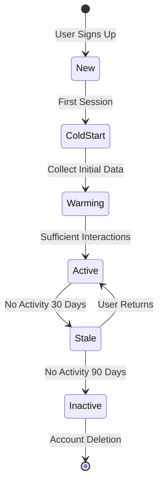
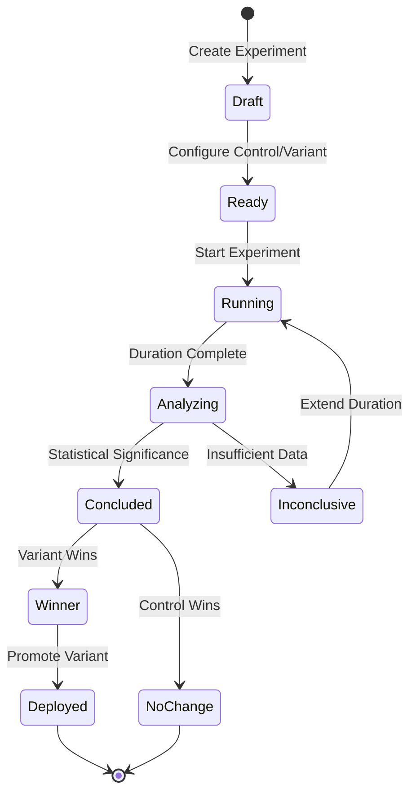

# State Machine Diagram - Smart Recommendation Engine

## 1. Model Lifecycle

```mermaid
stateDiagram-v2
    [*] --> Training: Initiate Training
    Training --> Validating: Training Complete
    Validating --> Registered: Metrics Acceptable
    Validating --> Failed: Metrics Poor
    
    Failed --> Training: Adjust Hyperparameters
    Failed --> [*]: Abandon
    
    Registered --> Staging: Deploy to Staging
    Staging --> Testing: Run A/B Test
    Testing --> Production: Test Passes
    Testing --> Registered: Test Fails
    
    Production --> Monitoring: Active
    Monitoring --> Deprecated: New Model Deployed
    Monitoring --> Rollback: Performance Degradation
    
    Rollback --> Monitoring: Issue Resolved
    Deprecated --> Archived: Retention Period
    Archived --> [*]
```

## 2. Recommendation Request

```mermaid
stateDiagram-v2
    [*] --> Received: API Request
    Received --> Loading: Validate Request
    Loading --> Computing: Load Features
    Computing --> Ranking: ML Inference
    Ranking --> Filtering: Apply Scores
    Filtering --> Complete: Apply Rules
    Complete --> [*]: Return Results
    
    Loading --> Error: Invalid User/Item
    Computing --> Error: Feature Missing
    Error --> [*]: Return Error
```

## 3. User Profile State

```mermaid
stateDiagram-v2
    [*] --> New: User Signs Up
    New --> ColdStart: First Session
    ColdStart --> Warming: Collect Initial Data
    Warming --> Active: Sufficient Interactions
    Active --> Stale: No Activity 30 Days
    Stale --> Active: User Returns
    Stale --> Inactive: No Activity 90 Days
    Inactive --> [*]: Account Deletion
```

## 4. Experiment State

```mermaid
stateDiagram-v2
    [*] --> Draft: Create Experiment
    Draft --> Ready: Configure Control/Variant
    Ready --> Running: Start Experiment
    Running --> Analyzing: Duration Complete
    Analyzing --> Concluded: Statistical Significance
    Analyzing --> Inconclusive: Insufficient Data
    
    Concluded --> Winner: Variant Wins
    Concluded --> NoChange: Control Wins
    Inconclusive --> Running: Extend Duration
    
    Winner --> Deployed: Promote Variant
    Deployed --> [*]
    NoChange --> [*]
```
