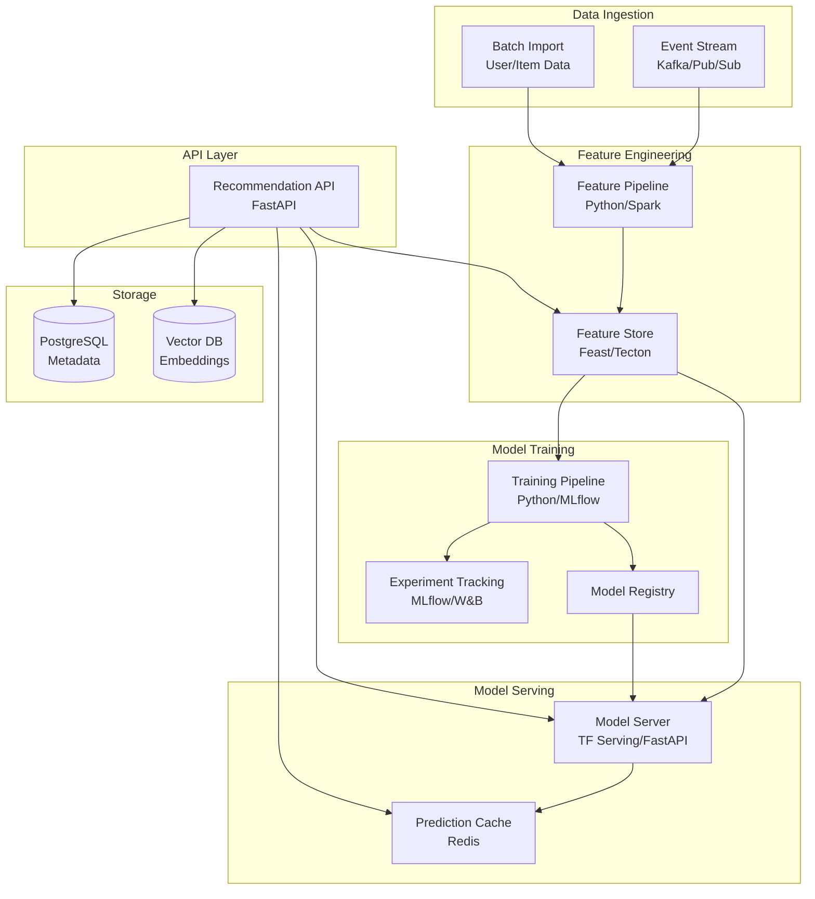

# Architecture Diagram - Smart Recommendation Engine

## ML Pipeline Architecture



## Layered Architecture

```
┌─────────────────────────────────────────┐
│         Application Layer               │
│  (API Endpoints, Business Logic)        │
└───────────────┬─────────────────────────┘
                │
┌───────────────▼─────────────────────────┐
│          ML Service Layer               │
│  (Feature Engineering, Model Serving)   │
└───────────────┬─────────────────────────┘
                │
┌───────────────▼─────────────────────────┐
│       Infrastructure Layer               │
│  (Feature Store, Model Registry, DB)    │
└─────────────────────────────────────────┘
```

## Microservices View

- **Event Tracker Service**: Capture user actions
- **Feature Service**: Manage and serve features
- **Training Service**: Train and evaluate models
- **Inference Service**: Generate predictions
- **Recommendation API**: Public-facing endpoints
