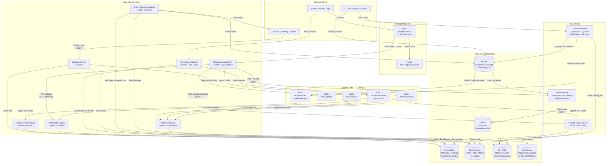

# Architecture Diagram — Smart Recommendation Engine

## Overview

The Smart Recommendation Engine is built as a collection of loosely coupled microservices that together deliver sub-100 ms personalized recommendations at scale. Each service owns a single bounded context, communicates over well-defined contracts (REST/gRPC for synchronous calls, Apache Kafka for asynchronous events), and can be deployed, scaled, and updated independently.

This document describes the full microservices architecture, the technology choices behind each service, the end-to-end request flow for a real-time recommendation, and the data flow that keeps models continuously improving.

---

## Microservices Catalogue

### 1. Recommendation API Service
- **Runtime**: Python 3.11, FastAPI, Uvicorn + Gunicorn
- **SLA**: p99 latency ≤ 100 ms, 99.9 % availability
- **Responsibilities**: Authenticates callers (JWT/API-key), resolves A/B variant, orchestrates calls to Feature Store and Model Serving, applies diversity and business rules, logs impressions to Kafka, returns ranked `RecommendationResult` payloads.
- **Scaling**: Horizontal pod autoscaler on CPU + custom metric (request queue depth). Minimum 3 replicas.

### 2. Catalog Service
- **Runtime**: Python 3.11, FastAPI
- **Responsibilities**: CRUD for items and item attributes, validates catalog payloads, enriches items with metadata (brand, category, price), triggers embedding generation via Kafka `item.upserted` events, exposes `/catalog/items` and `/catalog/search` endpoints.
- **Storage**: PostgreSQL (authoritative), Redis cache for hot items, Qdrant for embedding-based similarity.

### 3. Interaction Collector Service
- **Runtime**: Python 3.11, FastAPI, background Kafka producer pool
- **Throughput target**: 10 000+ events/sec per instance
- **Responsibilities**: Validates event schema (`click`, `purchase`, `rating`, `add_to_cart`, `view`, `skip`), performs Redis-based deduplication (event_id TTL 60 s), publishes events to the `interactions.raw` Kafka topic, returns `202 Accepted` immediately to keep client latency low.

### 4. Feature Store Service
- **Runtime**: Python, Feast (or Tecton) SDK wrapper
- **Online store**: Redis Cluster (user feature vectors, item feature vectors)
- **Offline store**: S3/GCS Parquet snapshots for training
- **Responsibilities**: Serves low-latency feature vectors for online inference (<5 ms p99), maintains feature freshness windows, exposes `/features/user/{id}` and `/features/item/{id}` endpoints, runs periodic materialization jobs to sync offline → online store.

### 5. Model Serving Service
- **Runtime**: TorchServe (PyTorch models) or TensorFlow Serving (TF SavedModels), ONNX Runtime for CPU-optimised inference
- **Responsibilities**: Loads versioned model artefacts from MLflow model registry, exposes a `/predict` gRPC endpoint, performs approximate nearest-neighbour search via Qdrant for two-tower retrieval, handles model warm-up and shadow deployment.
- **Hardware**: GPU node pool (NVIDIA T4/A10G) for neural models; CPU pool for ALS/linear models.

### 6. Training Pipeline Service
- **Runtime**: Apache Spark 3.x (ALS), PyTorch + PyTorch Lightning (NCF, two-tower), HuggingFace Transformers (BERT4Rec), Kubernetes Job orchestration
- **Responsibilities**: Reads training data from offline feature store, trains and cross-validates models, computes offline metrics (NDCG@10, MAP@K, coverage, diversity), logs everything to MLflow, publishes `model.trained` events.

### 7. A/B Testing Service
- **Runtime**: Python, FastAPI
- **Responsibilities**: Manages experiment definitions (traffic splits, eligibility rules, start/end dates), assigns users deterministically to variants using hashed bucketing, records exposures to Kafka `ab.exposures` topic, computes statistical significance (two-proportion z-test, sequential testing), exposes experiment dashboards.

### 8. Fairness Audit Service
- **Runtime**: Python, AIF360, Fairlearn
- **Responsibilities**: Subscribes to `model.trained` events, runs disparate impact and equal opportunity metrics across protected groups (age, gender, region), writes `BiasReport` records to PostgreSQL, blocks model promotion if bias score exceeds configured thresholds.

### 9. Analytics Service
- **Runtime**: Python, ClickHouse client
- **Responsibilities**: Consumes impression and interaction events from Kafka, aggregates click-through rate (CTR), conversion rate, novelty, serendipity, and intra-list diversity (ILD) per model version and experiment variant, exposes Grafana-compatible metrics endpoint.

### 10. Batch Recommendation Service
- **Runtime**: Python, Apache Spark, Kubernetes CronJob (nightly)
- **Responsibilities**: Pre-computes top-N recommendations for all active users, stores results in Redis with a 24-hour TTL, feeds personalised product digests to the Email Marketing Platform, reduces real-time load for inactive users.

---

## Technology Stack Summary

| Layer | Technology | Rationale |
|---|---|---|
| API Framework | FastAPI (Python 3.11) | High async throughput, OpenAPI auto-generation, type safety via Pydantic |
| Reverse Proxy | Nginx + cert-manager | TLS termination, rate limiting, static content |
| API Cache | Redis 7 | Sub-millisecond response cache for repeated requests |
| Feature Store | Feast / Tecton | Unified online/offline feature serving, point-in-time correctness for training |
| Online Features | Redis Cluster | <5 ms feature lookup for inference critical path |
| Offline Features | S3/GCS Parquet | Cost-efficient columnar storage for training data snapshots |
| Model Training | Apache Spark ALS | Distributed collaborative filtering for large user-item matrices |
| Model Training | PyTorch + Lightning | NCF, two-tower neural networks, flexible research iteration |
| Model Training | HuggingFace Transformers | BERT4Rec sequential recommendation using attention mechanisms |
| Model Serving | TorchServe / TF Serving | Standardised model lifecycle management, batching, A/B shadow |
| Inference Optimisation | ONNX Runtime | 2–4× CPU inference speedup via graph optimisation |
| Vector Database | Qdrant | ANN search for embedding-based retrieval, filtering, and payload storage |
| ANN (in-memory) | FAISS | High-throughput nearest-neighbour for hot embedding sets |
| Experiment Tracking | MLflow | Unified metric logging, artefact versioning, model registry |
| Message Broker | Apache Kafka | Durable, ordered, high-throughput event streaming |
| Metadata DB | PostgreSQL 15 | ACID transactions for catalog, user profiles, experiment configs |
| Analytics DB | ClickHouse | Columnar OLAP, sub-second aggregation over billions of impression rows |
| Container Orchestration | Kubernetes (EKS/GKE) | Auto-scaling, GPU node pools, rolling deployments |
| Monitoring | Prometheus + Grafana | Service-level metrics, model-level KPIs |
| APM | Datadog | Distributed traces, latency heatmaps, anomaly alerts |
| CI/CD | GitHub Actions + Argo CD | GitOps deployment pipeline |

---

## Full Architecture Diagram


```mermaid
graph TB
    %% ── External Clients ──────────────────────────────────────────
    subgraph CLIENTS["External Clients"]
        BROWSER["🌐 User Browser / App"]
        EMAIL_PLAT["📧 Email Marketing Platform"]
        DS["👨‍🔬 Data Scientist / MLOps"]
    end

    %% ── API Gateway ───────────────────────────────────────────────
    subgraph GATEWAY["API Gateway Layer"]
        NGINX["Nginx\nReverse Proxy\n(TLS, Rate-Limit)"]
        REDIS_API["Redis\nAPI Response Cache"]
    end

    %% ── Core Microservices ────────────────────────────────────────
    subgraph SERVICES["Core Microservices"]
        REC_API["Recommendation API\nFastAPI · p99 ≤100ms"]
        CATALOG_SVC["Catalog Service\nFastAPI"]
        COLLECTOR["Interaction Collector\nFastAPI · 10K+ ev/s"]
        AB_SVC["A/B Testing Service\nPython · FastAPI"]
        ANALYTICS_SVC["Analytics Service\nPython · ClickHouse"]
        BATCH_REC["Batch Recommendation\nSpark · CronJob"]
        FAIRNESS_SVC["Fairness Audit Service\nPython · AIF360"]
    end

    %% ── ML Services ───────────────────────────────────────────────
    subgraph ML_SERVICES["ML Services"]
        FEAT_SVC["Feature Store Service\nFeast/Tecton SDK"]
        MODEL_SVC["Model Serving\nTorchServe / TF Serving\nONNX Runtime"]
        TRAIN_SVC["Training Pipeline\nSpark ALS · PyTorch\nBERT4Rec · K8s Jobs"]
    end

    %% ── Storage Layer ─────────────────────────────────────────────
    subgraph STORAGE["Storage & Infrastructure"]
        PG[("PostgreSQL\nMetadata · Catalog\nExperiment Config")]
        REDIS_FEAT[("Redis Cluster\nOnline Feature Store\nRec Cache")]
        S3[("S3 / GCS\nOffline Features\nTraining Snapshots")]
        CLICKHOUSE[("ClickHouse\nImpression Analytics\nCTR / CVR Metrics")]
        QDRANT[("Qdrant\nVector DB\nEmbedding ANN")]
        MLFLOW[("MLflow\nExperiment Tracking\nModel Registry")]
    end

    %% ── Event Bus ─────────────────────────────────────────────────
    subgraph KAFKA_BUS["Apache Kafka — Event Bus"]
        K_INTERACT["Topic:\ninteractions.raw"]
        K_ITEM["Topic:\nitem.upserted"]
        K_MODEL["Topic:\nmodel.trained\nmodel.deployed"]
        K_IMPRESS["Topic:\nrecommendations\n.impressions"]
        K_AB["Topic:\nab.exposures"]
    end

    %% ── Request Path ──────────────────────────────────────────────
    BROWSER -->|"HTTPS"| NGINX
    NGINX -->|"Check cache"| REDIS_API
    NGINX -->|"Cache miss → route"| REC_API
    REC_API -->|"JWT validate\nGET /auth/verify"| AB_SVC
    REC_API -->|"GET /features/user/{id}\ngRPC"| FEAT_SVC
    REC_API -->|"POST /predict\ngRPC"| MODEL_SVC
    MODEL_SVC -->|"ANN search\nREST"| QDRANT
    REC_API -->|"async publish"| K_IMPRESS

    %% ── Interaction Path ──────────────────────────────────────────
    BROWSER -->|"POST /events"| COLLECTOR
    COLLECTOR -->|"Dedup check TTL=60s"| REDIS_FEAT
    COLLECTOR -->|"publish event"| K_INTERACT

    %% ── Catalog Path ──────────────────────────────────────────────
    EMAIL_PLAT -->|"Catalog sync\nREST"| CATALOG_SVC
    CATALOG_SVC -->|"Store item"| PG
    CATALOG_SVC -->|"Cache item"| REDIS_FEAT
    CATALOG_SVC -->|"Trigger embedding"| K_ITEM

    %% ── Feature Store ─────────────────────────────────────────────
    FEAT_SVC -->|"Online read"| REDIS_FEAT
    FEAT_SVC -->|"Materialise"| S3
    K_INTERACT -->|"Update user vector"| FEAT_SVC

    %% ── Training Path ─────────────────────────────────────────────
    DS -->|"POST /train"| TRAIN_SVC
    TRAIN_SVC -->|"Read training data"| S3
    TRAIN_SVC -->|"Log metrics & artefacts"| MLFLOW
    TRAIN_SVC -->|"publish model.trained"| K_MODEL
    K_MODEL -->|"trigger bias check"| FAIRNESS_SVC
    FAIRNESS_SVC -->|"Store BiasReport"| PG
    DS -->|"Promote version"| MLFLOW
    MLFLOW -->|"Load new model"| MODEL_SVC
    MLFLOW -->|"publish model.deployed"| K_MODEL

    %% ── A/B Testing ───────────────────────────────────────────────
    AB_SVC -->|"Store config"| PG
    K_IMPRESS -->|"Consume exposures"| AB_SVC
    K_AB -->|"Log assignment"| ANALYTICS_SVC

    %% ── Analytics ─────────────────────────────────────────────────
    K_INTERACT -->|"CTR / CVR aggregation"| ANALYTICS_SVC
    K_IMPRESS -->|"Impression events"| ANALYTICS_SVC
    ANALYTICS_SVC -->|"Write metrics"| CLICKHOUSE

    %% ── Batch Recs ────────────────────────────────────────────────
    BATCH_REC -->|"Read model"| MLFLOW
    BATCH_REC -->|"Read features"| S3
    BATCH_REC -->|"Write pre-computed recs"| REDIS_FEAT
    BATCH_REC -->|"Send digest"| EMAIL_PLAT
```

---

## Real-Time Recommendation Request Flow

The following sequence describes every hop a request makes from the moment a user opens a product page to the point recommendations appear on screen.

1. **TLS Termination** — The user's browser sends `GET /v1/recommendations?userId=U123&limit=10` over HTTPS. Nginx terminates TLS, validates the API key header, applies rate-limiting (token bucket, 100 req/s per API key), and checks the Redis API-response cache keyed on `{userId}:{page_context}:{limit}`.

2. **Cache Hit Path** — If a cached response exists (TTL = 30 s), Nginx returns it immediately. The Recommendation API is never reached. Median latency: **3–5 ms**.

3. **Cache Miss → Recommendation API** — The request is forwarded to the Recommendation API pod. The API extracts the Bearer JWT and calls the A/B Testing Service (`GET /ab/variant?userId=U123&experiment=rec_model_v3`) to determine which model variant the user is assigned to.

4. **Feature Lookup** — The API calls the Feature Store Service (`GET /features/user/U123`) which reads the user's 128-dimensional embedding, recent interaction context (last 10 items), and demographic features from the Redis online store. Simultaneously it fetches item-level features for the candidate set from the same Redis cluster. Latency target: **<5 ms**.

5. **Model Inference** — The API forwards the feature payload to the Model Serving Service over gRPC. For two-tower models the service encodes the user embedding and queries Qdrant for approximate nearest neighbours (ANN) among the 2 M item embedding vectors, returning the top-200 candidates. For neural collaborative filtering, a batch score is computed for the candidate set. Latency target: **20–40 ms**.

6. **Ranking and Business Rules** — The Recommendation API receives raw scores and applies: (a) price/inventory eligibility filter from PostgreSQL; (b) diversity re-ranking (Maximal Marginal Relevance) to prevent category repetition; (c) sponsored item injection at configurable slots; (d) explicit user exclusions (already purchased items).

7. **Response Assembly and Cache Write** — The top-10 items are serialised into the response JSON with metadata (title, image URL, price, score, explanation). The response is written to the Redis API cache (TTL = 30 s) before being returned to the client. Total end-to-end p99: **<100 ms**.

8. **Asynchronous Impression Logging** — After returning the response, the API publishes an `ImpressionEvent` to Kafka (`recommendations.impressions` topic) containing userId, itemIds, model version, experiment variant, and timestamp. This is fire-and-forget; it does not block the response path.

---

## Interaction Data Flow: From Click to Updated Model

This section describes how a single user interaction (e.g., a product click) eventually improves the recommendation model.

1. **Event Capture** — The browser fires a `POST /v1/events` to the Interaction Collector with payload `{userId, itemId, action: "click", timestamp, sessionId, pageContext}`.

2. **Deduplication** — The Collector checks Redis for `event:{eventId}`. If found (TTL = 60 s), the event is discarded as a duplicate. If not, the key is set and the event proceeds.

3. **Kafka Publish** — The validated event is published to `interactions.raw` with a partition key of `userId` to preserve per-user event ordering.

4. **Online Feature Update** — The Feature Store Service consumes the event and updates the user's interaction history in the Redis online store using a sliding-window ring buffer (last 50 interactions). This keeps recommendations fresh for the next real-time request within seconds.

5. **Analytics Aggregation** — The Analytics Service consumes the same event and increments CTR counters, session duration metrics, and per-experiment conversion funnels in ClickHouse.

6. **Offline Training Data Accumulation** — A separate Kafka consumer writes events to S3 as Parquet files partitioned by date. At end-of-day, a Spark job compacts and enriches these files with item features to produce training-ready datasets.

7. **Scheduled Training** — The Training Pipeline Service is triggered nightly (or on-demand by a data scientist). It reads the offline feature store from S3, trains ALS and NCF models, computes NDCG@10, MAP@10, coverage, and fairness metrics, and logs all artefacts to MLflow.

8. **Fairness Gate** — On `model.trained` event, the Fairness Audit Service re-runs bias checks. If disparate impact ratio < 0.8 for any protected group, it marks the model as `BLOCKED` and alerts the ML team via PagerDuty.

9. **Model Promotion** — A data scientist reviews metrics in the MLflow UI, compares against the champion model, and promotes the new version to `Production` stage via the MLflow API.

10. **Hot Reload** — The Model Serving Service polls MLflow for model version changes every 30 s. On detecting a new production version it downloads the artefact, loads it into a shadow slot, runs a warm-up pass, and atomically swaps the active model handler — with zero downtime.

---

## Fault Tolerance and Degradation Strategy

| Failure Scenario | Detection | Mitigation |
|---|---|---|
| Feature Store timeout (>10 ms) | Circuit breaker (Resilience4j) | Serve cached user vector; fall back to global popularity |
| Model Serving unavailable | Health check probe | Route to backup model (ALS matrix factorisation, always available) |
| Kafka broker partition leader election | Kafka client retries | Interaction Collector buffers events in-memory for up to 5 s |
| Redis cluster failover | Sentinel notification | Feature Store falls back to PostgreSQL for cold reads |
| Qdrant node failure | Replication factor 2 | ANN query retries on healthy replica |
| Training job failure | MLflow run status | Alerting only; current production model continues serving |

---

## Deployment Topology

```
Kubernetes Cluster
├── Namespace: rec-serving         (Recommendation API, Model Serving, Feature Store, A/B)
│   ├── GPU Node Pool              (TorchServe pods — NVIDIA T4)
│   └── CPU Node Pool              (FastAPI pods — 4 vCPU / 8 GB)
├── Namespace: rec-ingestion       (Interaction Collector, Catalog Service)
│   └── High-Throughput Node Pool  (8 vCPU / 16 GB, NVMe local disk for Kafka buffers)
├── Namespace: rec-training        (Spark Driver, PyTorch Training Jobs)
│   └── Spot/Preemptible Pool      (Cost reduction for batch workloads)
└── Namespace: rec-platform        (MLflow, Analytics Service, Fairness Audit)
```

---

## Release Gate Checklist

- [ ] Capacity model validated for target QPS and catalog growth (next 6 months).
- [ ] All service-to-service contracts versioned and backward-compatible.
- [ ] Circuit breakers and fallback policies tested under load (chaos testing with Litmus).
- [ ] GPU node pool auto-scaling verified (scale from 0 to N in <3 min).
- [ ] Fairness thresholds reviewed and approved by responsible-AI team.
- [ ] Prometheus alert rules and Grafana dashboards deployed and tested.
- [ ] Rollback procedure documented and validated in staging.
