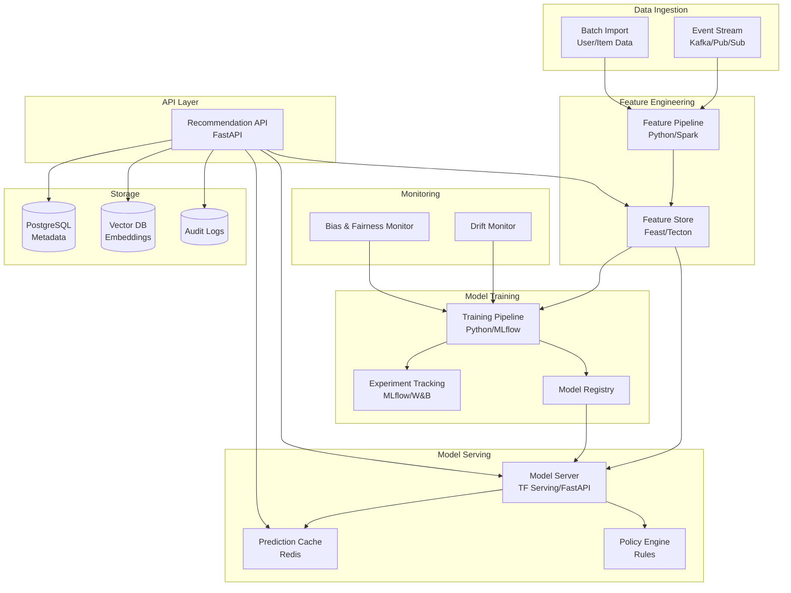
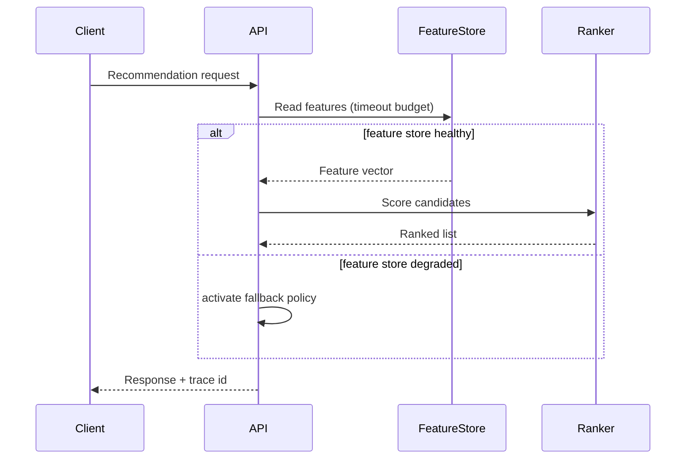

# Architecture Diagram - Smart Recommendation Engine

## ML Pipeline Architecture


```mermaid
graph TB
    subgraph "Data Ingestion"
        EVENTS[Event Stream<br/>Kafka/Pub/Sub]
        BATCH[Batch Import<br/>User/Item Data]
    end
    
    subgraph "Feature Engineering"
        FEATURE_PIPELINE[Feature Pipeline<br/>Python/Spark]
        FEATURE_STORE[Feature Store<br/>Feast/Tecton]
    end
    
    subgraph "Model Training"
        TRAIN[Training Pipeline<br/>Python/MLflow]
        EXP[Experiment Tracking<br/>MLflow/W&B]
        REGISTRY[Model Registry]
    end

    subgraph "Monitoring"
        DRIFT[Drift Monitor]
        BIAS[Bias & Fairness Monitor]
    end
    
    subgraph "Model Serving"
        SERVING[Model Server<br/>TF Serving/FastAPI]
        CACHE[Prediction Cache<br/>Redis]
        POLICY[Policy Engine<br/>Rules]
    end
    
    subgraph "API Layer"
        API[Recommendation API<br/>FastAPI]
    end
    
    subgraph "Storage"
        DB[(PostgreSQL<br/>Metadata)]
        VECTOR[(Vector DB<br/>Embeddings)]
        AUDIT[(Audit Logs)]
    end
    
    EVENTS --> FEATURE_PIPELINE
    BATCH --> FEATURE_PIPELINE
    FEATURE_PIPELINE --> FEATURE_STORE
    
    FEATURE_STORE --> TRAIN
    TRAIN --> EXP
    TRAIN --> REGISTRY
    DRIFT --> TRAIN
    BIAS --> TRAIN
    
    FEATURE_STORE --> SERVING
    REGISTRY --> SERVING
    SERVING --> CACHE
    SERVING --> POLICY
    
    API --> FEATURE_STORE
    API --> SERVING
    API --> CACHE
    API --> DB
    API --> VECTOR
    API --> AUDIT
```

## Layered Architecture

```
┌─────────────────────────────────────────┐
│         Application Layer               │
│  (API Endpoints, Business Logic)        │
└───────────────┬─────────────────────────┘
                │
┌───────────────▼─────────────────────────┐
│          ML Service Layer               │
│  (Feature Engineering, Model Serving)   │
└───────────────┬─────────────────────────┘
                │
┌───────────────▼─────────────────────────┐
│       Infrastructure Layer               │
│  (Feature Store, Model Registry, DB)    │
└─────────────────────────────────────────┘
```

## Microservices View

- **Event Tracker Service**: Capture user actions
- **Feature Service**: Manage and serve features
- **Training Service**: Train and evaluate models
- **Inference Service**: Generate predictions
- **Recommendation API**: Public-facing endpoints

## Design Realization Guidance
- Use this artifact to define deployment units, API ownership boundaries, and cross-service contracts.
- Bind each edge in the diagram to a concrete protocol (`HTTP/gRPC/Kafka`), timeout, retry, and auth mode.

## Mermaid Scenario: Failure-Aware Architecture Diagram

```mermaid
sequenceDiagram
    participant Client
    participant API
    participant FeatureStore
    participant Ranker
    Client->>API: Recommendation request
    API->>FeatureStore: Read features (timeout budget)
    alt feature store healthy
        FeatureStore-->>API: Feature vector
        API->>Ranker: Score candidates
        Ranker-->>API: Ranked list
    else feature store degraded
        API->>API: activate fallback policy
    end
    API-->>Client: Response + trace id
```

## Release Gate
- [ ] Capacity model updated for projected QPS and catalog growth.
- [ ] Threat model and data classification map reviewed.
- [ ] Rollback topology validated in staging.
