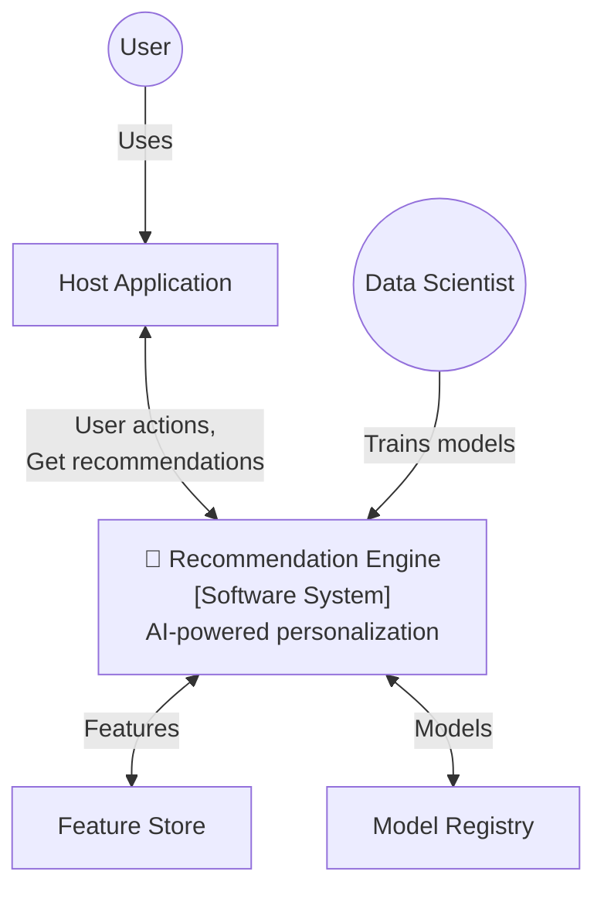
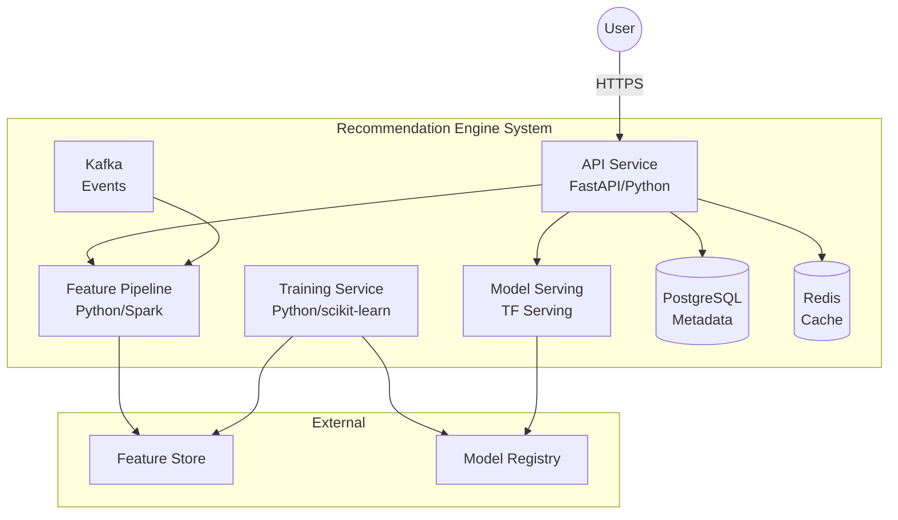
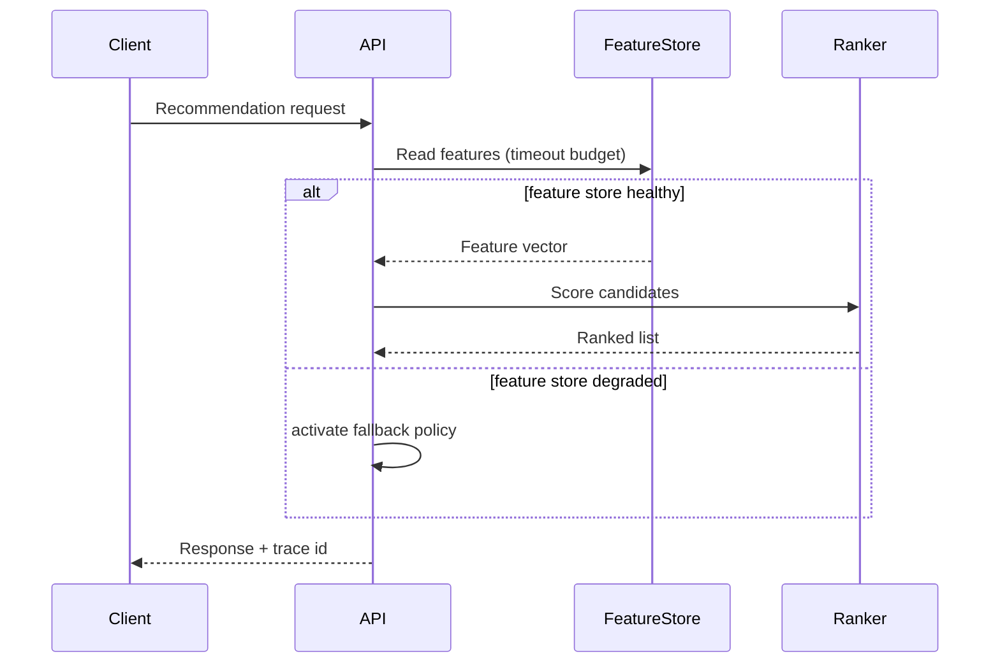

# C4 Context & Container - Smart Recommendation Engine

## Level 1: System Context

```mermaid
graph TB
    USER((User))
    DS((Data Scientist))
    
    REC["🤖 Recommendation Engine<br/>[Software System]<br/>AI-powered personalization"]
    
    HOST[Host Application]
    FEATURE[Feature Store]
    REGISTRY[Model Registry]
    
    USER -->|Uses| HOST
    HOST <-->|User actions,<br/>Get recommendations| REC
    DS -->|Trains models| REC
    REC <-->|Features| FEATURE
    REC <-->|Models| REGISTRY
```

## Level 2: Container Diagram

```mermaid
graph TB
    subgraph "Recommendation Engine System"
        API[API Service<br/>FastAPI/Python]
        TRAIN[Training Service<br/>Python/scikit-learn]
        FEATURE_ENG[Feature Pipeline<br/>Python/Spark]
        SERVING[Model Serving<br/>TF Serving]
        
        DB[(PostgreSQL<br/>Metadata)]
        REDIS[(Redis<br/>Cache)]
        KAFKA[Kafka<br/>Events]
    end
    
    subgraph "External"
        FEATURE_STORE[Feature Store]
        MODEL_REG[Model Registry]
    end
    
    USER((User)) -->|HTTPS| API
    API --> FEATURE_ENG
    API --> SERVING
    API --> REDIS
    API --> DB
    
    KAFKA --> FEATURE_ENG
    FEATURE_ENG --> FEATURE_STORE
    
    TRAIN --> FEATURE_STORE
    TRAIN --> MODEL_REG
    
    SERVING --> MODEL_REG
```

## Container Descriptions

| Container | Technology | Purpose |
|-----------|------------|---------|
| API Service | FastAPI | Handle HTTP requests |
| Training Service | Python, MLflow | Train ML models |
| Feature Pipeline | PySpark | Process events into features |
| Model Serving | TensorFlow Serving | Serve ML models |
| PostgreSQL | Database | Store metadata |
| Redis | Cache | Cache predictions |
| Kafka | Event Stream | Real-time events |

## Design Realization Guidance
- Use this artifact to define deployment units, API ownership boundaries, and cross-service contracts.
- Bind each edge in the diagram to a concrete protocol (`HTTP/gRPC/Kafka`), timeout, retry, and auth mode.

## Mermaid Scenario: Failure-Aware C4 Context Container

```mermaid
sequenceDiagram
    participant Client
    participant API
    participant FeatureStore
    participant Ranker
    Client->>API: Recommendation request
    API->>FeatureStore: Read features (timeout budget)
    alt feature store healthy
        FeatureStore-->>API: Feature vector
        API->>Ranker: Score candidates
        Ranker-->>API: Ranked list
    else feature store degraded
        API->>API: activate fallback policy
    end
    API-->>Client: Response + trace id
```

## Release Gate
- [ ] Capacity model updated for projected QPS and catalog growth.
- [ ] Threat model and data classification map reviewed.
- [ ] Rollback topology validated in staging.
