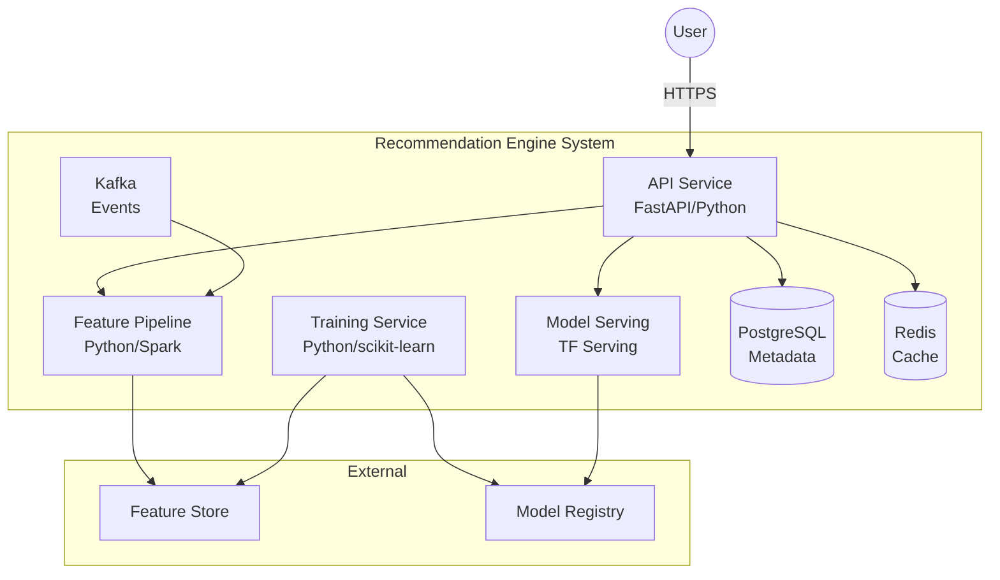

# C4 Context & Container - Smart Recommendation Engine

## Level 1: System Context

```mermaid
graph TB
    USER((User))
    DS((Data Scientist))
    
    REC["🤖 Recommendation Engine<br/>[Software System]<br/>AI-powered personalization"]
    
    HOST[Host Application]
    FEATURE[Feature Store]
    REGISTRY[Model Registry]
    
    USER -->|Uses| HOST
    HOST <-->|User actions,<br/>Get recommendations| REC
    DS -->|Trains models| REC
    REC <-->|Features| FEATURE
    REC <-->|Models| REGISTRY
```

## Level 2: Container Diagram

## Container Descriptions

| Container | Technology | Purpose |
|-----------|------------|---------|
| API Service | FastAPI | Handle HTTP requests |
| Training Service | Python, MLflow | Train ML models |
| Feature Pipeline | PySpark | Process events into features |
| Model Serving | TensorFlow Serving | Serve ML models |
| PostgreSQL | Database | Store metadata |
| Redis | Cache | Cache predictions |
| Kafka | Event Stream | Real-time events |
