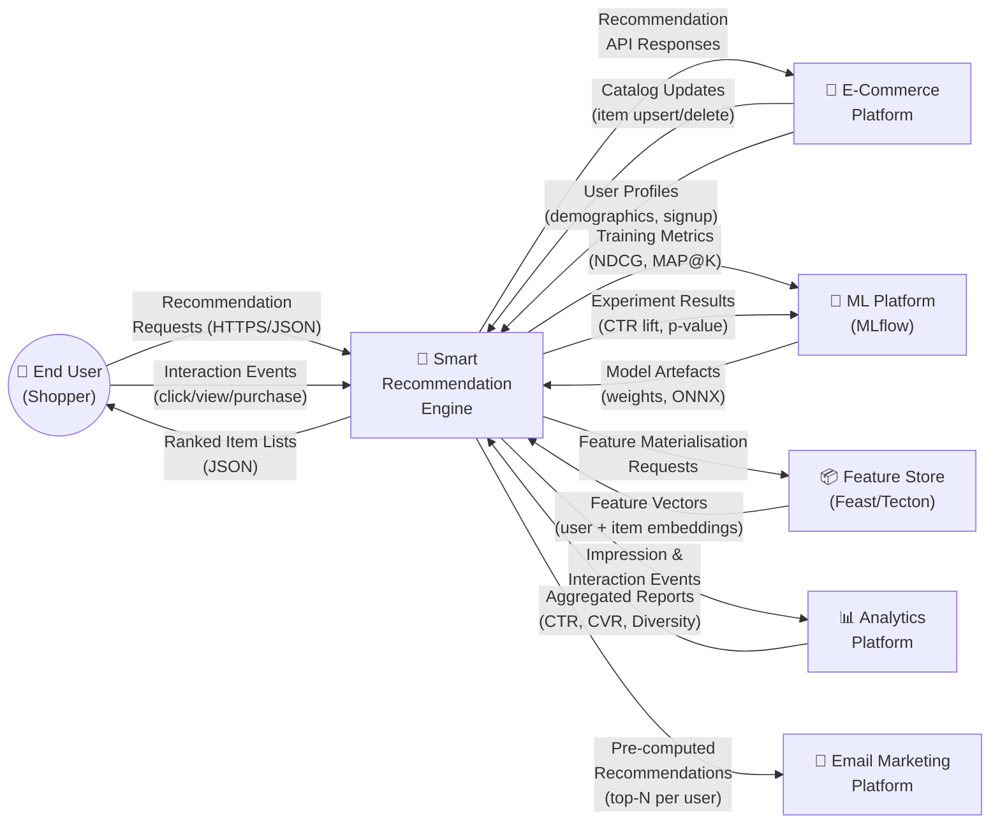
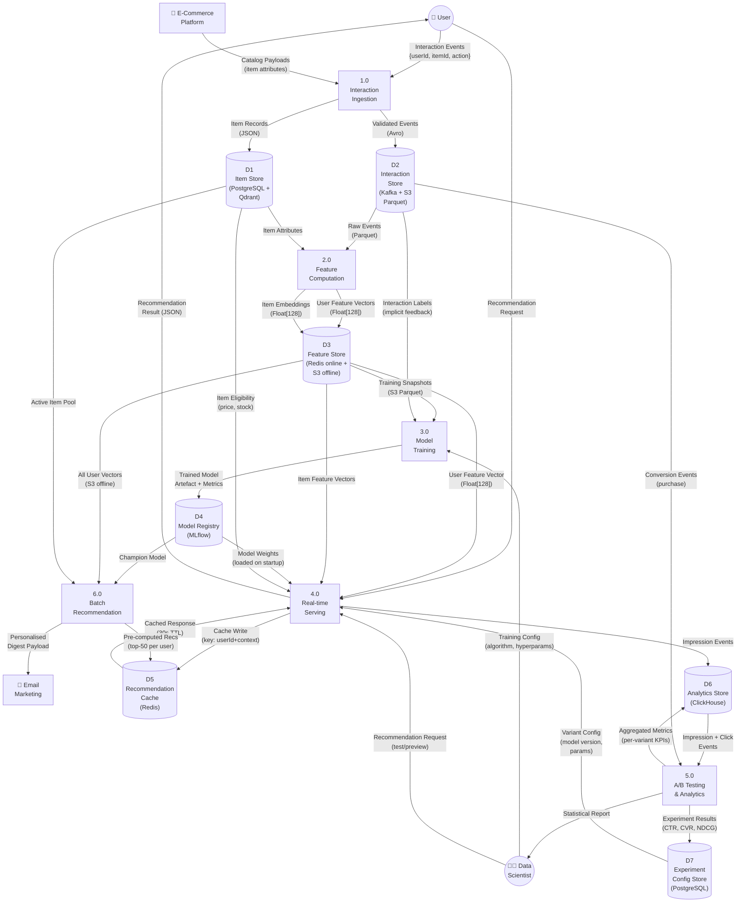
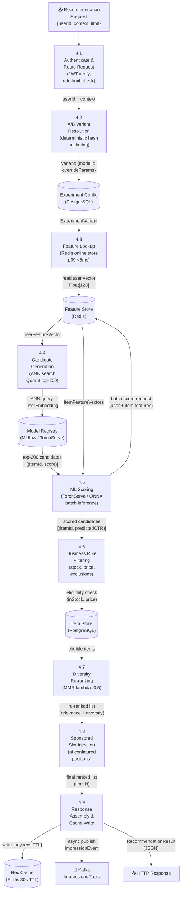
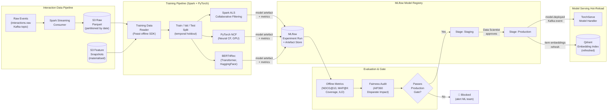
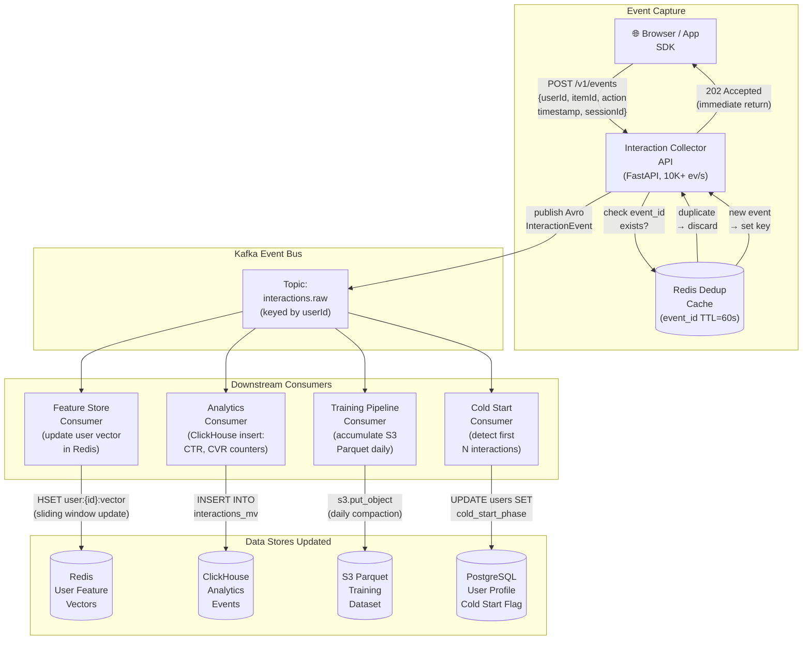

# Data Flow Diagram — Smart Recommendation Engine

## Overview

This document presents the data flows of the Smart Recommendation Engine using a three-level DFD hierarchy. Level 0 gives the system-in-context view; Level 1 decomposes the engine into its six major processes and their data stores; subsequent sections drill into specific high-value flows: real-time recommendation serving, model training, and interaction ingestion.

---

## Level 0 — Context Diagram (System Boundary)

The Level 0 diagram shows the Smart Recommendation Engine as a single process surrounded by the external entities that produce or consume data. It establishes the system boundary and names every external data flow.



---

## Level 1 — System Decomposition

Level 1 breaks the engine into six major processes and identifies the data stores each process reads from or writes to.



---

## Level 2 — Real-Time Recommendation Serving (Process 4.0)

This diagram zooms into the real-time serving process, showing every sub-step and the exact data format moving between them.



---

## Level 2 — Model Training Data Flow (Process 3.0)



---

## Level 2 — Interaction Ingestion Data Flow (Process 1.0)



---

## Data Schemas at Key Boundaries

### Interaction Event (Avro — Kafka)
```json
{
  "interactionId": "uuid-v4",
  "userId": "string",
  "itemId": "string",
  "actionType": "enum[view|click|add_to_cart|purchase|rating|skip]",
  "explicitRating": "float|null",
  "timestamp": "long (epoch ms)",
  "sessionId": "string",
  "pageContext": "string",
  "deviceType": "enum[web|ios|android]",
  "contextData": "map<string, string>"
}
```

### Feature Vector (Redis HSET)
```
Key:   feat:user:{userId}
Field: embedding      → Float[128] (MessagePack encoded)
Field: last_10_items  → JSON array of itemIds
Field: category_affinity → JSON map {category: score}
Field: computed_at    → ISO-8601 timestamp
Field: feature_set_v  → "v2.3"
```

### Recommendation Response (JSON)
```json
{
  "requestId": "uuid-v4",
  "userId": "string",
  "items": [
    {
      "position": 1,
      "itemId": "string",
      "title": "string",
      "imageUrl": "string",
      "price": 29.99,
      "score": 0.94,
      "explanation": "Based on your recent purchases",
      "isSponsored": false
    }
  ],
  "modelVersion": "als-v3.2.1",
  "experimentVariant": "treatment_neural_v2",
  "inferenceLatencyMs": 42,
  "generatedAt": "ISO-8601"
}
```

---

## Release Gate Checklist

- [ ] All Kafka topics provisioned with correct partition counts and replication factors.
- [ ] Avro schemas registered and backward-compatible in schema registry.
- [ ] Deduplication TTL validated against expected event burst window.
- [ ] S3 Parquet compaction job tested for correctness and idempotence.
- [ ] Feature freshness SLA (≤5 min lag from event to online store) validated under load.
- [ ] Offline → online feature parity test passes (no training-serving skew detected).
