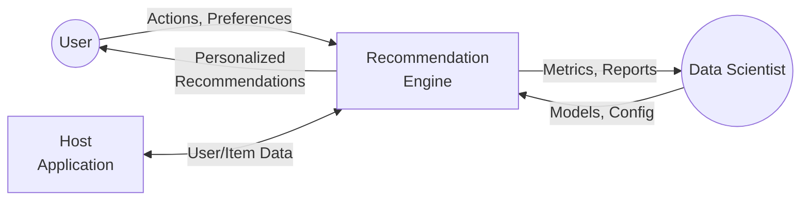
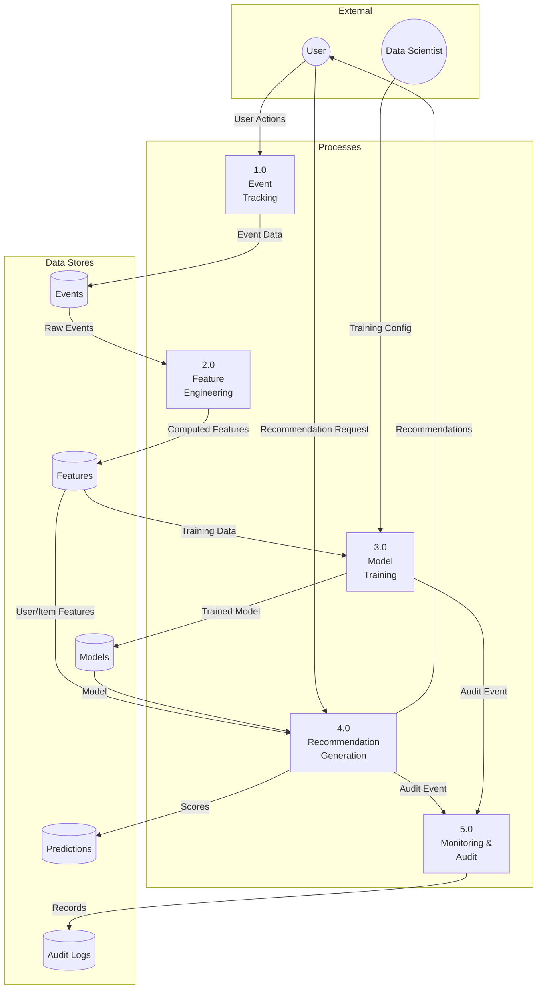
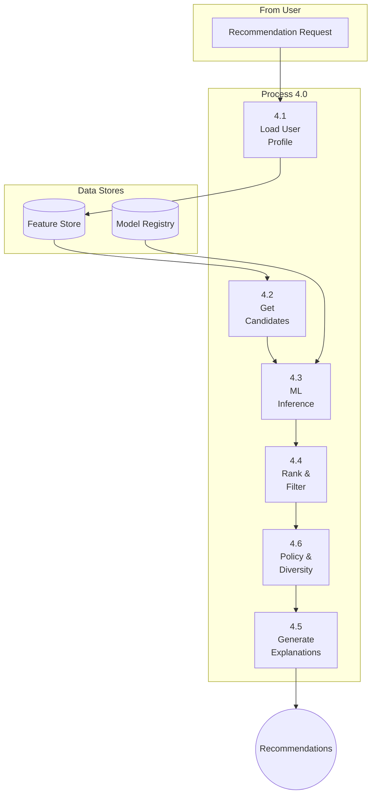
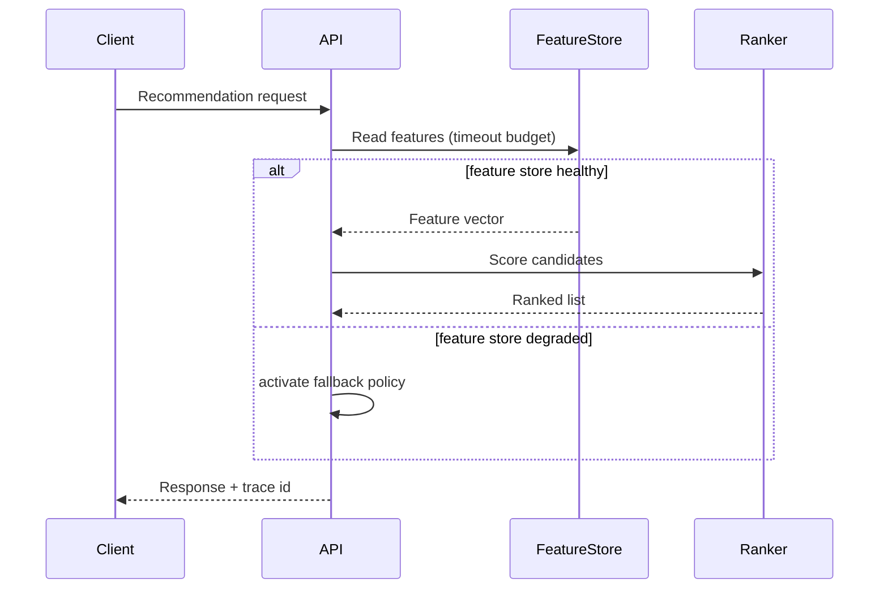

# Data Flow Diagram - Smart Recommendation Engine

## Level 0: Context Diagram

## Level 1: Main Processes

## Level 2: Recommendation Generation (4.0)

## Design Realization Guidance
- Use this artifact to define deployment units, API ownership boundaries, and cross-service contracts.
- Bind each edge in the diagram to a concrete protocol (`HTTP/gRPC/Kafka`), timeout, retry, and auth mode.

## Mermaid Scenario: Failure-Aware Data Flow Diagram

## Release Gate
- [ ] Capacity model updated for projected QPS and catalog growth.
- [ ] Threat model and data classification map reviewed.
- [ ] Rollback topology validated in staging.
