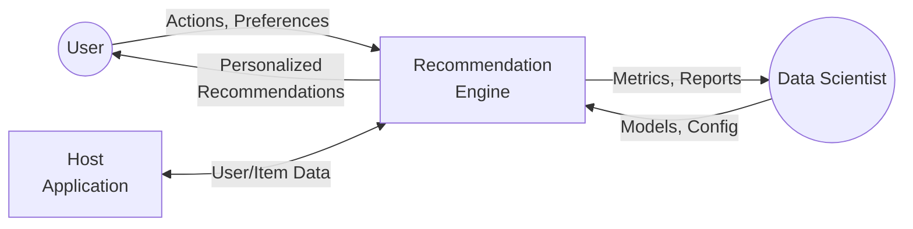
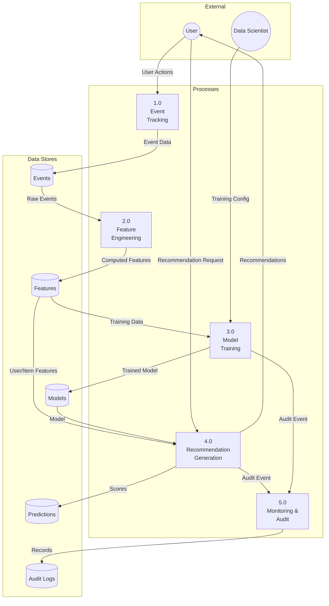
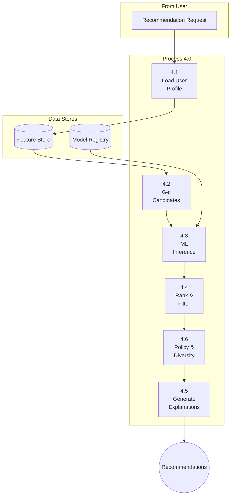

# Data Flow Diagram - Smart Recommendation Engine

## Level 0: Context Diagram

```mermaid
flowchart LR
    USER((User)) -->|Actions, Preferences| REC[Recommendation<br/>Engine]
    REC -->|Personalized<br/>Recommendations| USER
    
    DS((Data Scientist)) -->|Models, Config| REC
    REC -->|Metrics, Reports| DS
    
    HOST[Host<br/>Application] <-->|User/Item Data| REC
```

## Level 1: Main Processes

```mermaid
flowchart TB
    subgraph "External"
        USER((User))
        DS((Data Scientist))
    end
    
    subgraph "Processes"
        P1[1.0<br/>Event<br/>Tracking]
        P2[2.0<br/>Feature<br/>Engineering]
        P3[3.0<br/>Model<br/>Training]
        P4[4.0<br/>Recommendation<br/>Generation]
        P5[5.0<br/>Monitoring &<br/>Audit]
    end
    
    subgraph "Data Stores"
        D1[(Events)]
        D2[(Features)]
        D3[(Models)]
        D4[(Predictions)]
        D5[(Audit Logs)]
    end
    
    USER -->|User Actions| P1
    P1 -->|Event Data| D1
    
    D1 -->|Raw Events| P2
    P2 -->|Computed Features| D2
    
    D2 -->|Training Data| P3
    DS -->|Training Config| P3
    P3 -->|Trained Model| D3
    
    USER -->|Recommendation Request| P4
    D2 -->|User/Item Features| P4
    D3 -->|Model| P4
    P4 -->|Scores| D4
    P4 -->|Recommendations| USER
    P4 -->|Audit Event| P5
    P3 -->|Audit Event| P5
    P5 -->|Records| D5
```

## Level 2: Recommendation Generation (4.0)

```mermaid
flowchart TB
    subgraph "From User"
        REQ[Recommendation Request]
    end
    
    subgraph "Process 4.0"
        P4_1[4.1<br/>Load User<br/>Profile]
        P4_2[4.2<br/>Get<br/>Candidates]
        P4_3[4.3<br/>ML<br/>Inference]
        P4_4[4.4<br/>Rank &<br/>Filter]
        P4_5[4.5<br/>Generate<br/>Explanations]
        P4_6[4.6<br/>Policy &<br/>Diversity]
    end
    
    subgraph "Data Stores"
        D2[(Feature Store)]
        D3[(Model Registry)]
    end
    
    REQ --> P4_1
    P4_1 --> D2
    D2 --> P4_2
    P4_2 --> P4_3
    D3 --> P4_3
    P4_3 --> P4_4
    P4_4 --> P4_6
    P4_6 --> P4_5
    P4_5 --> RES((Recommendations))
```
