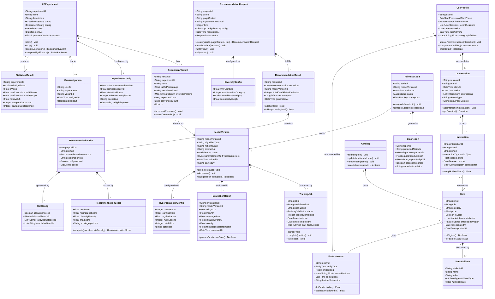

# Domain Model — Smart Recommendation Engine

## Overview

The domain model captures the core business concepts, rules, and relationships of the Smart Recommendation Engine. It is structured around Domain-Driven Design (DDD) principles: aggregate roots enforce consistency boundaries, value objects carry immutable, self-validating data, domain events decouple aggregates, and domain services coordinate operations that span multiple aggregates.

The engine has **four primary aggregate roots**:

| Aggregate Root | Bounded Context | Responsibility |
|---|---|---|
| `RecommendationRequest` | Serving | Orchestrates a single recommendation lifecycle — from request receipt to ranked result delivery |
| `ModelVersion` | ML Platform | Manages a trained model artefact from training through evaluation to deployment |
| `ABExperiment` | Experimentation | Controls traffic allocation, variant assignment, and statistical analysis for an experiment |
| `UserProfile` | Identity & Personalisation | Maintains the accumulated representation of a user's preferences and history |

---

## Full Class Diagram

```mermaid
classDiagram
    %% ────────────────────────────────────────────────────────
    %% Aggregate Root: RecommendationRequest
    %% ────────────────────────────────────────────────────────
    class RecommendationRequest {
        +String requestId
        +String userId
        +String pageContext
        +String experimentVariantId
        +Integer limit
        +DiversityConfig diversityConfig
        +DateTime requestedAt
        +RequestStatus status
        +create(userId, pageContext, limit) RecommendationRequest
        +attachVariant(variantId) void
        +fulfill(result) void
        +fail(reason) void
    }

    class RecommendationResult {
        +String requestId
        +List~RecommendationSlot~ slots
        +String modelVersionId
        +Integer totalCandidatesEvaluated
        +Long inferenceLatencyMs
        +DateTime generatedAt
        +addSlot(slot) void
        +toResponsePayload() Map
    }

    class RecommendationSlot {
        +Integer position
        +String itemId
        +RecommendationScore score
        +String explanationText
        +Boolean isSponsored
        +SlotConfig config
    }

    class SlotConfig {
        +Boolean allowSponsored
        +Float minScoreThreshold
        +List~String~ allowedCategories
        +List~String~ excludedItemIds
    }

    class DiversityConfig {
        +Float mmrLambda
        +Integer maxItemsPerCategory
        +Boolean enableSerendipity
        +Float serendipityWeight
    }

    %% ────────────────────────────────────────────────────────
    %% Aggregate Root: ModelVersion
    %% ────────────────────────────────────────────────────────
    class ModelVersion {
        +String modelVersionId
        +String algorithmType
        +String mlflowRunId
        +String artefactUri
        +ModelStatus status
        +HyperparameterConfig hyperparameters
        +DateTime trainedAt
        +String trainedBy
        +promote(stage) void
        +deprecate() void
        +isEligibleForProduction() Boolean
    }

    class TrainingJob {
        +String jobId
        +String modelVersionId
        +String sparkJobId
        +TrainingJobStatus status
        +Integer epochsCompleted
        +DateTime startedAt
        +DateTime completedAt
        +Map~String,Float~ finalMetrics
        +start() void
        +complete(metrics) void
        +fail(reason) void
    }

    class EvaluationResult {
        +String evaluationId
        +String modelVersionId
        +Float ndcgAt10
        +Float mapAtK
        +Float coverageRate
        +Float intralistDiversity
        +Float novelty
        +Float fairnessDIsparateImpact
        +DateTime evaluatedAt
        +passesProductionGate() Boolean
    }

    class HyperparameterConfig {
        +Integer numFactors
        +Float learningRate
        +Float regularisation
        +Integer numEpochs
        +Integer batchSize
        +String optimiser
    }

    %% ────────────────────────────────────────────────────────
    %% Aggregate Root: ABExperiment
    %% ────────────────────────────────────────────────────────
    class ABExperiment {
        +String experimentId
        +String name
        +String description
        +ExperimentStatus status
        +ExperimentConfig config
        +DateTime startAt
        +DateTime endAt
        +List~ExperimentVariant~ variants
        +start() void
        +stop() void
        +assignUser(userId) ExperimentVariant
        +computeSignificance() StatisticalResult
    }

    class ExperimentVariant {
        +String variantId
        +String experimentId
        +String name
        +Float trafficPercentage
        +String modelVersionId
        +Map~String,Object~ overrideParams
        +Long exposureCount
        +Long conversionCount
        +Float ctr
        +incrementExposure() void
        +recordConversion() void
    }

    class UserAssignment {
        +String userId
        +String experimentId
        +String variantId
        +DateTime assignedAt
        +Boolean isHoldout
    }

    class ExperimentConfig {
        +Float minimumDetectableEffect
        +Float significanceLevel
        +Float statisticalPower
        +Integer minimumSampleSize
        +String bucketing
        +List~String~ eligibilityRules
    }

    class StatisticalResult {
        +String experimentId
        +Boolean isSignificant
        +Float pValue
        +Float confidenceInterval95Lower
        +Float confidenceInterval95Upper
        +Float relativeLift
        +Integer sampleSizeControl
        +Integer sampleSizeTreatment
    }

    %% ────────────────────────────────────────────────────────
    %% Aggregate Root: UserProfile
    %% ────────────────────────────────────────────────────────
    class UserProfile {
        +String userId
        +ColdStartPhase coldStartPhase
        +FeatureVector featureVector
        +List~UserSession~ recentSessions
        +DateTime createdAt
        +DateTime lastActiveAt
        +Map~String,Float~ categoryAffinities
        +updateFromInteraction(interaction) void
        +computeEmbedding() FeatureVector
        +isColdStart() Boolean
    }

    class UserSession {
        +String sessionId
        +String userId
        +DateTime startAt
        +DateTime endAt
        +List~Interaction~ interactions
        +String deviceType
        +String entryPageContext
        +addInteraction(interaction) void
        +getDuration() Duration
    }

    class Interaction {
        +String interactionId
        +String userId
        +String itemId
        +InteractionType actionType
        +Float explicitRating
        +DateTime occurredAt
        +Map~String,Object~ contextData
        +toImplicitFeedback() Float
    }

    class FeatureVector {
        +String entityId
        +EntityType entityType
        +Float[] embedding
        +Map~String,Float~ scalarFeatures
        +DateTime computedAt
        +String featureSetVersion
        +dotProduct(other) Float
        +cosineSimilarity(other) Float
    }

    %% ────────────────────────────────────────────────────────
    %% Catalog Context
    %% ────────────────────────────────────────────────────────
    class Catalog {
        +addItem(item) void
        +updateItem(itemId, attrs) void
        +removeItem(itemId) void
        +searchItems(query) List~Item~
    }

    class Item {
        +String itemId
        +String title
        +String category
        +Float price
        +Boolean inStock
        +List~ItemAttribute~ attributes
        +FeatureVector embeddingVector
        +DateTime createdAt
        +DateTime updatedAt
        +isEligible() Boolean
        +toFeatureMap() Map
    }

    class ItemAttribute {
        +String attributeId
        +String name
        +String value
        +AttributeType attributeType
        +Float numericValue
    }

    %% ────────────────────────────────────────────────────────
    %% Fairness Context
    %% ────────────────────────────────────────────────────────
    class FairnessAudit {
        +String auditId
        +String modelVersionId
        +DateTime auditedAt
        +AuditStatus status
        +List~BiasReport~ reports
        +run(modelVersionId) void
        +isModelApproved() Boolean
    }

    class BiasReport {
        +String reportId
        +String protectedAttribute
        +Float disparateImpactRatio
        +Float equalOpportunityDiff
        +Float demographicParityDiff
        +Boolean passesThreshold
        +String remediationAdvice
    }

    class RecommendationScore {
        +Float rawScore
        +Float normalizedScore
        +Float diversityPenalty
        +Float finalScore
        +String scoringAlgorithm
        +compute(raw, diversityPenalty) RecommendationScore
    }

    %% ────────────────────────────────────────────────────────
    %% Relationships
    %% ────────────────────────────────────────────────────────

    RecommendationRequest "1" *-- "1" RecommendationResult : fulfills
    RecommendationRequest "1" *-- "1" DiversityConfig : configured by
    RecommendationResult "1" *-- "1..*" RecommendationSlot : contains
    RecommendationSlot "1" *-- "1" RecommendationScore : scored by
    RecommendationSlot "1" *-- "1" SlotConfig : governed by

    ModelVersion "1" *-- "1" TrainingJob : produced by
    ModelVersion "1" *-- "1" EvaluationResult : evaluated in
    ModelVersion "1" *-- "1" HyperparameterConfig : configured with

    ABExperiment "1" *-- "2..*" ExperimentVariant : has
    ABExperiment "1" *-- "1" ExperimentConfig : configured by
    ABExperiment "1" o-- "0..*" UserAssignment : tracks
    ExperimentVariant "1" --> "1" ModelVersion : references
    ABExperiment "1" ..> "1" StatisticalResult : produces

    UserProfile "1" *-- "0..*" UserSession : accumulates
    UserProfile "1" *-- "1" FeatureVector : represented by
    UserSession "1" *-- "0..*" Interaction : records
    Interaction "0..*" --> "1" Item : references

    Catalog "1" *-- "0..*" Item : owns
    Item "1" *-- "0..*" ItemAttribute : described by
    Item "1" o-- "1" FeatureVector : has

    FairnessAudit "1" *-- "1..*" BiasReport : generates
    FairnessAudit "1" --> "1" ModelVersion : audits
```

---

## Value Objects

Value objects are immutable and defined entirely by their attributes. They carry no identity of their own.

### `RecommendationScore`
Encapsulates the multi-stage scoring pipeline result. The `rawScore` comes from the ML model (e.g., predicted click probability). The `diversityPenalty` is applied by Maximal Marginal Relevance re-ranking. The `finalScore` drives slot ordering.

### `DiversityConfig`
Controls how aggressively the ranking engine diversifies results. `mmrLambda` (0–1) balances relevance vs. diversity. `maxItemsPerCategory` prevents category monopoly. These values differ per page context (homepage vs. cart upsell).

### `ExperimentConfig`
Stores the statistical design parameters for an A/B experiment before it is launched. Once the experiment starts, this config is immutable — changes require a new experiment to prevent Simpson's paradox from polluting results.

### `FeatureConfig`
(Used by Feature Store Service.) Specifies which feature groups and versions to materialise for a given model. Stored alongside `ModelVersion` to guarantee training-serving skew prevention.

### `HyperparameterConfig`
Immutable once a `TrainingJob` begins. Logged to MLflow verbatim to ensure full reproducibility of training runs.

---

## Domain Events

Domain events are published to Kafka and allow aggregates to react to changes without direct coupling.

| Event | Published By | Consumed By |
|---|---|---|
| `UserInteractionRecorded` | Interaction Collector | Feature Store, Analytics, Training Pipeline |
| `ItemUpserted` | Catalog Service | Model Serving (embedding refresh), Feature Store |
| `ItemRemoved` | Catalog Service | Recommendation API (exclusion list refresh) |
| `RecommendationServed` | Recommendation API | Analytics Service, A/B Testing Service |
| `ModelTrainingCompleted` | Training Pipeline | Fairness Audit Service, Data Scientist alert |
| `ModelVersionPromoted` | MLflow / Model Registry | Model Serving Service (hot reload) |
| `ModelVersionDeprecated` | Data Scientist | Model Serving Service (unload), Analytics (archive) |
| `ExperimentStarted` | A/B Testing Service | Recommendation API (load variant config) |
| `ExperimentStopped` | A/B Testing Service | Analytics Service (finalise metrics) |
| `BiasThresholdExceeded` | Fairness Audit Service | PagerDuty alert, Model Registry (block promotion) |
| `ColdStartUserCreated` | User Profile Service | Recommendation API (trigger popularity fallback) |

---

## Domain Services

Domain services implement logic that does not naturally belong to a single aggregate.

### `RecommendationEngine`
Coordinates a full recommendation cycle: retrieves user features from `UserProfile`, fetches item candidates via the `Catalog`, invokes `ModelVersion` scoring, applies `DiversityConfig`, and assembles the `RecommendationResult`. Lives in the Serving bounded context.

### `FeatureEngineer`
Transforms raw `Interaction` events into numeric feature vectors. Handles implicit feedback normalisation (purchase > cart-add > click > view), computes recency-weighted interaction counts, and manages feature freshness checks. Owned by the ML Platform context.

### `ModelTrainer`
Orchestrates a full training run: reads offline features from S3, configures Spark/PyTorch based on `HyperparameterConfig`, checkpoints progress, and finalises the `TrainingJob` with evaluation metrics. Publishes `ModelTrainingCompleted` on success.

### `ExperimentManager`
Manages the full lifecycle of an `ABExperiment`: validates variant traffic percentages sum to ≤ 100 %, runs bucketing assignment for incoming users using deterministic hashing (`murmurhash(userId + experimentId) % 100`), and continuously monitors for early stopping conditions using the sequential probability ratio test (SPRT).

---

## Ubiquitous Language Glossary

| Term | Definition |
|---|---|
| **Recommendation Request** | A single invocation asking the system to produce a ranked list of items for a user in a given context. |
| **Recommendation Slot** | One position in the returned recommendation list, carrying an item, its score, and its explanation. |
| **Impression** | The act of showing a recommendation slot to a user. Recorded as a domain event. |
| **Interaction** | A user action against an item: `view`, `click`, `add_to_cart`, `purchase`, `rating`, `skip`. |
| **Implicit Feedback** | Interaction signals (clicks, views) from which preference must be inferred, as opposed to explicit ratings. |
| **Feature Vector** | A numeric representation of a user or item used as input to an ML model. |
| **Embedding** | A dense, low-dimensional float vector learned by a neural model that captures semantic similarity. |
| **Cold Start** | The state of a new user or item for which insufficient interaction history exists to produce personalised recommendations. |
| **Candidate Generation** | The first stage of the recommendation pipeline that narrows millions of items down to hundreds of candidates. |
| **Ranking** | The second stage that scores and orders candidates to produce the final recommendation list. |
| **Re-ranking** | Post-model adjustments to the ranked list for diversity, business rules, or sponsored insertion. |
| **Model Version** | A specific trained artefact identified by algorithm, training run, and semantic version number. |
| **Champion Model** | The currently deployed production model version serving live traffic. |
| **Challenger Model** | A newly trained model version being evaluated in an A/B experiment against the champion. |
| **A/B Experiment** | A controlled trial that exposes different user segments to different model variants to measure impact. |
| **Variant** | One arm of an A/B experiment, associated with a specific model version and traffic allocation. |
| **Disparate Impact Ratio** | A fairness metric: the ratio of positive outcome rates between a protected group and a reference group. A ratio below 0.8 is flagged. |
| **NDCG@K** | Normalised Discounted Cumulative Gain at K — the primary offline evaluation metric measuring ranking quality. |
| **Feature Freshness** | The maximum tolerable age of a feature value before it is considered stale for inference. |
| **Training-Serving Skew** | A production bug where features computed at training time differ from features computed at serving time, degrading model accuracy. |
| **MMR** | Maximal Marginal Relevance — a re-ranking algorithm that balances relevance and diversity. |
| **ANN Search** | Approximate Nearest Neighbour search — efficiently finds the most similar embedding vectors in a large index. |
| **Materialization** | The process of computing features from raw data and writing them to the online feature store. |

---

## Release Gate Checklist

- [ ] All aggregate root invariants documented and enforced by unit tests.
- [ ] Domain events schema registered in the Kafka schema registry (Avro/Protobuf).
- [ ] Ubiquitous language reviewed with product, data science, and engineering teams.
- [ ] Value object immutability enforced at the language level (frozen dataclasses / Pydantic models).
- [ ] Domain service integration tests cover all cross-aggregate workflows.
