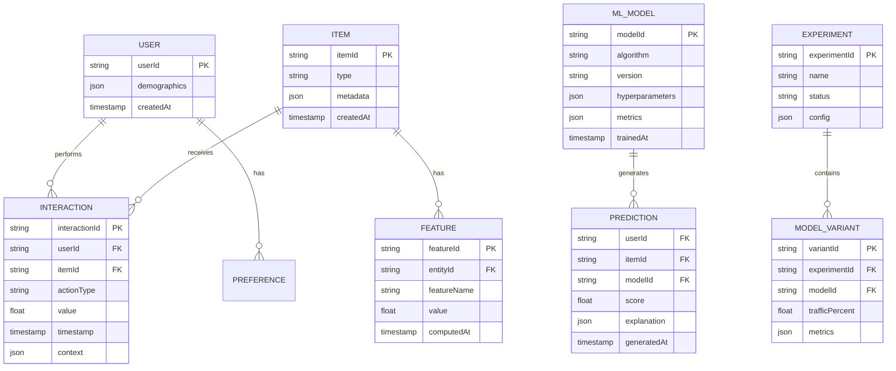
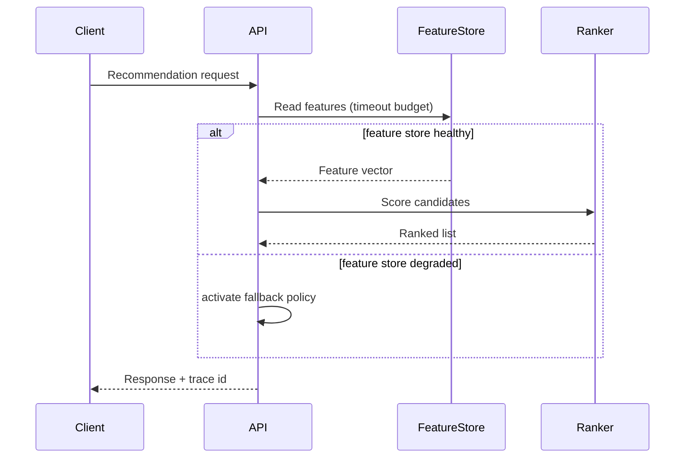

# Domain Model - Smart Recommendation Engine

```mermaid
erDiagram
    USER ||--o{ INTERACTION : performs
    USER ||--o{ PREFERENCE : has
    USER {
        string userId PK
        json demographics
        timestamp createdAt
    }
    
    ITEM ||--o{ INTERACTION : receives
    ITEM ||--o{ FEATURE : has
    ITEM {
        string itemId PK
        string type
        json metadata
        timestamp createdAt
    }
    
    INTERACTION {
        string interactionId PK
        string userId FK
        string itemId FK
        string actionType
        float value
        timestamp timestamp
        json context
    }
    
    FEATURE {
        string featureId PK
        string entityId FK
        string featureName
        float value
        timestamp computedAt
    }
    
    ML_MODEL ||--o{ PREDICTION : generates
    ML_MODEL {
        string modelId PK
        string algorithm
        string version
        json hyperparameters
        json metrics
        timestamp trainedAt
    }
    
    PREDICTION {
        string userId FK
        string itemId FK
        string modelId FK
        float score
        json explanation
        timestamp generatedAt
    }
    
    EXPERIMENT ||--o{ MODEL_VARIANT : contains
    EXPERIMENT {
        string experimentId PK
        string name
        string status
        json config
    }
    
    MODEL_VARIANT {
        string variantId PK
        string experimentId FK
        string modelId FK
        float trafficPercent
        json metrics
    }
```

**Domain Services**:
- **FeatureEngineering**: Extract and compute features from raw data
- **ModelTraining**: Train ML models on historical data
- **RecommendationGeneration**: Generate personalized recommendations
- **ExperimentManagement**: Run A/B tests

## Design Realization Guidance
- Use this artifact to define deployment units, API ownership boundaries, and cross-service contracts.
- Bind each edge in the diagram to a concrete protocol (`HTTP/gRPC/Kafka`), timeout, retry, and auth mode.

## Mermaid Scenario: Failure-Aware Domain Model

```mermaid
sequenceDiagram
    participant Client
    participant API
    participant FeatureStore
    participant Ranker
    Client->>API: Recommendation request
    API->>FeatureStore: Read features (timeout budget)
    alt feature store healthy
        FeatureStore-->>API: Feature vector
        API->>Ranker: Score candidates
        Ranker-->>API: Ranked list
    else feature store degraded
        API->>API: activate fallback policy
    end
    API-->>Client: Response + trace id
```

## Release Gate
- [ ] Capacity model updated for projected QPS and catalog growth.
- [ ] Threat model and data classification map reviewed.
- [ ] Rollback topology validated in staging.
