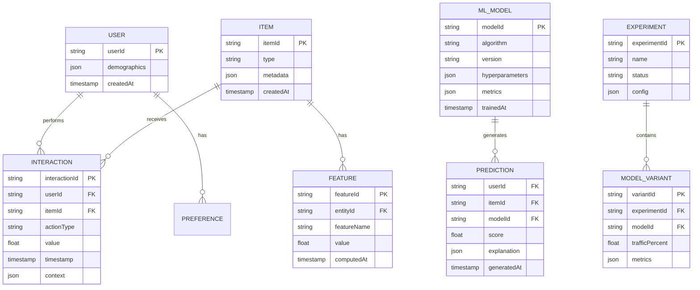

# Domain Model - Smart Recommendation Engine

**Domain Services**:
- **FeatureEngineering**: Extract and compute features from raw data
- **ModelTraining**: Train ML models on historical data
- **RecommendationGeneration**: Generate personalized recommendations
- **ExperimentManagement**: Run A/B tests
