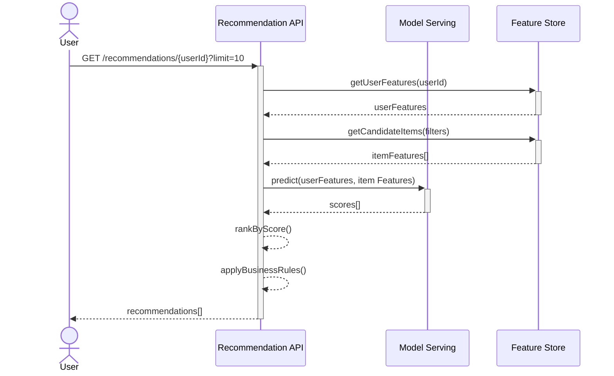
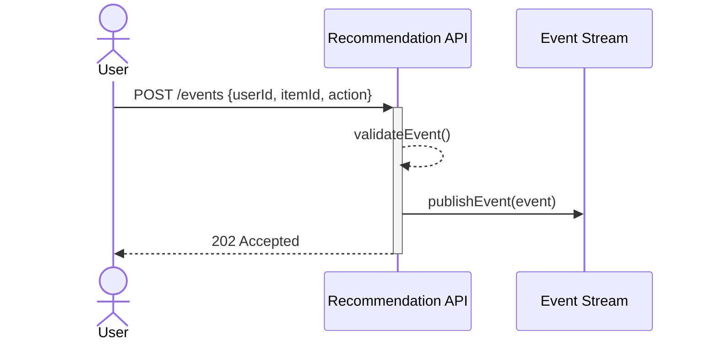
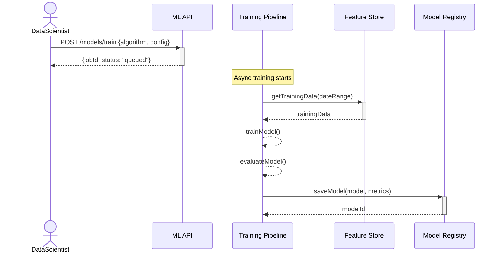

# System Sequence Diagram - Smart Recommendation Engine

## SSD-01: Get Recommendations

```mermaid
sequenceDiagram
    actor User
    participant API as Recommendation API
    participant ModelServing as Model Serving
    participant FeatureStore as Feature Store
    
    User->>+API: GET /recommendations/{userId}?limit=10
    API->>+FeatureStore: getUserFeatures(userId)
    FeatureStore-->>-API: userFeatures
    API->>+FeatureStore: getCandidateItems(filters)
    FeatureStore-->>-API: itemFeatures[]
    API->>+ModelServing: predict(userFeatures, item Features)
    ModelServing-->>-API: scores[]
    API-->>API: rankByScore()
    API-->>API: applyBusinessRules()
    API-->>-User: recommendations[]
```

## SSD-02: Track User Action

```mermaid
sequenceDiagram
    actor User
    participant API as Recommendation API
    participant EventStream as Event Stream
    
    User->>+API: POST /events {userId, itemId, action}
    API-->>API: validateEvent()
    API->>EventStream: publishEvent(event)
    API-->>-User: 202 Accepted
```

## SSD-03: Train Model

```mermaid
sequenceDiagram
    actor DataScientist
    participant API as ML API
    participant TrainingPipeline as Training Pipeline
    participant FeatureStore as Feature Store
    participant ModelRegistry as Model Registry
    
    DataScientist->>+API: POST /models/train {algorithm, config}
    API-->>-DataScientist: {jobId, status: "queued"}
    
    Note over TrainingPipeline: Async training starts
    
    TrainingPipeline->>+FeatureStore: getTrainingData(dateRange)
    FeatureStore-->>-TrainingPipeline: trainingData
    TrainingPipeline-->>TrainingPipeline: trainModel()
    TrainingPipeline-->>TrainingPipeline: evaluateModel()
    TrainingPipeline->>+ModelRegistry: saveModel(model, metrics)
    ModelRegistry-->>-TrainingPipeline: modelId
```
