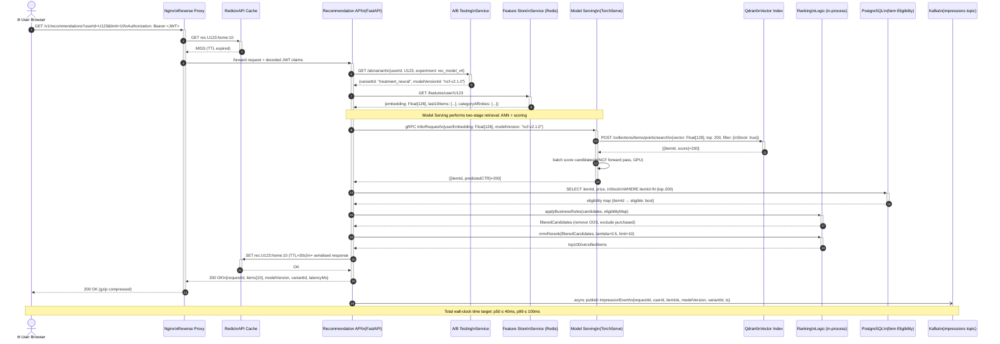
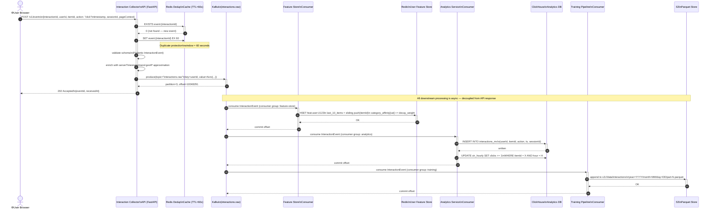
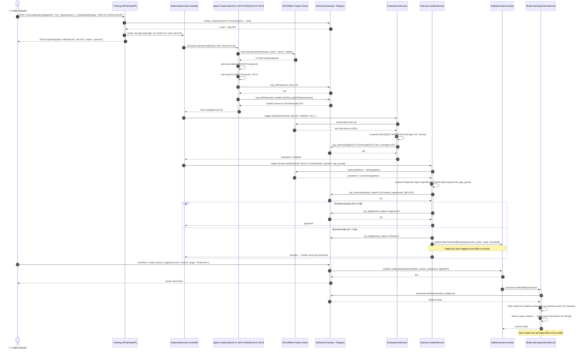
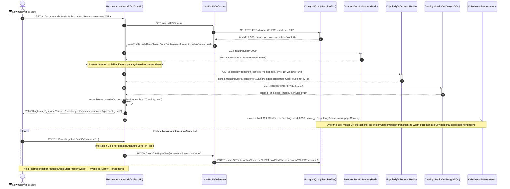

# System Sequence Diagrams — Smart Recommendation Engine

## Overview

This document contains system-level sequence diagrams (SSDs) for the four most important interaction scenarios in the Smart Recommendation Engine. Each SSD shows the messages exchanged between actors and system components, including synchronous calls, asynchronous events, error/fallback paths, and timing annotations.

---

## SSD-01: Real-Time Recommendation Request (Happy Path)

**Trigger**: A logged-in user loads a product discovery page.  
**Goal**: Return a ranked, diversified, experiment-aware list of up to N recommendations within 100 ms (p99).  
**Preconditions**: JWT is valid; user has at least one prior interaction (warm user).



### Key Design Decisions in SSD-01
- Steps 3–4: The API cache check happens at Nginx before the Recommendation API is ever invoked, saving the full orchestration cost on cache hits (>60 % of requests in steady state).
- Steps 6–8: Feature lookup and A/B assignment can be parallelised with `asyncio.gather` because they are independent.
- Steps 9–11: Two-tower retrieval (ANN) narrows 2 M items to 200 candidates; NCF scoring then ranks those 200 precisely. This two-stage design keeps latency within budget.
- Step 18: The Kafka publish is fire-and-forget (non-blocking). If Kafka is slow, it does not affect response latency.

---

## SSD-02: Interaction Event Recording

**Trigger**: A user clicks on a recommended item.  
**Goal**: Record the interaction durably, update real-time features, and feed analytics — all without blocking the UI click response beyond 50 ms.



### Key Design Decisions in SSD-02
- The Collector API returns `202 Accepted` after Kafka `produce()` succeeds — not after downstream consumers finish. This keeps UI response time <20 ms.
- Redis deduplication prevents double-counting if the browser retries a failed click event (at-least-once Kafka delivery).
- All three consumer groups (feature-store, analytics, training) read independently from the same Kafka partition, applying exactly-once semantics via committed offsets.

---

## SSD-03: Model Training and Deployment

**Trigger**: A data scientist submits a new training job via the ML API, or a nightly scheduled CronJob fires.  
**Goal**: Train a new model version, evaluate it, gate it through fairness checks, and deploy it to production — with the running recommendation service experiencing zero downtime.



---

## SSD-04: Cold Start — New User First Visit

**Trigger**: A brand-new user visits the platform for the first time (no prior interactions, no feature vector).  
**Goal**: Serve a useful, non-personalised recommendation fallback immediately, then progressively personalise as the user interacts.



### Cold Start Phases

| Phase | Condition | Strategy |
|---|---|---|
| `cold` | < 3 interactions | Popularity-based (trending, new arrivals, editorial picks) |
| `warm` | 3–20 interactions | Hybrid: 70 % popularity + 30 % embedding similarity |
| `active` | > 20 interactions | Fully personalised (NCF / two-tower model) |
| `returning` | > 20 interactions + >7 days inactive | Re-entry hybrid: decayed embedding + recent trends |

---

## SSD-05: Graceful Degradation — Feature Store Unavailable

**Trigger**: The Redis Feature Store cluster experiences a failover during peak traffic.  
**Goal**: Continue serving recommendations (with reduced personalisation quality) rather than returning errors.

```mermaid
sequenceDiagram
    autonumber
    actor Browser as 🌐 User Browser
    participant REC_API as Recommendation API
    participant FEAT_SVC as Feature Store\nService
    participant REDIS as Redis Cluster\n(DEGRADED)
    participant POP_SVC as Popularity Service\n(fallback)
    participant KAFKA as Kafka\n(degradation events)

    Browser->>+REC_API: GET /v1/recommendations?userId=U123

    REC_API->>+FEAT_SVC: GET /features/user/U123 (timeout=10ms)
    FEAT_SVC->>+REDIS: GET feat:user:U123
    REDIS-->>-FEAT_SVC: TIMEOUT (Redis failover in progress)
    FEAT_SVC-->>-REC_API: 503 Feature Store Unavailable

    Note over REC_API: Circuit breaker OPEN\n(>5 failures in 10s window)

    REC_API->>+POP_SVC: GET /popularity/trending?limit=10\n(fallback path — always available)
    POP_SVC-->>-REC_API: [{itemId, trendingScore}×10]\n(served from local in-memory cache)

    REC_API-->>-Browser: 200 OK\n{items[10], recommendationType: "degraded_popularity"\nX-Degraded: true}

    REC_API-)KAFKA: publish DegradedServingEvent\n{userId, reason: "feature_store_timeout"\ntimestamp, fallbackStrategy: "popularity"}

    Note over REC_API,KAFKA: SRE alert fires; circuit breaker\nauto-recovers when Redis is healthy
```

---

## Timing Budget Summary

| Step | Component | Target Latency |
|---|---|---|
| API cache check (Nginx) | Redis | ≤ 2 ms |
| JWT validation | A/B Service | ≤ 5 ms |
| Feature lookup | Redis Feature Store | ≤ 5 ms |
| ANN retrieval | Qdrant | ≤ 15 ms |
| NCF batch scoring | TorchServe GPU | ≤ 20 ms |
| Business rule filtering | In-process | ≤ 3 ms |
| MMR re-ranking (200 items) | In-process | ≤ 5 ms |
| Response serialisation | FastAPI | ≤ 3 ms |
| **Total (cache miss path)** | **End-to-end** | **≤ 58 ms (p50), ≤ 100 ms (p99)** |

---

## Release Gate Checklist

- [ ] All SSD-01 steps load-tested at 1000 req/s sustained with p99 ≤ 100 ms.
- [ ] SSD-02 deduplication tested with burst of 500 duplicate events per second.
- [ ] SSD-03 fairness gate integration-tested with synthetic biased model (DI < 0.8 must block promotion).
- [ ] SSD-04 cold start fallback tested for zero-interaction and partial-interaction users.
- [ ] SSD-05 circuit breaker opens within 10 s of Redis failure and recovers within 30 s of Redis recovery.
- [ ] All Kafka publishes validated as non-blocking (async fire-and-forget pattern).
