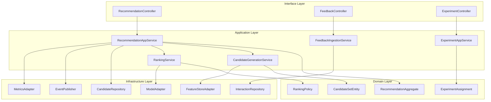
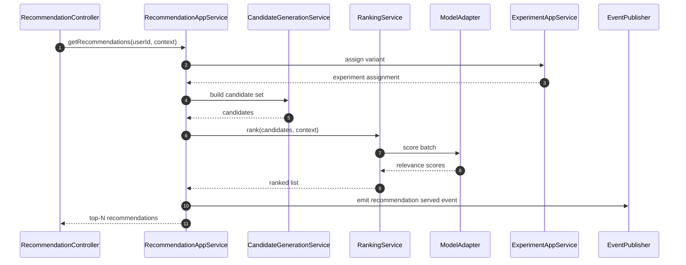
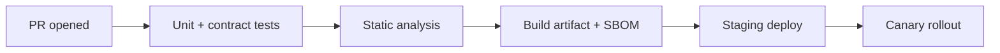

# C4 Code Diagram

This document expands the **code-level C4 map** for the Smart Recommendation Engine with explicit module responsibilities and execution flow.

## Code-Level Structure

## Critical Runtime Sequence: Recommendation Request

## Module Responsibilities
- **Candidate generation**: recall-focused, high coverage, low latency.
- **Ranking**: precision-focused ordering using model scores + policy constraints.
- **Experiment service**: deterministic bucketing and variant guardrails.
- **Feedback ingestion**: captures click/view/conversion signals for retraining.

## Implementation Notes
- Version recommendation payloads to avoid client breakage when features evolve.
- Track `model version`, `feature snapshot`, and `experiment variant` per response.
- Separate online ranking latency budget from offline training pipelines.

## Code Realization Guidance
- Ensure package boundaries mirror architectural boundaries and avoid cyclic dependencies.
- Capture module-level observability conventions (structured logging, tracing spans, metric naming).

## Mermaid CI Flow

