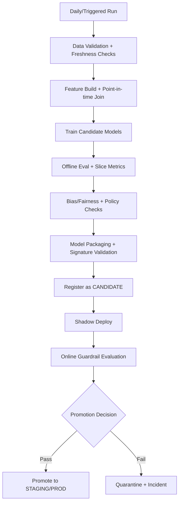

# MLOps Orchestration & Runtime Retrieval

## 1) Training Orchestration

## 1.1 Pipeline DAG

## 1.2 Orchestration rules
- Training runs are triggered by:
  - daily schedule,
  - drift threshold breach,
  - major catalog shift,
  - manual release request.
- Mandatory preconditions:
  - data quality checks pass,
  - no schema drift without approved migration,
  - feature freshness within configured bounds.
- Artifact outputs:
  - model binary,
  - feature spec version,
  - evaluation report,
  - calibration curves,
  - lineage metadata.

## 2) Model Registry Promotion Rules

## 2.1 Registry stages
`CANDIDATE -> SHADOW -> STAGING -> PRODUCTION -> ARCHIVED`

## 2.2 Hard gates for promotion
A model can promote only when all of the following pass:
1. **Offline quality gate**
   - NDCG@10, Recall@50, MAP exceed baseline by configured minimum delta.
2. **Slice reliability gate**
   - no critical segment regresses beyond threshold (new users, locale, device, category).
3. **Fairness gate**
   - exposure disparity and calibration parity remain within policy limits.
4. **Performance gate**
   - p95 scoring latency, memory, and CPU within serving envelope.
5. **Schema/contract gate**
   - model signature matches current online feature contract exactly.
6. **Business KPI gate (shadow/canary)**
   - CTR/CVR/revenue guardrails hold for minimum traffic/time window.

## 2.3 Auto-promotion policy
- `CANDIDATE -> SHADOW`: automatic after offline pass.
- `SHADOW -> STAGING`: automatic if no critical alert for 24 hours.
- `STAGING -> PRODUCTION`: requires signed approval from ML owner + on-call owner.
- `PRODUCTION rollback`: automatic on guardrail breach (see monitoring doc).

## 2.4 Registry metadata requirements
Each version must include:
- `training_data_window`, `feature_spec_version`, `code_commit_sha`, `run_id`.
- `intended_traffic_segments` and excluded segments.
- compatible embedding/index version IDs.
- explicit rollback target version.

## 3) Real-Time Feature Retrieval

## 3.1 Retrieval sequence
1. Resolve feature keys (`user_id`, `item_ids`, context).
2. Fetch online features from low-latency store.
3. Merge nearline counters and cached aggregates.
4. Attach freshness metadata.
5. Apply defaulting + imputation rules.
6. Emit `feature_resolution_report` for observability.

## 3.2 Latency budget and timeouts
- End-to-end feature retrieval budget: **25ms p95**.
- Per dependency timeout:
  - online store: 10ms,
  - cache: 5ms,
  - nearline service: 10ms.
- Use hedged reads for hot shards.

## 4) Fallback Behavior Matrix

| Failure Condition | Detection | Fallback Behavior | User-visible Effect |
|---|---|---|---|
| Missing non-critical features | null/missing columns | impute defaults + confidence penalty | slight relevance drop |
| Missing critical user profile features | contract validator fail | switch to context + popularity strategy | less personalized results |
| Feature store timeout | timeout > budget | read-through cache, else stale snapshot | bounded quality degradation |
| Stale user embedding | `staleness > 24h` | reduce embedding weight, increase session/context signals | mitigated drift |
| ANN/index unavailable | index health red | skip ANN candidates, use co-visitation + trending | lower novelty |
| Ranker unavailable | health check fail | serve precomputed/cached fallback slate | degraded mode flagged |

All fallback paths must set `degraded_mode=true` and annotate `fallback_path` in API response/logs.

## 5) Runtime Controls
- Feature flags for:
  - ranker selection,
  - exploration rate,
  - diversity weight,
  - fallback policy strictness.
- Circuit breakers:
  - open after threshold of downstream failures,
  - half-open probes every 30s,
  - close after stable success window.
- Replay harness:
  - deterministic replay for production incidents using sampled request logs.
