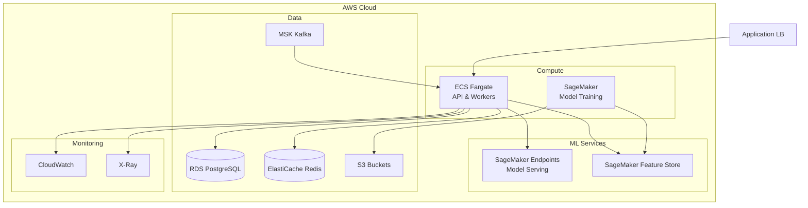
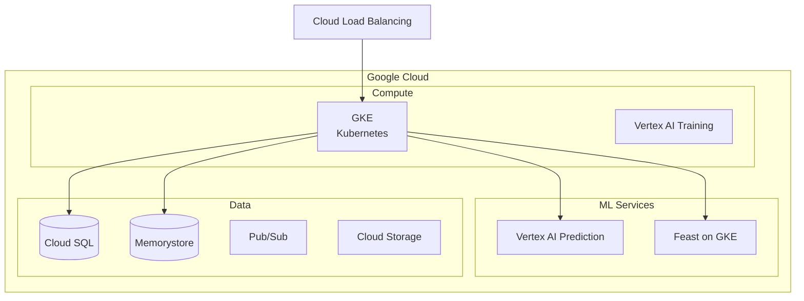

# Cloud Architecture - Smart Recommendation Engine

## AWS Architecture

## GCP Architecture

## Provider Mapping

| Component | AWS | GCP | Azure |
|-----------|-----|-----|-------|
| Container Runtime | ECS/EKS | GKE | AKS |
| Model Training | SageMaker | Vertex AI | Azure ML |
| Model Serving | SageMaker Endpoints | Vertex AI Prediction | Azure ML Endpoints |
| Feature Store | SageMaker Feature Store | Feast on GKE | Azure ML Feature Store |
| Database | RDS PostgreSQL | Cloud SQL | Azure PostgreSQL |
| Cache | ElastiCache | Memorystore | Azure Cache |
| Message Queue | MSK/SQS | Pub/Sub | Event Hubs |
| Vector DB | Self-managed | Self-managed | Self-managed |
| ML Registry | Self-managed MLflow | Self-managed MLflow | Azure ML Registry |

## Cost Estimation (AWS)

| Tier | Monthly Cost | Specs |
|------|--------------|-------|
| **Starter** | ~$500 | 2 API instances, t3.medium, basic ML |
| **Growth** | ~$2000 | Auto-scaling, r5.large, GPU training |
| **Enterprise** | ~$8000+ | Multi-region, dedicated GPU, HA |
