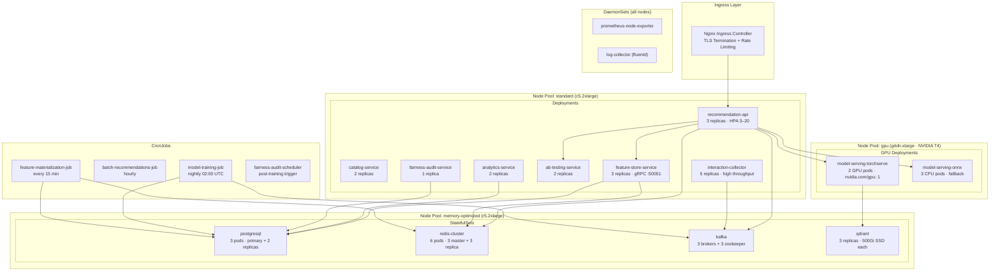
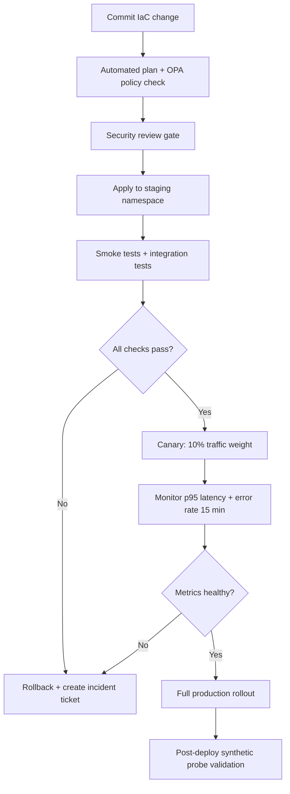

# Deployment Diagram — Smart Recommendation Engine

## Architecture Overview

The Smart Recommendation Engine runs on a multi-zone Kubernetes cluster spanning three availability zones (AZ-1, AZ-2, AZ-3). The cluster uses dedicated node pools to isolate workloads by resource profile:

| Node Pool | Instance Type | Purpose | AZs |
|-----------|--------------|---------|-----|
| `standard` | c5.2xlarge (8 vCPU / 16 GB) | API servers, microservices, feature store | All 3 |
| `gpu` | g4dn.xlarge (4 vCPU / 16 GB, NVIDIA T4) | TorchServe model inference | AZ-1, AZ-2 |
| `memory-optimized` | r5.2xlarge (8 vCPU / 64 GB) | Redis cluster, feature cache | All 3 |
| `training` | p3.2xlarge (8 vCPU / 61 GB, V100) | Nightly model training jobs | AZ-1 |

Workloads are placed on the correct node pool via `nodeSelector` and `tolerations` to avoid resource contention between latency-sensitive serving paths and batch training jobs.

---

## Kubernetes Workload Overview


```mermaid
graph TB
    subgraph ingress["Ingress Layer"]
        NGINX[Nginx Ingress Controller<br/>TLS Termination + Rate Limiting]
    end

    subgraph standard_pool["Node Pool: standard (c5.2xlarge)"]
        subgraph deployments["Deployments"]
            REC_API["recommendation-api<br/>3 replicas · HPA 3–20"]
            CATALOG["catalog-service<br/>2 replicas"]
            INTERACT["interaction-collector<br/>5 replicas · high throughput"]
            FEATURE_SVC["feature-store-service<br/>3 replicas · gRPC :50051"]
            AB_SVC["ab-testing-service<br/>2 replicas"]
            ANALYTICS["analytics-service<br/>2 replicas"]
            FAIRNESS["fairness-audit-service<br/>1 replica"]
        end
    end

    subgraph gpu_pool["Node Pool: gpu (g4dn.xlarge · NVIDIA T4)"]
        subgraph gpu_deploys["GPU Deployments"]
            TORCHSERVE["model-serving-torchserve<br/>2 GPU pods · nvidia.com/gpu: 1"]
            ONNX["model-serving-onnx<br/>3 CPU pods · fallback"]
        end
    end

    subgraph mem_pool["Node Pool: memory-optimized (r5.2xlarge)"]
        subgraph statefulsets["StatefulSets"]
            PG["postgresql<br/>3 pods · primary + 2 replicas"]
            REDIS["redis-cluster<br/>6 pods · 3 master + 3 replica"]
            KAFKA["kafka<br/>3 brokers + 3 zookeeper"]
            QDRANT["qdrant<br/>3 replicas · 500Gi SSD each"]
        end
    end

    subgraph daemonsets["DaemonSets (all nodes)"]
        NODE_EXPORTER["prometheus-node-exporter"]
        FLUENTD["log-collector (fluentd)"]
    end

    subgraph cronjobs["CronJobs"]
        TRAIN_JOB["model-training-job<br/>nightly 02:00 UTC"]
        BATCH_REC["batch-recommendations-job<br/>hourly"]
        FEAT_MAT["feature-materialization-job<br/>every 15 min"]
        FAIRNESS_SCHED["fairness-audit-scheduler<br/>post-training trigger"]
    end

    NGINX --> REC_API
    REC_API --> FEATURE_SVC
    REC_API --> TORCHSERVE
    REC_API --> ONNX
    REC_API --> AB_SVC
    REC_API --> REDIS
    REC_API --> KAFKA
    INTERACT --> KAFKA
    FEATURE_SVC --> REDIS
    FEATURE_SVC --> PG
    TORCHSERVE --> QDRANT
    ANALYTICS --> PG
    FAIRNESS --> PG
    TRAIN_JOB --> PG
    TRAIN_JOB --> KAFKA
    FEAT_MAT --> REDIS
    FEAT_MAT --> PG
```

---

## Deployment Manifests

### recommendation-api — Deployment + HPA

```yaml
apiVersion: apps/v1
kind: Deployment
metadata:
  name: recommendation-api
  namespace: rec-engine
  labels:
    app: recommendation-api
    tier: serving
spec:
  replicas: 3
  selector:
    matchLabels:
      app: recommendation-api
  strategy:
    type: RollingUpdate
    rollingUpdate:
      maxSurge: 2
      maxUnavailable: 0
  template:
    metadata:
      labels:
        app: recommendation-api
      annotations:
        prometheus.io/scrape: "true"
        prometheus.io/port: "8000"
    spec:
      nodeSelector:
        node-pool: standard
      terminationGracePeriodSeconds: 60
      containers:
        - name: api
          image: registry.example.com/rec-engine/api:v1.4.2
          ports:
            - containerPort: 8000
          env:
            - name: FEATURE_STORE_GRPC_HOST
              value: feature-store-service.rec-engine.svc.cluster.local:50051
            - name: MODEL_SERVING_GRPC_HOST
              value: model-serving-torchserve.rec-engine.svc.cluster.local:50052
            - name: REDIS_URL
              valueFrom:
                secretKeyRef:
                  name: redis-credentials
                  key: url
          resources:
            requests:
              cpu: "1"
              memory: "2Gi"
            limits:
              cpu: "2"
              memory: "4Gi"
          readinessProbe:
            httpGet:
              path: /health/ready
              port: 8000
            initialDelaySeconds: 10
            periodSeconds: 5
          livenessProbe:
            httpGet:
              path: /health/live
              port: 8000
            initialDelaySeconds: 20
            periodSeconds: 15
---
apiVersion: autoscaling/v2
kind: HorizontalPodAutoscaler
metadata:
  name: recommendation-api-hpa
  namespace: rec-engine
spec:
  scaleTargetRef:
    apiVersion: apps/v1
    kind: Deployment
    name: recommendation-api
  minReplicas: 3
  maxReplicas: 20
  metrics:
    - type: Resource
      resource:
        name: cpu
        target:
          type: Utilization
          averageUtilization: 60
    - type: Pods
      pods:
        metric:
          name: http_requests_per_second
        target:
          type: AverageValue
          averageValue: "500"
```

### model-serving-torchserve — GPU Deployment

```yaml
apiVersion: apps/v1
kind: Deployment
metadata:
  name: model-serving-torchserve
  namespace: rec-engine
spec:
  replicas: 2
  selector:
    matchLabels:
      app: model-serving-torchserve
  template:
    spec:
      nodeSelector:
        node-pool: gpu
        nvidia.com/gpu: "1"
      tolerations:
        - key: nvidia.com/gpu
          operator: Exists
          effect: NoSchedule
      initContainers:
        - name: model-downloader
          image: registry.example.com/rec-engine/model-init:latest
          command: ["python", "download_model.py", "--version", "$(MODEL_VERSION)"]
          env:
            - name: MODEL_VERSION
              valueFrom:
                configMapKeyRef:
                  name: model-config
                  key: active_version
          volumeMounts:
            - name: model-store
              mountPath: /model-store
      containers:
        - name: torchserve
          image: pytorch/torchserve:0.9.0-gpu
          ports:
            - containerPort: 7070  # gRPC
            - containerPort: 7071  # REST management
            - containerPort: 8082  # metrics
          resources:
            requests:
              cpu: "2"
              memory: "8Gi"
              nvidia.com/gpu: "1"
            limits:
              cpu: "4"
              memory: "16Gi"
              nvidia.com/gpu: "1"
          volumeMounts:
            - name: model-store
              mountPath: /model-store
      volumes:
        - name: model-store
          emptyDir: {}
```

---

## Vector Database — Qdrant StatefulSet

```yaml
apiVersion: apps/v1
kind: StatefulSet
metadata:
  name: qdrant
  namespace: rec-engine
spec:
  serviceName: qdrant-headless
  replicas: 3
  selector:
    matchLabels:
      app: qdrant
  template:
    spec:
      nodeSelector:
        node-pool: memory-optimized
      containers:
        - name: qdrant
          image: qdrant/qdrant:v1.8.3
          ports:
            - containerPort: 6333  # REST
            - containerPort: 6334  # gRPC
          env:
            - name: QDRANT__CLUSTER__ENABLED
              value: "true"
          resources:
            requests:
              cpu: "2"
              memory: "16Gi"
            limits:
              cpu: "4"
              memory: "32Gi"
          volumeMounts:
            - name: qdrant-storage
              mountPath: /qdrant/storage
  volumeClaimTemplates:
    - metadata:
        name: qdrant-storage
      spec:
        accessModes: ["ReadWriteOnce"]
        storageClassName: premium-ssd
        resources:
          requests:
            storage: 500Gi
```

**Qdrant Collection Configuration:**
- Collection name: `items_vectors`
- Vector dimension: `256`
- Distance metric: `Cosine`
- On-disk payload: `true` (reduce RAM pressure)
- Quantization: `Scalar INT8` (4× memory reduction, <5% accuracy loss)

---

## Feature Store Infrastructure — Redis Cluster

```yaml
apiVersion: apps/v1
kind: StatefulSet
metadata:
  name: redis-cluster
  namespace: rec-engine
spec:
  serviceName: redis-cluster-headless
  replicas: 6   # 3 master + 3 replica
  template:
    spec:
      nodeSelector:
        node-pool: memory-optimized
      containers:
        - name: redis
          image: redis:7.2-alpine
          command:
            - redis-server
            - --cluster-enabled yes
            - --cluster-config-file nodes.conf
            - --cluster-node-timeout 5000
            - --maxmemory 56gb
            - --maxmemory-policy allkeys-lru
            - --save ""
          resources:
            requests:
              cpu: "2"
              memory: "60Gi"
            limits:
              cpu: "4"
              memory: "64Gi"
          ports:
            - containerPort: 6379
            - containerPort: 16379  # cluster bus
```

**Feature TTL Policy:**

| Feature Set | TTL | Eviction Priority |
|-------------|-----|-------------------|
| User real-time features | 24 hours | Low (hot path) |
| Item content features | 7 days | Medium |
| User historical aggregates | 48 hours | Low |
| A/B experiment assignments | 30 days | High (sticky) |
| Popularity scores | 1 hour | Medium |

---

## Ingress and Load Balancing

```yaml
apiVersion: networking.k8s.io/v1
kind: Ingress
metadata:
  name: rec-engine-ingress
  namespace: rec-engine
  annotations:
    nginx.ingress.kubernetes.io/ssl-redirect: "true"
    nginx.ingress.kubernetes.io/limit-rps: "1000"
    nginx.ingress.kubernetes.io/limit-burst-multiplier: "5"
    nginx.ingress.kubernetes.io/canary: "true"
    nginx.ingress.kubernetes.io/canary-weight: "10"
spec:
  ingressClassName: nginx
  tls:
    - hosts:
        - api.rec-engine.example.com
      secretName: rec-engine-tls
  rules:
    - host: api.rec-engine.example.com
      http:
        paths:
          - path: /v1/recommendations
            pathType: Prefix
            backend:
              service:
                name: recommendation-api
                port:
                  number: 8000
          - path: /v1/interactions
            pathType: Prefix
            backend:
              service:
                name: interaction-collector
                port:
                  number: 8001
```

---

## CronJob Definitions

### Nightly Model Training

```yaml
apiVersion: batch/v1
kind: CronJob
metadata:
  name: model-training-job
  namespace: rec-engine
spec:
  schedule: "0 2 * * *"   # 02:00 UTC daily
  concurrencyPolicy: Forbid
  jobTemplate:
    spec:
      backoffLimit: 2
      template:
        spec:
          nodeSelector:
            node-pool: training
          tolerations:
            - key: nvidia.com/gpu
              operator: Exists
              effect: NoSchedule
          restartPolicy: Never
          containers:
            - name: trainer
              image: registry.example.com/rec-engine/trainer:latest
              command: ["python", "-m", "training.pipeline", "--config", "als_config.yaml"]
              resources:
                requests:
                  cpu: "8"
                  memory: "32Gi"
                  nvidia.com/gpu: "1"
                limits:
                  cpu: "16"
                  memory: "61Gi"
                  nvidia.com/gpu: "1"
```

---

## Resource Quotas per Service

| Service | CPU Request | CPU Limit | Mem Request | Mem Limit | GPU |
|---------|------------|-----------|-------------|-----------|-----|
| recommendation-api (per pod) | 1 | 2 | 2 Gi | 4 Gi | — |
| interaction-collector (per pod) | 500m | 1 | 512 Mi | 1 Gi | — |
| feature-store-service (per pod) | 1 | 2 | 2 Gi | 4 Gi | — |
| catalog-service (per pod) | 500m | 1 | 512 Mi | 1 Gi | — |
| ab-testing-service (per pod) | 500m | 1 | 1 Gi | 2 Gi | — |
| analytics-service (per pod) | 1 | 2 | 2 Gi | 4 Gi | — |
| fairness-audit-service (per pod) | 500m | 1 | 1 Gi | 2 Gi | — |
| model-serving-torchserve (per pod) | 2 | 4 | 8 Gi | 16 Gi | 1× T4 |
| model-serving-onnx (per pod) | 2 | 4 | 4 Gi | 8 Gi | — |
| postgresql (per pod) | 2 | 4 | 8 Gi | 16 Gi | — |
| redis-cluster (per pod) | 2 | 4 | 60 Gi | 64 Gi | — |
| qdrant (per pod) | 2 | 4 | 16 Gi | 32 Gi | — |
| kafka broker (per pod) | 2 | 4 | 8 Gi | 16 Gi | — |

---

## Deployment Operations Runbook

### Rolling Deployment Procedure


```mermaid
flowchart TB
    A[Commit IaC change] --> B[Automated plan + OPA policy check]
    B --> C[Security review gate]
    C --> D[Apply to staging namespace]
    D --> E[Smoke tests + integration tests]
    E --> F{All checks pass?}
    F -- No --> G[Rollback + create incident ticket]
    F -- Yes --> H[Canary: 10% traffic weight]
    H --> I[Monitor p95 latency + error rate 15 min]
    I --> J{Metrics healthy?}
    J -- No --> G
    J -- Yes --> K[Full production rollout]
    K --> L[Post-deploy synthetic probe validation]
```

### Capacity and Reliability

- **AZ failure tolerance**: Pods spread across 3 AZs using `topologySpreadConstraints` with `maxSkew: 1`.
- **PDB (PodDisruptionBudget)**: `minAvailable: 2` for recommendation-api, `minAvailable: 1` for other services.
- **Peak capacity**: HPA scales recommendation-api to 20 pods at ~10,000 RPS before CPU saturation.
- **RTO target**: < 10 minutes for pod-level failures; < 30 minutes for node pool failure.
- **RPO target**: Zero for stateless services; < 5 seconds for Redis (AOF enabled); < 1 minute for PostgreSQL (WAL streaming).
- **GPU warm-up**: TorchServe init container pre-downloads model; first-inference latency is eliminated via pre-warming on pod start.
