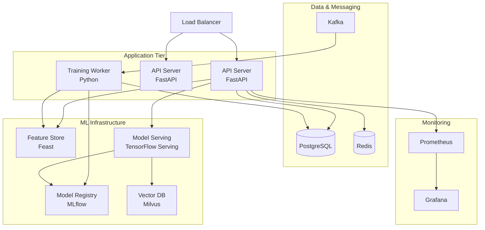

# Deployment Diagram - Smart Recommendation Engine



## Kubernetes Deployment

```yaml
# API Deployment
apiVersion: apps/v1
kind: Deployment
metadata:
  name: recommendation-api
spec:
  replicas: 3
  template:
    spec:
      containers:
      - name: api
        image: rec-api:latest
        resources:
          requests:
            memory: "2Gi"
            cpu: "1"
          limits:
            memory: "4Gi"
            cpu: "2"
```

## Node Specifications

| Service | CPU | RAM | GPU | Purpose |
|---------|-----|-----|-----|---------|
| API Server | 2 vCPU | 4GB | - | Serve requests |
| Training Worker | 8 vCPU | 32GB | Optional | Train models |
| Model Serving | 4 vCPU | 8GB | Optional | ML inference |
| Feature Store | 4 vCPU | 16GB | - | Feature management |
