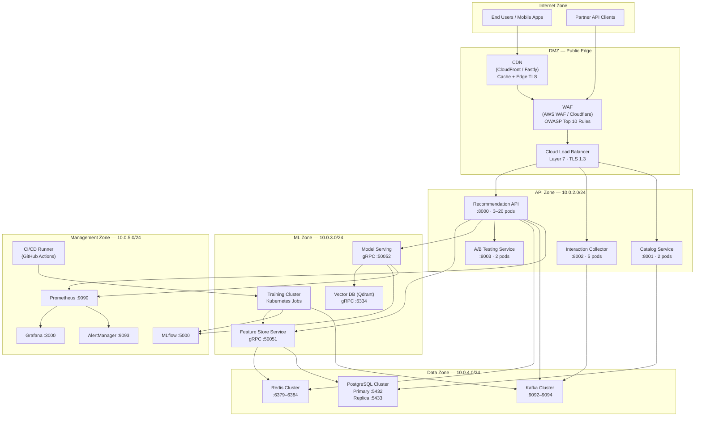

# Network Infrastructure — Smart Recommendation Engine

## Network Topology Overview

The system is segmented into five distinct security zones, each with strict ingress/egress controls enforced by Kubernetes NetworkPolicy, cloud security groups, and Istio service mesh policies.


```mermaid
graph TB
    subgraph internet["Internet Zone"]
        USER[End Users / Mobile Apps]
        PARTNER[Partner API Clients]
    end

    subgraph dmz["DMZ — Public Edge"]
        CDN["CDN<br/>(CloudFront / Fastly)<br/>Cache + Edge TLS"]
        WAF["WAF<br/>(AWS WAF / Cloudflare)<br/>OWASP Top 10 Rules"]
        LB["Cloud Load Balancer<br/>Layer 7 · TLS 1.3"]
    end

    subgraph api_zone["API Zone — 10.0.2.0/24"]
        REC_API["Recommendation API<br/>:8000 · 3–20 pods"]
        CATALOG["Catalog Service<br/>:8001 · 2 pods"]
        INTERACT["Interaction Collector<br/>:8002 · 5 pods"]
        AB_SVC["A/B Testing Service<br/>:8003 · 2 pods"]
    end

    subgraph data_zone["Data Zone — 10.0.4.0/24"]
        PG["PostgreSQL Cluster<br/>Primary :5432<br/>Replica :5433"]
        REDIS["Redis Cluster<br/>:6379–6384"]
        KAFKA["Kafka Cluster<br/>:9092–9094"]
    end

    subgraph ml_zone["ML Zone — 10.0.3.0/24"]
        FEATURE_SVC["Feature Store Service<br/>gRPC :50051"]
        MODEL_SVC["Model Serving<br/>gRPC :50052"]
        QDRANT["Vector DB (Qdrant)<br/>gRPC :6334"]
        TRAINING["Training Cluster<br/>Kubernetes Jobs"]
    end

    subgraph mgmt_zone["Management Zone — 10.0.5.0/24"]
        PROM["Prometheus :9090"]
        GRAFANA["Grafana :3000"]
        MLFLOW["MLflow :5000"]
        CICD["CI/CD Runner<br/>(GitHub Actions)"]
        ALERTMGR["AlertManager :9093"]
    end

    USER --> CDN
    PARTNER --> WAF
    CDN --> WAF
    WAF --> LB
    LB --> REC_API
    LB --> INTERACT
    LB --> CATALOG

    REC_API --> FEATURE_SVC
    REC_API --> MODEL_SVC
    REC_API --> AB_SVC
    REC_API --> REDIS
    REC_API --> KAFKA

    INTERACT --> KAFKA
    CATALOG --> PG

    FEATURE_SVC --> REDIS
    FEATURE_SVC --> PG
    MODEL_SVC --> QDRANT
    MODEL_SVC --> MLFLOW

    TRAINING --> FEATURE_SVC
    TRAINING --> MLFLOW
    TRAINING --> KAFKA

    REC_API --> PROM
    MODEL_SVC --> PROM
    PROM --> GRAFANA
    PROM --> ALERTMGR
    CICD --> TRAINING
```

---

## Security Zone Definitions

### DMZ — Public Edge

| Component | Purpose | Inbound | Outbound |
|-----------|---------|---------|---------|
| CDN | Cache recommendation responses for non-personalized slots, edge TLS | Internet :443 | WAF :443 |
| WAF | Block SQL injection, XSS, rate limit per IP (1000 req/min) | CDN + direct :443 | LB :443 |
| Load Balancer | Layer 7 TLS termination, health-based routing | WAF :443 | API Zone :8000–8002 |

### API Zone

Hosts all customer-facing microservices. No direct database access permitted — all DB reads/writes flow through service layer.

- Allowed inbound: Load Balancer only (enforced by Security Group + NetworkPolicy)
- Allowed outbound: ML Zone (gRPC), Data Zone (Redis, Kafka), Management Zone (metrics push)
- Denied outbound: Internet (egress NAT gateway required for external calls)

### ML Zone

Hosts the most sensitive workloads: model weights and training pipelines.

- Model Serving: accepts traffic only from Recommendation API
- Training Cluster: no inbound from internet; outbound to Feature Store + MLflow + Kafka only
- Qdrant: accepts traffic only from Model Serving service

### Data Zone

All datastores reside in private subnets with no public IPs.

- PostgreSQL: accepts connections from API Zone and ML Zone only
- Redis: accepts connections from API Zone and Feature Store Service only
- Kafka: accepts from Interaction Collector, Training Cluster, Feature Materialization Job

### Management Zone

- Prometheus scrapes all pods (pull-based, not push from internet)
- Grafana accessible via VPN or bastion only
- MLflow accessible from ML Zone and Management Zone only

---

## Firewall Rules

| From | To | Port | Protocol | Purpose |
|------|----|------|----------|---------|
| Internet | CDN | 443 | HTTPS | API + cached content |
| CDN | WAF | 443 | HTTPS | Forwarded requests |
| WAF | Load Balancer | 443 | HTTPS | After inspection |
| Load Balancer | recommendation-api | 8000 | HTTP/2 | Recommendation requests |
| Load Balancer | interaction-collector | 8002 | HTTP/2 | Event recording |
| recommendation-api | feature-store-service | 50051 | gRPC | Feature fetch |
| recommendation-api | model-serving | 50052 | gRPC | Inference scoring |
| recommendation-api | ab-testing-service | 8003 | HTTP/2 | Experiment assignment |
| recommendation-api | redis-cluster | 6379 | TCP | Cache reads/writes |
| recommendation-api | kafka | 9092 | TCP | Publish served events |
| interaction-collector | kafka | 9092 | TCP | Publish interaction events |
| feature-store-service | postgresql | 5432 | TCP | Offline feature reads |
| feature-store-service | redis-cluster | 6379 | TCP | Online feature cache |
| model-serving | qdrant | 6334 | gRPC | ANN vector search |
| model-serving | mlflow | 5000 | HTTP | Model artifact download |
| training-cluster | feature-store-service | 50051 | gRPC | Training feature fetch |
| training-cluster | kafka | 9092 | TCP | Training data consumption |
| training-cluster | mlflow | 5000 | HTTP | Log artifacts + metrics |
| Prometheus | All pods | 9090 | HTTP (scrape) | Metrics collection |
| CI/CD | training-cluster | (k8s API) | HTTPS | Submit training jobs |

---

## CDN Configuration

Recommendations are segmented into two tiers for caching:

### Cacheable (Non-Personalized)

- **Key**: `slot_id` + `user_segment` (not individual `user_id`)
- **Cache TTL**: 5 minutes for popularity-based and trending recommendations
- **Vary headers**: `Accept-Language`, `Accept-Encoding`
- **Stale-while-revalidate**: 30 seconds (serve stale while refreshing asynchronously)
- **Invalidation trigger**: Model deployment webhook invalidates all `slot_id` cache entries for the affected model

### Not Cached (Personalized)

- Requests with a resolved `user_id` and active personalization flag are forwarded directly to the API
- `Cache-Control: private, no-store` header set on all personalized responses
- CDN pass-through mode activated for authenticated sessions

```
GET /v1/recommendations?slot_id=homepage_hero&user_segment=new_user
→ Cache HIT: TTL 5 min, Key: slot_id+user_segment

GET /v1/recommendations?slot_id=homepage_hero&user_id=u-123
→ Cache MISS (personalized): forwarded to API directly
```

---

## gRPC Internal Services

All service-to-service communication within the cluster uses gRPC over HTTP/2. Protocol Buffer schemas are versioned and stored in the `proto/` directory.

| Service | Port | Protocol | Key Methods |
|---------|------|----------|-------------|
| feature-store-service | 50051 | gRPC | `GetUserFeatures`, `GetItemFeatures`, `GetBatchFeatures` |
| model-serving | 50052 | gRPC | `ScoreCandidates`, `GetItemEmbedding`, `GetUserEmbedding` |
| qdrant | 6334 | gRPC | `Search`, `Upsert`, `DeletePoints` |

```protobuf
// feature_store.proto
syntax = "proto3";

service FeatureStoreService {
  rpc GetUserFeatures(UserFeaturesRequest) returns (UserFeaturesResponse);
  rpc GetBatchFeatures(BatchFeaturesRequest) returns (BatchFeaturesResponse);
}

message UserFeaturesRequest {
  string user_id = 1;
  repeated string feature_names = 2;
  int64 max_staleness_seconds = 3;
}

message UserFeaturesResponse {
  string user_id = 1;
  map<string, FeatureValue> features = 2;
  int64 feature_timestamp = 3;
}
```

---

## Service Mesh — Istio Configuration

All inter-service communication is protected by Istio mTLS. The mesh enforces:

### mTLS Policy

```yaml
apiVersion: security.istio.io/v1beta1
kind: PeerAuthentication
metadata:
  name: default
  namespace: rec-engine
spec:
  mtls:
    mode: STRICT   # No plain-text traffic between pods
```

### Circuit Breaker (DestinationRule)

```yaml
apiVersion: networking.istio.io/v1beta1
kind: DestinationRule
metadata:
  name: model-serving-cb
  namespace: rec-engine
spec:
  host: model-serving-torchserve
  trafficPolicy:
    outlierDetection:
      consecutive5xxErrors: 5
      interval: 10s
      baseEjectionTime: 30s
      maxEjectionPercent: 30   # Eject at most 30% of pods
    connectionPool:
      http:
        h2UpgradePolicy: UPGRADE
        http2MaxRequests: 200
        pendingRequests: 50
```

### Retry and Timeout Policy (VirtualService)

```yaml
apiVersion: networking.istio.io/v1beta1
kind: VirtualService
metadata:
  name: recommendation-api-vs
  namespace: rec-engine
spec:
  hosts:
    - recommendation-api
  http:
    - match:
        - uri:
            prefix: /v1/recommendations
      timeout: 100ms
      retries:
        attempts: 2
        perTryTimeout: 40ms
        retryOn: "5xx,reset,connect-failure"
        # Do NOT retry on 4xx (client errors are not transient)
      route:
        - destination:
            host: recommendation-api
            port:
              number: 8000
---
# Feature store: tight latency SLA
apiVersion: networking.istio.io/v1beta1
kind: VirtualService
metadata:
  name: feature-store-vs
spec:
  hosts:
    - feature-store-service
  http:
    - timeout: 20ms
      retries:
        attempts: 1
        retryOn: "connect-failure,reset"
      route:
        - destination:
            host: feature-store-service
            port:
              number: 50051
```

**Timeout Budget Summary:**

| Dependency | Timeout | Retries | Notes |
|------------|---------|---------|-------|
| Feature Store (gRPC) | 20 ms | 1 | Cache-backed; fast or fail |
| Model Serving (gRPC) | 60 ms | 2 | GPU inference budget |
| A/B Testing Service | 10 ms | 1 | Redis lookup |
| Kafka publish | 5 ms | 0 | Fire-and-forget |
| PostgreSQL | 50 ms | 0 | Used only for catalog; non-critical path |

---

## Kubernetes NetworkPolicy

```yaml
# recommendation-api: restrict ingress/egress precisely
apiVersion: networking.k8s.io/v1
kind: NetworkPolicy
metadata:
  name: recommendation-api-netpol
  namespace: rec-engine
spec:
  podSelector:
    matchLabels:
      app: recommendation-api
  policyTypes:
    - Ingress
    - Egress
  ingress:
    - from:
        - namespaceSelector:
            matchLabels:
              kubernetes.io/metadata.name: ingress-nginx
      ports:
        - port: 8000
  egress:
    - to:
        - podSelector:
            matchLabels:
              app: feature-store-service
      ports:
        - port: 50051
    - to:
        - podSelector:
            matchLabels:
              app: model-serving-torchserve
      ports:
        - port: 50052
    - to:
        - podSelector:
            matchLabels:
              app: ab-testing-service
      ports:
        - port: 8003
    - to:
        - podSelector:
            matchLabels:
              app: redis-cluster
      ports:
        - port: 6379
    - to:
        - podSelector:
            matchLabels:
              app: kafka
      ports:
        - port: 9092
---
apiVersion: networking.k8s.io/v1
kind: NetworkPolicy
metadata:
  name: model-serving-netpol
  namespace: rec-engine
spec:
  podSelector:
    matchLabels:
      app: model-serving-torchserve
  policyTypes:
    - Ingress
    - Egress
  ingress:
    - from:
        - podSelector:
            matchLabels:
              app: recommendation-api
      ports:
        - port: 50052
  egress:
    - to:
        - podSelector:
            matchLabels:
              app: qdrant
      ports:
        - port: 6334
    - to:
        - namespaceSelector:
            matchLabels:
              kubernetes.io/metadata.name: mlops
      ports:
        - port: 5000   # MLflow
```

---

## DNS and Service Discovery

### Internal (Kubernetes DNS)

All services use the standard Kubernetes DNS pattern:

```
<service-name>.<namespace>.svc.cluster.local
```

Examples:
- `feature-store-service.rec-engine.svc.cluster.local:50051`
- `redis-cluster.rec-engine.svc.cluster.local:6379`
- `postgresql.rec-engine.svc.cluster.local:5432`

Headless services are used for StatefulSets (PostgreSQL, Redis, Qdrant) to enable stable per-pod DNS for connection routing:
- `postgresql-0.postgresql.rec-engine.svc.cluster.local` (primary)
- `postgresql-1.postgresql.rec-engine.svc.cluster.local` (replica)

### External (Route53 / Cloud DNS)

| Record | Type | Target | TTL |
|--------|------|--------|-----|
| `api.rec-engine.example.com` | CNAME | CloudFront distribution | 60s |
| `api-eu.rec-engine.example.com` | CNAME | EU Load Balancer | 60s |
| `mlflow.internal.example.com` | A | Management LB (VPN-only) | 300s |

Latency-based routing via Route53 routes users to the nearest regional API Gateway endpoint (us-east-1, eu-west-1, ap-southeast-1).
