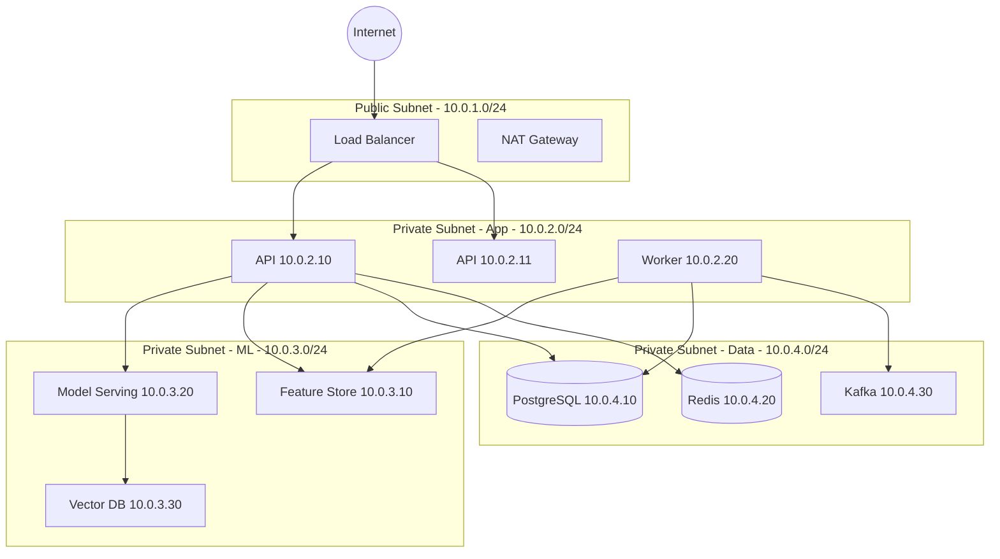

# Network / Infrastructure Diagram - Smart Recommendation Engine

## Firewall Rules

| From | To | Port | Protocol | Purpose |
|------|-----|------|----------|---------|
| Internet | LB | 443 | HTTPS | API access |
| LB | API Servers | 8000 | HTTP | Internal routing |
| API Servers | ML Services | various | HTTP/gRPC | ML inference |
| API Servers | Data | 5432, 6379 | TCP | Database access |
| Workers | Feature Store | 6566 | gRPC | Feature retrieval |

**Security Zones**:
- **DMZ**: Load balancer
- **Application**: API servers, workers
- **ML**: Feature store, model serving
- **Data**: Databases, message queues
