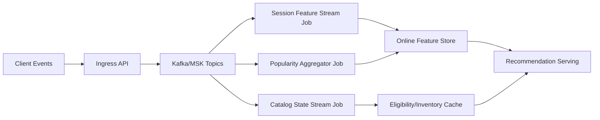

# Real-Time Serving Topology

## 1) Stream Processing Architecture

## Stream design constraints
- Partition by `tenant_id:user_id` for session/order guarantees where needed.
- Exactly-once processing for critical counters; at-least-once for non-critical telemetry.
- Watermarks and late-event handling for up to 15 minutes.
- Dead-letter topics for schema-invalid or poison events.

## 2) Vector/Index Service Topology

## 2.1 Service layout
- **Primary ANN cluster**: sharded by item id range, multi-AZ replicas.
- **Shadow ANN cluster**: receives dual-writes for index migration/testing.
- **Index builder workers**: offline compaction + periodic rebuild.
- **Hot patch updater**: applies incremental upserts/deletes from stream.

## 2.2 Versioning and cutover
- Every index publish gets `index_version`.
- Serving layer can route by `(model_version, index_version)` compatibility matrix.
- Blue/green cutover with 1-5% canary before full switch.

## 2.3 Resilience controls
- Query retries with alternate replica on timeout.
- Per-shard health scoring to avoid degraded nodes.
- Automatic fallback to non-vector candidate sources when cluster unhealthy.

## 3) Cache Strategy

## 3.1 Cache tiers
1. **L1 in-process cache** (milliseconds):
   - model metadata, policy rules, hot feature keys.
2. **L2 distributed cache** (Redis/Memorystore):
   - short-lived recommendation slates,
   - session features,
   - fallback popularity lists.
3. **Read-through snapshots** (object storage):
   - last-known-good global fallback artifacts.

## 3.2 TTL and invalidation policy
| Cache Asset | TTL | Invalidation Trigger |
|---|---:|---|
| Recommendation slate | 30-120s | user action event or policy change |
| Session feature vector | 2-5m | session update watermark |
| Popularity lists | 1-5m | stream aggregate publish |
| Model metadata | 10m | registry promotion event |
| Policy rules | 1m | admin config update |

## 3.3 Stampede protection
- request coalescing for identical keys,
- jittered TTL,
- stale-while-revalidate for non-critical paths,
- per-tenant cache quotas.

## 4) Fault Isolation Design

## 4.1 Isolation boundaries
- Separate compute pools for:
  - online serving,
  - stream processing,
  - batch/index building,
  - experimentation traffic.
- Tenant-aware rate limits and bulkheads.
- Dedicated circuit breakers for each downstream (feature store, ANN, cache, model service).

## 4.2 Blast-radius controls
- Cell-based deployment (small independent serving cells).
- Per-cell error budget and auto-drain on SLO breach.
- Regional failover with degraded-mode defaults.

## 4.3 Degraded-mode guarantees
When dependencies fail, system must still provide:
- non-empty recommendation slate,
- policy/compliance filtering,
- response latency within 2x normal p95 target,
- explicit degraded-mode telemetry.

## 5) Operational SLOs
- Event ingest lag p95 < 30s.
- Online feature materialization freshness p95 < 2m.
- ANN query p95 < 10ms; availability >= 99.95%.
- Cache hit rate >= 85% on hot endpoints.
- Degraded-mode request ratio < 3% rolling 1 hour.
