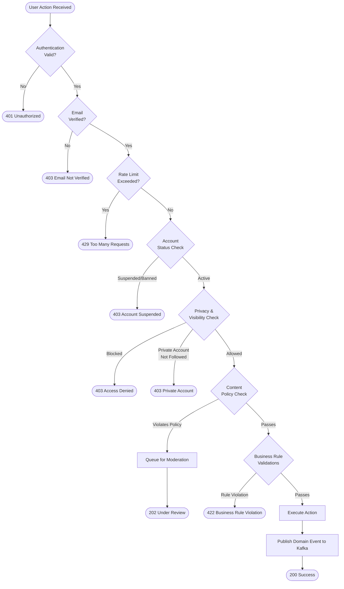

# Business Rules — Social Networking Platform

Business rules define the invariants, constraints, and policies enforced by the platform to ensure safety, compliance, and consistent behavior across all services.

## Enforceable Rules

The following rules are enforced at the application layer and, where applicable, at the database constraint layer:

1. A user must verify their email address before posting content.
2. Stories automatically expire and are deleted after 24 hours.
3. A blocked user cannot view, react to, or message the blocking user.
4. Content reported by 10 or more users is automatically queued for moderation review.
5. Minors under 13 years of age cannot create accounts.
6. Deleted posts must be removed from all feeds within 60 seconds.
7. Ad campaigns must pass content review before going live.
8. Private account posts are only visible to approved followers.
9. A user may not follow more than 7,500 accounts (anti-spam protection).
10. Rate limiting: a user may publish at most 20 posts per hour.
11. A user cannot react to their own post with a "like" incrementing their own engagement score.
12. Direct messages can only be sent between users who mutually follow each other or where the recipient has open DMs enabled.
13. Users with an active ban record cannot create new accounts using the same device or IP within the ban period.
14. Story highlights are only available to accounts with at least 100 followers (or verified accounts).
15. Community admins can remove any post in their community without platform moderation approval.
16. Sponsored/ad content must be clearly labeled with a "Sponsored" badge; removal of the label is a policy violation.
17. A single ad creative may not exceed 30 MB in file size.
18. Password reset links expire after 15 minutes.
19. OAuth tokens must be refreshed every 24 hours; stale tokens result in session termination.
20. GDPR deletion requests must be fulfilled within 30 days; the user's PII must be anonymized or removed from all stores.

### Rule Categories

| Rule ID | Category | Enforcement Layer | Priority |
|---|---|---|---|
| BR-001 | Content | Application (email verification check) | Critical |
| BR-002 | Content | Application (TTL job) + Database | Critical |
| BR-003 | Privacy & Safety | Application (social graph check) | Critical |
| BR-004 | Moderation | Application (report counter trigger) | High |
| BR-005 | Compliance | Application (age gate) + Legal | Critical |
| BR-006 | Performance | Application (Kafka fan-out + cache invalidation) | High |
| BR-007 | Advertising | Application (campaign approval workflow) | High |
| BR-008 | Privacy | Application (visibility check) | Critical |
| BR-009 | Anti-Spam | Application (follow count check) | Medium |
| BR-010 | Anti-Spam | API rate limiter (Redis sliding window) | Medium |
| BR-011 | Integrity | Application (self-reaction guard) | Low |
| BR-012 | Messaging | Application (social graph + DM settings check) | Medium |
| BR-013 | Safety | Application (device fingerprint + IP ban list) | High |
| BR-014 | Feature Gate | Application (follower count check) | Low |
| BR-015 | Community | Application (community admin role check) | Medium |
| BR-016 | Advertising | Application (ad rendering layer) | Critical |
| BR-017 | Advertising | Media upload service (file size validation) | Medium |
| BR-018 | Security | Auth service (token TTL) | High |
| BR-019 | Security | Auth service (OAuth refresh policy) | High |
| BR-020 | Compliance | GDPR pipeline (automated + manual) | Critical |

## Rule Evaluation Pipeline

The following flowchart shows how business rules are evaluated when a user action is received:

### Rule Evaluation Order
Rules are evaluated in the following priority order to short-circuit as early as possible:

1. **Authentication** — Token validity, session check (fastest exit, no DB hit)
2. **Authorization** — Role and permission check
3. **Rate Limiting** — Redis sliding window counter check
4. **Account Status** — Active/suspended/banned status lookup (cached in Redis)
5. **Privacy Rules** — Block list and follow status checks
6. **Content Policy** — Inline AI screening for new content
7. **Business Constraints** — Domain-specific rules (follow limits, DM eligibility, etc.)
8. **Persistence** — Write to database only after all rules pass

## Exception and Override Handling

### Admin Overrides
Platform administrators can override the following rules through the Admin Dashboard:
- Override account verification requirement for bulk-imported legacy accounts.
- Override story expiry for legally mandated evidence preservation (with audit log).
- Override ban record to restore access after successful appeal.
- Override ad campaign approval for managed/trusted advertisers with a clean track record.

### System Exceptions
- **BR-002 (Story Expiry):** If a story is part of an active legal hold, expiry is suspended until the hold is lifted. The legal hold flag is set by the Trust & Safety team.
- **BR-004 (Auto-queue at 10 reports):** Coordinated mass reporting by bot accounts is detected by the anti-abuse system. If the reporting accounts are flagged as bots, the report threshold is not incremented.
- **BR-006 (Feed removal in 60s):** In the event of a Kafka consumer lag spike, the SLO is relaxed to 120s with an ops alert fired.
- **BR-020 (GDPR 30-day deletion):** If the user's content is under active law enforcement investigation, deletion may be delayed with documented legal justification.

### Appeal Process
| Scenario | Who Can Appeal | Channel | SLA |
|---|---|---|---|
| Account suspension | Account owner | In-app appeal form | 5 business days |
| Post removal | Post author | In-app appeal form | 3 business days |
| Ad campaign rejection | Advertiser | Ads support portal | 2 business days |
| Permanent ban | Account owner | Email to trust@platform.com | 10 business days |
| Community removal | Community admin | Community appeal form | 5 business days |

### Escalation Matrix
| Rule Violation Severity | First Response | Escalation Level | Human Review Required |
|---|---|---|---|
| Low (spam, minor policy) | Automated warning | Level 1 Moderator | No |
| Medium (harassment, repeated violation) | 7-day suspension | Level 2 Moderator | Yes |
| High (CSAM, doxxing, credible threat) | Immediate ban + content removal | Level 3 Trust & Safety | Yes + Law Enforcement |
| Critical (terrorism, NCII) | Immediate ban + legal hold | Legal Team + Authorities | Yes + Mandatory Reporting |

### Rule Change Management
All changes to business rules follow this process:
1. Rule change proposal drafted by Product or Legal team.
2. Impact analysis performed (affected user segments, revenue, compliance).
3. A/B test or staged rollout for behavioral rules (e.g., rate limits, follow caps).
4. Rule deployed to staging environment with integration test coverage.
5. Deployed to production with feature flag; monitored for 48h before full rollout.
6. Rule documented in this file and announced in release notes.
