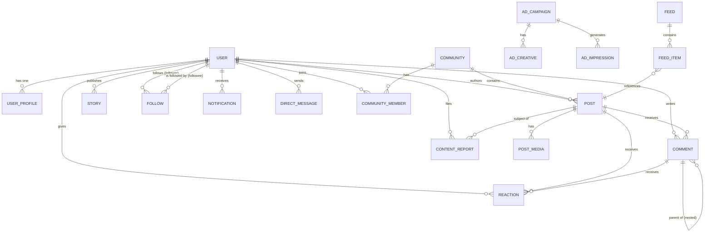

# Data Dictionary — Social Networking Platform

## Core Entities

### User
| Attribute | Type | Nullable | Description | Validation |
|---|---|---|---|---|
| user_id | UUID | No | Primary key, globally unique identifier | UUID v4 |
| username | VARCHAR(50) | No | Unique handle, lowercase alphanumeric + underscore | ^[a-z0-9_]{3,50}$ |
| email | VARCHAR(255) | No | Primary contact and login email | Valid RFC 5322 email |
| phone_number | VARCHAR(20) | Yes | E.164 format phone number | E.164 format |
| display_name | VARCHAR(100) | No | Public display name | 1-100 non-empty chars |
| account_type | ENUM | No | personal, creator, business | Enum value |
| is_verified | BOOLEAN | No | Blue checkmark verification status | Default false |
| is_private | BOOLEAN | No | Private account flag — restricts post visibility | Default false |
| status | ENUM | No | active, suspended, banned, deleted | Enum value |
| date_of_birth | DATE | No | Used for age verification | Must be ≥ 13 years ago |
| created_at | TIMESTAMPTZ | No | Account creation timestamp | UTC |
| updated_at | TIMESTAMPTZ | No | Last profile update timestamp | UTC |
| deleted_at | TIMESTAMPTZ | Yes | Soft-delete timestamp for GDPR | UTC or null |

### UserProfile
| Attribute | Type | Nullable | Description | Validation |
|---|---|---|---|---|
| profile_id | UUID | No | Primary key | UUID v4 |
| user_id | UUID | No | Foreign key to users | Must exist in users |
| bio | TEXT | Yes | Short biography text | Max 500 characters |
| avatar_url | TEXT | Yes | CDN URL for profile picture | Valid HTTPS URL |
| cover_url | TEXT | Yes | CDN URL for cover banner | Valid HTTPS URL |
| website_url | TEXT | Yes | External website link | Valid HTTPS URL |
| location | VARCHAR(100) | Yes | User-provided location string | Max 100 chars |
| follower_count | INTEGER | No | Cached follower count | ≥ 0 |
| following_count | INTEGER | No | Cached following count | ≥ 0 |
| post_count | INTEGER | No | Cached post count | ≥ 0 |

### Post
| Attribute | Type | Nullable | Description | Validation |
|---|---|---|---|---|
| post_id | UUID | No | Primary key | UUID v4 |
| author_id | UUID | No | Foreign key to users | Must exist |
| content_type | ENUM | No | text, photo, video, poll, reel | Enum value |
| body | TEXT | Yes | Text content of the post | Max 5000 chars |
| visibility | ENUM | No | public, followers, private | Default public |
| status | ENUM | No | draft, published, under_review, removed | Default draft |
| like_count | INTEGER | No | Cached reaction count | ≥ 0 |
| comment_count | INTEGER | No | Cached comment count | ≥ 0 |
| share_count | INTEGER | No | Cached share count | ≥ 0 |
| view_count | BIGINT | No | Cumulative view counter | ≥ 0 |
| is_pinned | BOOLEAN | No | Pinned to author's profile | Default false |
| created_at | TIMESTAMPTZ | No | Publish timestamp | UTC |
| updated_at | TIMESTAMPTZ | No | Last edit timestamp | UTC |
| deleted_at | TIMESTAMPTZ | Yes | Soft-delete for GDPR | UTC or null |

### PostMedia
| Attribute | Type | Nullable | Description | Validation |
|---|---|---|---|---|
| media_id | UUID | No | Primary key | UUID v4 |
| post_id | UUID | No | Foreign key to posts | Must exist |
| media_type | ENUM | No | image, video, gif | Enum value |
| storage_url | TEXT | No | S3/CDN storage URL | Valid HTTPS URL |
| thumbnail_url | TEXT | Yes | Video thumbnail URL | Valid HTTPS URL |
| width | INTEGER | Yes | Media width in pixels | > 0 |
| height | INTEGER | Yes | Media height in pixels | > 0 |
| duration_seconds | FLOAT | Yes | Video duration | > 0 for video |
| file_size_bytes | BIGINT | No | File size in bytes | > 0, ≤ 5GB |
| sort_order | SMALLINT | No | Order within post | 0-9 |

### Comment
| Attribute | Type | Nullable | Description | Validation |
|---|---|---|---|---|
| comment_id | UUID | No | Primary key | UUID v4 |
| post_id | UUID | No | Foreign key to posts | Must exist |
| author_id | UUID | No | Foreign key to users | Must exist |
| parent_comment_id | UUID | Yes | For nested/reply comments | Must exist if set |
| body | TEXT | No | Comment text content | 1–2000 chars |
| like_count | INTEGER | No | Reaction count on comment | ≥ 0 |
| status | ENUM | No | visible, hidden, removed | Default visible |
| created_at | TIMESTAMPTZ | No | Comment timestamp | UTC |
| deleted_at | TIMESTAMPTZ | Yes | Soft-delete | UTC or null |

### Reaction
| Attribute | Type | Nullable | Description | Validation |
|---|---|---|---|---|
| reaction_id | UUID | No | Primary key | UUID v4 |
| user_id | UUID | No | Reacting user | Must exist |
| target_type | ENUM | No | post, comment | Enum value |
| target_id | UUID | No | ID of post or comment | Must exist |
| reaction_type | ENUM | No | like, love, laugh, sad, angry, wow | Enum value |
| created_at | TIMESTAMPTZ | No | Reaction timestamp | UTC |

### Follow
| Attribute | Type | Nullable | Description | Validation |
|---|---|---|---|---|
| follow_id | UUID | No | Primary key | UUID v4 |
| follower_id | UUID | No | User who is following | Must exist |
| followee_id | UUID | No | User being followed | Must exist, ≠ follower |
| status | ENUM | No | pending, accepted, rejected | pending for private accounts |
| created_at | TIMESTAMPTZ | No | Follow request timestamp | UTC |
| accepted_at | TIMESTAMPTZ | Yes | Acceptance timestamp | UTC or null |

### Story
| Attribute | Type | Nullable | Description | Validation |
|---|---|---|---|---|
| story_id | UUID | No | Primary key | UUID v4 |
| author_id | UUID | No | Foreign key to users | Must exist |
| media_url | TEXT | No | CDN URL of story media | Valid HTTPS URL |
| media_type | ENUM | No | image, video | Enum value |
| caption | TEXT | Yes | Optional caption | Max 200 chars |
| view_count | INTEGER | No | Viewer count | ≥ 0 |
| status | ENUM | No | active, expired, archived | Default active |
| expires_at | TIMESTAMPTZ | No | Auto-expiry, 24h after creation | created_at + 24h |
| created_at | TIMESTAMPTZ | No | Publish timestamp | UTC |

### Notification
| Attribute | Type | Nullable | Description | Validation |
|---|---|---|---|---|
| notification_id | UUID | No | Primary key | UUID v4 |
| recipient_id | UUID | No | User receiving notification | Must exist |
| actor_id | UUID | Yes | User who triggered notification | Must exist if set |
| notification_type | ENUM | No | like, comment, follow, mention, message, etc. | Enum value |
| entity_type | ENUM | No | post, comment, message, user | Enum value |
| entity_id | UUID | No | ID of the related entity | Must exist |
| is_read | BOOLEAN | No | Read status | Default false |
| delivery_status | ENUM | No | pending, sent, delivered, failed | Default pending |
| created_at | TIMESTAMPTZ | No | Notification creation time | UTC |

### DirectMessage
| Attribute | Type | Nullable | Description | Validation |
|---|---|---|---|---|
| message_id | UUID | No | Primary key | UUID v4 |
| conversation_id | UUID | No | Thread/conversation identifier | Must exist |
| sender_id | UUID | No | Message sender | Must exist |
| body | TEXT | Yes | Text content | Max 5000 chars |
| media_url | TEXT | Yes | Attached media URL | Valid HTTPS URL |
| status | ENUM | No | sent, delivered, read, deleted | Default sent |
| sent_at | TIMESTAMPTZ | No | Send timestamp | UTC |
| read_at | TIMESTAMPTZ | Yes | Read receipt timestamp | UTC or null |

### Community
| Attribute | Type | Nullable | Description | Validation |
|---|---|---|---|---|
| community_id | UUID | No | Primary key | UUID v4 |
| name | VARCHAR(100) | No | Community display name | 3–100 chars, unique |
| slug | VARCHAR(100) | No | URL-safe unique identifier | ^[a-z0-9-]{3,100}$ |
| description | TEXT | Yes | Community purpose/rules | Max 2000 chars |
| visibility | ENUM | No | public, private, invite_only | Default public |
| member_count | INTEGER | No | Cached member count | ≥ 0 |
| owner_id | UUID | No | Community creator/owner | Must exist |
| created_at | TIMESTAMPTZ | No | Creation timestamp | UTC |

### ContentReport
| Attribute | Type | Nullable | Description | Validation |
|---|---|---|---|---|
| report_id | UUID | No | Primary key | UUID v4 |
| reporter_id | UUID | No | Reporting user | Must exist |
| content_type | ENUM | No | post, comment, story, profile | Enum value |
| content_id | UUID | No | ID of reported content | Must exist |
| reason | ENUM | No | spam, harassment, hate_speech, nudity, violence, misinformation | Enum value |
| details | TEXT | Yes | Additional context | Max 1000 chars |
| status | ENUM | No | pending, under_review, action_taken, dismissed | Default pending |
| created_at | TIMESTAMPTZ | No | Report timestamp | UTC |

### AdCampaign
| Attribute | Type | Nullable | Description | Validation |
|---|---|---|---|---|
| campaign_id | UUID | No | Primary key | UUID v4 |
| advertiser_id | UUID | No | Foreign key to advertisers | Must exist |
| name | VARCHAR(200) | No | Campaign name | 1–200 chars |
| objective | ENUM | No | awareness, engagement, clicks, conversions | Enum value |
| status | ENUM | No | draft, under_review, active, paused, completed, rejected | Default draft |
| budget_amount | DECIMAL(12,2) | No | Total campaign budget | > 0 |
| budget_currency | CHAR(3) | No | ISO 4217 currency code | e.g., USD |
| start_date | DATE | No | Campaign start date | ≥ today |
| end_date | DATE | No | Campaign end date | > start_date |
| target_audience | JSONB | Yes | Targeting criteria (age, location, interests) | Valid JSON |
| created_at | TIMESTAMPTZ | No | Creation timestamp | UTC |

## Canonical Relationship Diagram

## Data Quality Controls

### Constraint Enforcement
- All UUID primary keys are generated server-side using UUID v4 (never client-supplied).
- Foreign key constraints are enforced at the database layer for all entity references.
- NOT NULL constraints are applied to all mandatory fields.
- UNIQUE constraints on `username`, `email`, community `slug`.
- CHECK constraints enforce positive counts (follower_count ≥ 0, etc.).
- Enum types are enforced at the database level using PostgreSQL native ENUM or CHECK constraints.

### Data Integrity Rules
- Soft deletes are used for User, Post, Comment, DirectMessage to preserve referential integrity and support GDPR audit.
- `deleted_at` IS NOT NULL records are excluded from all application-layer queries via row-level views.
- Cached counters (follower_count, like_count, etc.) are updated via Kafka consumers; a reconciliation job runs nightly.
- `expires_at` on Story is set by the application to `created_at + interval '24 hours'`; a cron job hard-deletes expired stories after a 7-day grace period.

### Audit Logging
- All write operations to `users`, `posts`, `content_reports`, `ban_records`, `ad_campaigns` are appended to an `audit_log` table with actor, action, old/new values, and IP address.
- Audit logs are immutable and retained for 7 years for compliance.

### Data Classification
| Classification | Examples | Retention | Encryption |
|---|---|---|---|
| PII — High Sensitivity | email, phone, date_of_birth | User lifetime + 30 days | AES-256 at rest, TLS in transit |
| PII — Medium Sensitivity | username, display_name, bio | User lifetime | AES-256 at rest |
| Content Data | posts, comments, media URLs | Indefinite (soft-delete) | AES-256 at rest |
| Behavioral Data | feed views, ad impressions | 2 years | AES-256 at rest |
| Moderation Data | reports, ban_records | 7 years | AES-256 at rest |
| Analytics Aggregates | daily stats, trending | 3 years | Standard |
